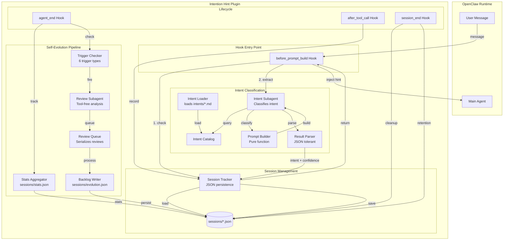
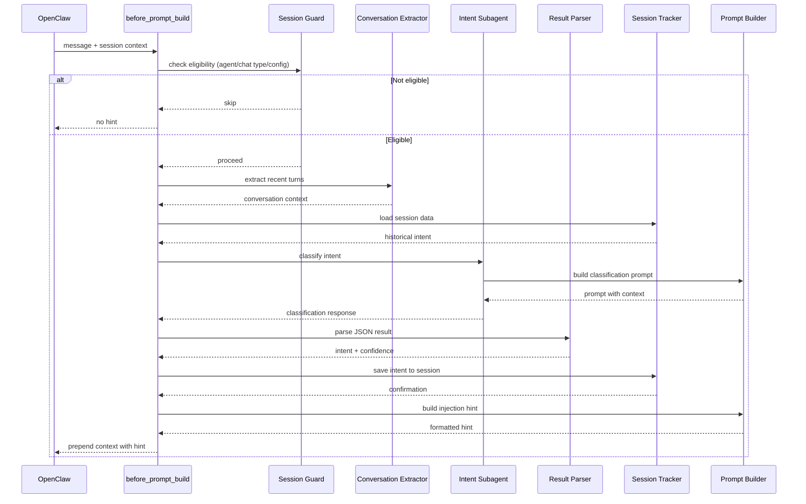
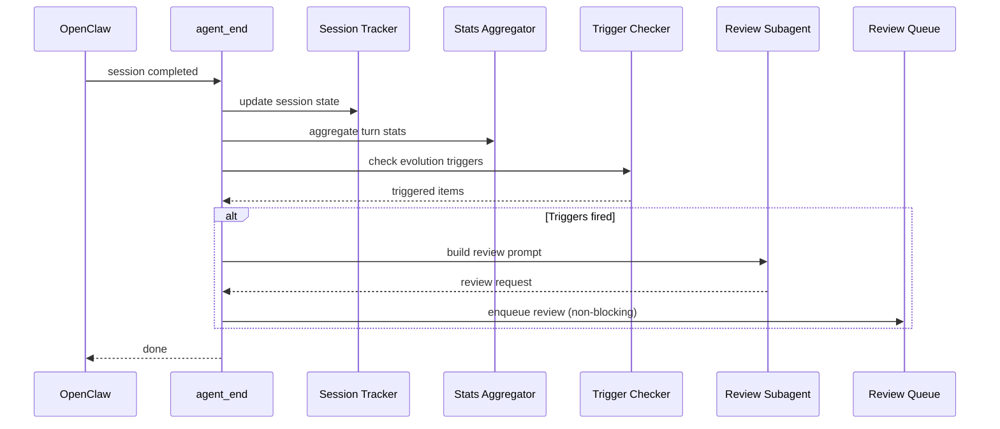
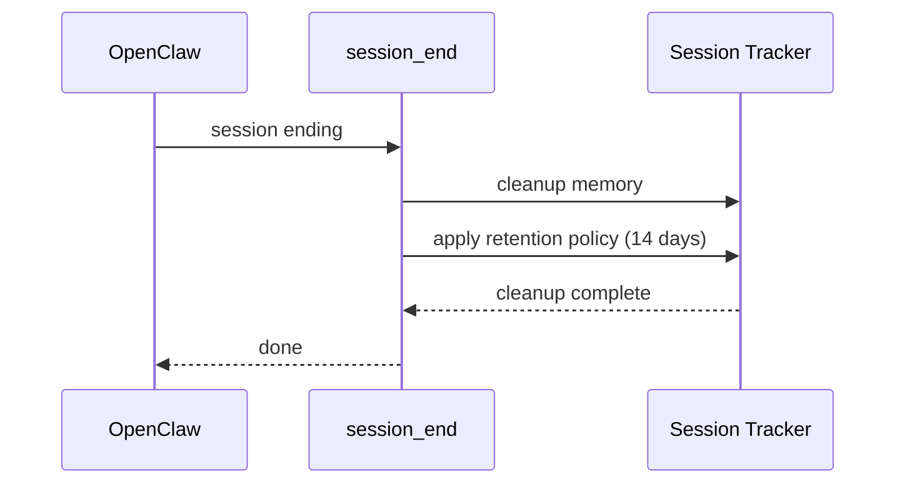

# Agent Guide — Intention Hint Plugin

An OpenClaw plugin that pre-scans user intent before replies and injects routing hints via `before_prompt_build` hook.

## Commands

```bash
pnpm run typecheck        # Type check without emitting
pnpm run test:unit        # Run tests
pnpm run test             # Type check + tests
pnpm run format           # Format with prettier
pnpm run backlog -- <cmd> # Run evolution backlog CLI
```

## Project Structure

```
src/
├── plugin.ts              # Plugin entry, registers hooks
├── hooks.ts               # Event handlers (prompt building, tracking, cleanup)
├── subagent.ts            # Intent classification sub-agent
├── intent-loader.ts       # Loads intent .md files from intentsDir
├── file-utils.ts          # Shared filesystem helpers (atomic I/O, path resolution)
├── constants.ts           # Default config values, fallback intent, prompt constants
├── session-tracker.ts     # Session persistence (sessions/<id>.json)
├── stats-aggregator.ts    # Runtime usage stats (sessions/stats.json)
├── trigger-checker.ts     # Detects 6 Self-Evolution triggers
├── review-subagent.ts     # Builds review prompts, runs tool-free review
├── review-queue.ts        # Serializes background evolution reviews
├── backlog-writer.ts      # Merges findings into sessions/evolution.json
├── evolution-backlog.ts   # Schema validation, atomic mutations
├── backlog-cli.ts         # CLI for backlog management
├── intent-validation.ts   # Validates intent markdown structure
├── conversation-extract.ts # Truncates conversation history
├── prompt.ts              # Builds classification prompt, parses JSON
├── session.ts             # Session eligibility guards
├── config.ts              # Zod schema validation
├── types.ts               # Core type definitions
└── evolution-types.ts     # Evolution-specific types

intents/                   # Intent definitions (YAML frontmatter .md files)
skills/                    # Plugin skills
dist/                      # Compiled output
```

## Architecture



### Module Responsibilities

| Module | Purpose |
|--------|---------|
| `plugin.ts` | Plugin entry point, registers hooks on OpenClaw lifecycle events |
| `hooks.ts` | Event handlers for prompt building, tool/agent tracking, and session cleanup |
| `subagent.ts` | Runs the intention classification sub-agent with model selection |
| `intent-loader.ts` | Loads and catalogs intent definitions from YAML-frontmatter `.md` files |
| `file-utils.ts` | Shared filesystem helpers — atomic JSON I/O, directory management, path resolution |
| `constants.ts` | Shared defaults — timeouts, fallback intent, complexity prompts, untrusted header |
| `types.ts` | All shared type definitions for plugin, config, intent, result, and turn shapes |
| `evolution-types.ts` | Shared types for Self-Evolution pipeline — ReviewState, ReviewSnapshot, EvolutionFinding, EvolutionSource |
| `session-tracker.ts` | Persist and clean up session data in `sessions/` JSON files |
| `stats-aggregator.ts` | Aggregate idempotent runtime usage statistics into `sessions/stats.json` |
| `trigger-checker.ts` | Detect six configurable Self-Evolution triggers from completed turns |
| `review-subagent.ts` | Build trigger-specific review prompts and run the tool-free review sub-agent |
| `review-queue.ts` | Serialized promise queue for background evolution reviews |
| `backlog-writer.ts` | Merge review findings atomically into `sessions/evolution.json` |
| `evolution-backlog.ts` | Validate/migrate backlog schema and provide atomic mutation primitives |
| `backlog-cli.ts` | List, target, validate, and optimistically complete pending backlog items |
| `intent-validation.ts` | Validate Intent Markdown structure, IDs, targets, and catalog loading |
| `conversation-extract.ts` | Extract and truncate recent conversation turns for intent context |
| `prompt.ts` | **Core prompt & parser** — builds classification prompt, parses JSON result |
| `session.ts` | Session eligibility guards (agent allow-list, chat type, internal run detection) |
| `config.ts` | Zod schema validation with defaults and clamping for plugin configuration |

## Hook Execution Flow

### `before_prompt_build` Flow



### `agent_end` Flow



### `session_end` Flow



## Session Data Structure

```typescript
interface SessionData {
  sessionId: string;
  intent?: {
    id: string;
    confidence: number;
    reasoning?: string;
  };
  lastActive: number; // timestamp
  turnCount: number;
  toolCalls?: ToolCall[];
}

interface ToolCall {
  name: string;
  timestamp: number;
  duration?: number;
}

interface StatsData {
  totalTurns: number;
  totalToolCalls: number;
  intentDistribution: Record<string, number>;
  toolUsageDistribution: Record<string, number>;
  averageConfidence: number;
}

interface EvolutionBacklog {
  pending: BacklogItem[];
  processed: BacklogItem[];
  lastProcessed: number;
}

interface BacklogItem {
  sessionId: string;
  triggerType: string;
  timestamp: number;
  data: any;
  processed?: boolean;
}
```

## Runtime Usage Statistics

`sessions/stats.json` structure:

```typescript
{
  schemaVersion: 1,
  lastUpdated: number,
  stats: {
    totalTurns: number,
    totalToolCalls: number,
    intentDistribution: Record<string, number>,
    toolUsageDistribution: Record<string, number>,
    averageConfidence: number,
    turnsByConfidence: {
      high: number,    // >= 0.8
      medium: number,  // >= 0.5
      low: number      // < 0.5
    },
    evolutionReviews: {
      total: number,
      byTrigger: Record<string, number>
    }
  }
}
```

**Stats are:**
- Idempotent (same turn won't be counted twice)
- Atomic (temp file + rename)
- Fire-and-forget (errors logged but don't block)

## Configuration

Plugin config in `openclaw.json`:

```json
{
  "plugins": {
    "entries": {
      "intention-hint": {
        "enabled": true,
        "config": {
          "agents": ["main"],
          "model": "google/gemini-2.0-flash-exp",
          "thinking": "low",
          "contextWindow": {
            "user": { "turns": 3, "chars": 1500 },
            "assistant": { "turns": 2, "chars": 1000 }
          },
          "intentsDir": "./intents",
          "confidenceThreshold": 0.7,
          "evolution": {
            "enabled": true,
            "model": "google/gemini-2.0-flash-exp",
            "thinking": "medium",
            "timeout": 30000,
            "triggers": {
              "lowConfidence": { "enabled": true, "threshold": 0.6 },
              "highToolUsage": { "enabled": true, "minCalls": 5 },
              "repeatedIntent": { "enabled": true, "window": 3, "count": 3 },
              "toolFailure": { "enabled": true, "count": 2 },
              "longTurn": { "enabled": true, "minDuration": 60000 },
              "explicitRequest": { "enabled": true }
            }
          }
        }
      }
    }
  }
}
```

### Configuration Reference

| Option | Type | Default | Description |
|--------|------|---------|-------------|
| `agents` | `string[]` | `["main"]` | Which agents trigger the plugin |
| `model` | `string` | `null` | Classification model (null = agent's default) |
| `thinking` | `string` | `"low"` | Thinking level for classifier |
| `contextWindow.user.turns` | `number` | `3` | User turns to include |
| `contextWindow.user.chars` | `number` | `1500` | Max chars for user context |
| `contextWindow.assistant.turns` | `number` | `2` | Assistant turns to include |
| `contextWindow.assistant.chars` | `number` | `1000` | Max chars for assistant context |
| `intentsDir` | `string` | `"./intents"` | Intent definitions directory |
| `confidenceThreshold` | `number` | `0.7` | Minimum confidence to inject hint |
| `evolution.enabled` | `boolean` | `false` | Enable Self-Evolution pipeline |
| `evolution.model` | `string` | `null` | Review subagent model |
| `evolution.thinking` | `string` | `"medium"` | Review thinking level |
| `evolution.timeout` | `number` | `30000` | Review timeout (ms) |
| `evolution.triggers.*` | `object` | varies | Trigger configuration |

### Intent Self-Evolution Triggers

| Trigger | Condition | Action |
|---------|-----------|--------|
| `lowConfidence` | Intent confidence < threshold | Review intent definitions |
| `highToolUsage` | Tool calls >= minCalls | Suggest skill extraction |
| `repeatedIntent` | Same intent N times in window | Review for consolidation |
| `toolFailure` | Tool failures >= count | Review tool usage patterns |
| `longTurn` | Turn duration >= minDuration | Suggest optimization |
| `explicitRequest` | User explicitly requests | Process user feedback |

## Key Design Decisions

### Pure Function Prompt Building

`prompt.ts` is a pure function — no side effects, no I/O. Makes it testable and predictable.

### JSON Output Format

Subagent returns JSON:
```json
{
  "intent": "file-edit",
  "confidence": 0.85,
  "reasoning": "User wants to modify a file"
}
```

Parser uses **tolerant JSON** (regex extraction) to handle LLM quirks.

### Intent Categories

Auto-derived from `intents/*.md` filenames:
```
intents/
├── file-edit.md
├── file-read.md
└── code-review.md
```

No manual registration needed.

### Time Injection

Prompts include relative time context ("2 minutes ago") to help the classifier understand temporal relationships.

### Conversation Handling

- Extracts recent turns (configurable window)
- Truncates by character limit
- Preserves message order
- Includes tool call summaries

### Internal User Turns

System/tool messages are filtered out before classification. Only user/assistant messages matter.

### Output Parsing

`parseIntentionResult()` uses regex to extract JSON from potentially malformed LLM output. Tolerant of:
- Extra whitespace
- Missing quotes
- Partial JSON
- Markdown code blocks

## Key Patterns

### Atomic File I/O
All JSON writes use `writeJsonAtomic()` from `file-utils.ts` — write to temp file, then rename. Use `safeWriteJson()` for fire-and-forget with error logging.

### Module Exports
Each module exports a class + a `default*` singleton instance. Classes take `pluginRoot: string` in constructor/factory.

## Dependencies

- **zod** — Schema validation
- **gray-matter** — Parse YAML frontmatter
- **vitest** — Testing
- **prettier** — Code formatting

## Protected Files

These files are NOT touched by session cleanup or retention:
- `sessions/stats.json` — Aggregated statistics
- `sessions/evolution.json` — Self-Evolution backlog

## Testing

Tests live alongside source files (`*.test.ts`). Run `pnpm run test` before committing. All tests must pass.

```bash
pnpm run test              # All tests
pnpm run test:unit         # Unit tests only
pnpm run test -- --watch   # Watch mode
```

## Adding a New Intent

1. Create `intents/<intent-id>.md` with YAML frontmatter:
```markdown
---
id: my-intent
name: My Intent
description: What this intent detects
examples:
  - "example user message 1"
  - "example user message 2"
---

# Intent Instructions

How to handle this intent...
```

2. Restart plugin — `intent-loader` picks it up automatically
3. No code changes needed for most intents
