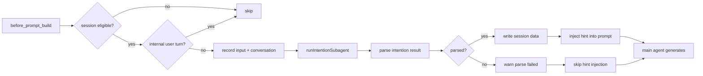

# Intention Hint Plugin

[](https://github.com/openclaw/openclaw)
[](https://opensource.org/licenses/MIT)

An OpenClaw plugin that pre-scans user intent before main-agent replies and injects routing hints via the `before_prompt_build` hook. It also tracks session-level metrics (tool calls, skills used, timestamps) via `after_tool_call` and `agent_end` hooks.

## Architecture

```
index.ts
  └─ plugin.ts → createPlugin()
       │
       ├─ intent-loader.ts → defaultCatalog (loads intent .md files from intentsDir)
       ├─ subagent.ts → runIntentionSubagent() (classifies intent via lightweight sub-agent)
       │    └─ resolveCurrentTime() — timezone-aware local time formatting
       │    └─ buildIntentionEmbeddedRunParams() — builds isolated sub-agent run config
       │
       ├─ hooks.ts → createHookHandlers()
       │    ├─ onBeforePromptBuild → rotate() → record() → write() → inject hint
       │    ├─ onAfterToolCall → record() → write() (tracks tool usage)
       │    └─ onAgentEnd → record() → write() (tracks final result)
       │
       ├─ prompt.ts → buildIntentionPrompt() (pure function — no API dependency)
       │    ├─ JSON output format with <id> (<name>) intent style
       │    ├─ parseIntentionResult() — JSON parser with code-block tolerance
       │    ├─ <intent_categories> — auto-derived from ID prefixes
       │    ├─ <current_time> — injects local timezone time
       │    ├─ <conversation> — omitted when empty
       │    └─ buildPromptPrefix() — builds injected hint text
       │
       ├─ hooks.ts → limitConversationTurns() → extract recent user/assistant turns
       │    └─ conversation-extract.ts (internal-turn detection + turn extraction)
       │
       ├─ session-tracker.ts → SessionTracker (JSON session persistence)
       │    └─ sessions/<sessionId>.json
       │
       ├─ session.ts → session guards (isEnabledForAgent, isEligibleInteractiveSession, etc.)
       │
       └─ config.ts → resolveConfig() (zod schema validation with contextWindow)
            └─ types.ts (all type definitions)
```

### Module Responsibilities

| Module                    | Purpose                                                                          |
| ------------------------- | -------------------------------------------------------------------------------- |
| `plugin.ts`               | Plugin entry point, registers hooks on OpenClaw lifecycle events                 |
| `hooks.ts`                | Event handlers for `before_prompt_build`, `after_tool_call`, `agent_end`         |
| `subagent.ts`             | Runs the intention classification sub-agent with model selection                 |
| `intent-loader.ts`        | Loads and catalogs intent definitions from YAML-frontmatter `.md` files          |
| `session-tracker.ts`      | Persist session data (intents, tools, skills) to `sessions/` JSON files          |
| `conversation-extract.ts` | Extract and truncate recent conversation turns for intent context                |
| `prompt.ts`               | **Core prompt & parser** — builds classification prompt, parses JSON result      |
| `session.ts`              | Session eligibility guards (agent allow-list, chat type, internal run detection) |
| `config.ts`               | Zod schema validation with defaults and clamping for plugin configuration        |

### Hook Execution Flow



### Session Data Structure

```typescript
interface SessionData {
  sessionId: string;
  sessionKey?: string;
  agentId?: string;
  current: {
    input?: string;
    intent: {
      input?: RecentTurn[];
      result?: IntentionResult;
    };
    skillsUsed?: SkillRecord[];
    toolCalls?: Array<{
      name: string;
      params: Record<string, unknown>;
      result?: string;
      error?: string;
      durationMs?: number;
    }>;
    result?: string;
    error?: string;
    timestamps?: { start?: string; end?: string };
  };
  history?: (typeof current)[];
}
```

## Installation

This plugin is a workspace package inside the OpenClaw extensions directory. Build it with:

```bash
cd extensions/intention-hint
pnpm install
pnpm run build
```

## Configuration (`openclaw.json`)

```json5
{
  plugins: {
    entries: {
      "intention-hint": {
        enabled: true,
        config: {
          agents: ["main"],
          intentDeny: {
            main: ["MEMORY_*"], // deny matching intent IDs for main
            "research-*": ["CHAT", "TYPO"],
            "*": ["AGENT_ADMIN"], // global deny for every agent
          },
          model: "google/gemini-3-flash", // lightweight scanner model
          modelFallback: "openai/gpt-5-mini",
          allowedChatTypes: ["direct"],
          allowedChatIds: [],
          deniedChatIds: [],
          queryMode: "recent",
          contextWindow: {
            user: { turns: 5, chars: 500 },
            assistant: { turns: 3, chars: 300 },
          },
          timeoutMs: 3000,
          intentsDir: "./intents",
          complexityPrompts: {
            low: "Custom low-complexity prompt...",
            medium: "Custom medium-complexity prompt...",
            high: "Custom high-complexity prompt...",
          },
        },
      },
    },
  },
}
```

### Configuration Reference

| Option              | Type       | Default       | Description                                                                                           |
| ------------------- | ---------- | ------------- | ----------------------------------------------------------------------------------------------------- |
| `agents`            | `string[]` | `["*"]`       | Which agents trigger the plugin. Use `["*"]` for all agents.                                          |
| `intentDeny`        | `object`   | `{}`          | Per-agent deny list of intent IDs. Keys support `*` glob patterns.                                    |
| `model`             | `string`   | —             | Lightweight model for the intention scanner. Falls back to the agent's default if empty.              |
| `modelFallback`     | `string`   | —             | Fallback model when `config.model` cannot be resolved.                                                |
| `allowedChatTypes`  | `string[]` | `["direct"]`  | Chat types (direct, group, channel) that allow intent analysis.                                       |
| `allowedChatIds`    | `string[]` | `[]`          | Allowlist of chat IDs. Empty means no allowlist restriction.                                          |
| `deniedChatIds`     | `string[]` | `[]`          | Blocklist of chat IDs. Plugin skips intent analysis for listed IDs.                                   |
| `queryMode`         | `string`   | `"recent"`    | Context window mode: `recent` (recent turns), `message` (latest message only), `full` (full history). |
| `contextWindow`     | `object`   | see below     | Turn/char limits for conversation extraction.                                                         |
| `timeoutMs`         | `number`   | `3000`        | Max wait time for subagent response. Clamped to 500–60000ms.                                          |
| `intentsDir`        | `string`   | `"./intents"` | Directory containing intent definition `.md` files with YAML frontmatter.                             |
| `complexityPrompts` | `object`   | built-in      | Custom classification prompt overrides per complexity level.                                          |

## Key Design Decisions

### Pure Function Prompt Building

`buildIntentionPrompt()` takes no API dependency. Timezone resolution and time formatting happen in `subagent.ts` via `resolveCurrentTime()`. The pure function receives `currentTime?: string` and injects it directly into the prompt.

### JSON Output Format

The classification sub-agent returns JSON:

```json
{
  "intent": "MEMORY_LOOKUP (Memory Lookup)",
  "reason": "User asked to recall previous conversation",
  "goal": "Retrieve memory of past discussion",
  "confidence": 0.9,
  "complexity": "medium",
  "suggestion": "Only present when confidence < 0.8"
}
```

- `intent` format: `<id> (<name>)` e.g. `MEMORY_LOOKUP (Memory Lookup)` or `OTHER (Fallback)`
- Parser extracts ID via regex `^([A-Za-z0-9_-]+)\s*\(` and normalizes case-insensitively against valid intent IDs
- Fallbacks to `OTHER` if parsed intent not found in catalog

### Intent Categories

The classification prompt auto-derives categories from intent ID prefixes:

- **2+ intents with same prefix** → `<PREFIX>\_\*: <id1>, <id2>, ...)
- **Standalone intents** → `STANDALONE: <id1>, <id2>, (...)

Example:

```
<intent_categories>
The following categories group intents by their ID prefix:
- MEMORY_*: MEMORY_COMPARE, MEMORY_EMOTION, MEMORY_LOOKUP, MEMORY_META, MEMORY_RECENT, MEMORY_TIMELINE
- RESEARCH_*: RESEARCH_GENERAL, RESEARCH_GOOGLE_DEV, RESEARCH_OPENSOURCE, RESEARCH_REALTIME
- OTHER_*: CHAT, HUMANITIES, PRODUCTIVITY, SUMMARIZATION, TYPO, OTHER
- STANDALONE: ANI_VISUAL, IMAGE_ANALYSIS, IMAGE_GENERATION
</intent_categories>
```

### Time Injection

`<current_time>` block is injected into the classification prompt using the user's configured timezone:

- Resolves timezone via `api.runtime.config?.current?.()?.agents?.defaults?.userTimezone`
- Fallbacks to `Intl.DateTimeFormat().resolvedOptions().timeZone` then `UTC`
- Format: `YYYY-MM-DDTHH:mm:ss (timezone: Asia/Taipei)` — **local time**, not UTC

### Conversation Handling

- `<conversation>` block is **omitted entirely** when conversation is empty or undefined
- When present, wraps turns XML inside `<conversation>...</conversation>` tags
- Extracted via `conversation-extract.ts` with configurable turn/char limits from `contextWindow` config

### Internal User Turns

OpenClaw-generated inter-session turns, such as subagent completion announcements
and `sessions_send` messages, are not direct end-user intent. The
`before_prompt_build` hook skips them before refreshing config, running the intent
scanner, recording intent data, or returning `prependContext`.

Detection uses the following priority:

1. Structured `message.provenance.kind === "inter_session"` on the latest matching
   user message.
2. OpenClaw's `[Inter-session message] ... isUser=false` marker when provenance is
   unavailable.
3. A complete protected OpenClaw runtime-context envelope containing
   `[Internal task completion event]`.

An explicit `external_user` or `internal_system` provenance is not skipped. A
standalone internal-context delimiter or an incomplete protected envelope is also
not enough to classify a normal user message as internal.

Inter-session user turns and their corresponding assistant replies are excluded
from extracted conversation history, so later direct-user intent scans are not
influenced by internal task-completion traffic.

### Output Parsing

`parseIntentionResult()` handles:

- Plain JSON (no markers)
- JSON wrapped in \`\`\`json ... \`\`\` code blocks (tolerant stripping)
- JSON wrapped in stray \`\`\` markers
- Required field validation (`intent`, `reason`, `goal`, `confidence`, `complexity`)
- Confidence range validation (0.0–1.0)
- Complexity enum validation (`low`, `medium`, `high`)
- Optional `suggestion` field (only included when present in JSON)
- Graceful fallback to `undefined` on any parse failure

### Testing

```bash
pnpm test          # typecheck + vitest run
pnpm run typecheck # tsc --noEmit
pnpm run test:unit # vitest run
```

179 tests covering:

- `buildIntentionPrompt()` prompt structure
- `parseIntentionResult()` JSON parsing (plain, code blocks, malformed, missing fields)
- Intent ID extraction and normalization from `<id> (<name>)` format
- Timezone-aware time formatting
- Config resolution and clamping
- Session tracker persistence
- Intent filtering via deny patterns
- Internal/inter-session turn detection and conversation-history filtering
