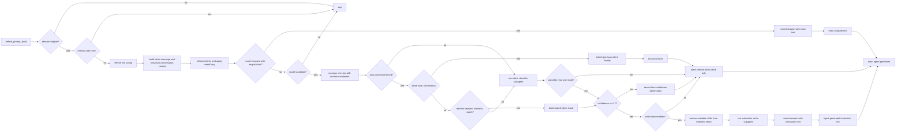

# Skill Harness Plugin

[](https://github.com/openclaw/openclaw)
[](https://opensource.org/licenses/MIT)

An OpenClaw plugin that pre-scans user intent before main-agent replies and injects routing hints via the `before_prompt_build` hook. It also tracks session-level metrics via `after_tool_call` and `agent_end`, then cleans up tracker state and session JSON retention via `session_end`.

## Current Status (verified 2026-07-06)

- Package version: `2026.6.11`; OpenClaw compatibility in `package.json` targets Plugin API and Gateway `>=2026.6.11`.
- Branch state inspected on `main` at `f803ae9` (`feat: inject domain skills prompt metadata (#48)`).
- Recent implementation work focused on direct runtime Intent Evolution, modern `runEmbeddedAgent` hint/review runs, reduced-noise skill recommendation stats, domain skill prompt metadata, and recursive async skill-root indexing for workspace, state, plugin, and bundled skills.
- Current first-install bundled intent assets are `approve`, `chat`, `memory-compare`, `memory-lookup`, `reject`, and `typo`; the active writable catalog still lives only under `$OPENCLAW_STATE_DIR/plugins/skill-harness/intents`.
- Codebase shape from `pygount` excluding dependencies/build output: 51 TypeScript files with 13,296 code lines, 15 Markdown files, 3 JSON files, and 70 counted files total.
- TypeScript line split from direct file line counts: 25 runtime files / 8,716 lines, 23 test files / 11,384 lines, 3 root/tooling files / 30 lines; test/runtime line ratio is about 1.31x.
- Verification status: `pnpm run typecheck` passes, `pnpm run test` passes with 23 test files / 452 tests, `pnpm run build` passes, and `pnpm pack --dry-run` succeeds.
- Package hygiene note: current `pnpm pack --dry-run` output still includes `dist/vitest.config.*` because `tsconfig.json` includes root `./*.ts`. Decide whether to keep publishing that harmless build artifact or narrow the TypeScript include/exclude list in a future cleanup.
- Dependency audit note: `pnpm audit --audit-level moderate` currently reports transitive OpenClaw dependency findings for `protobufjs` and `tar`, plus `gray-matter > js-yaml`. Remediation should be coordinated with OpenClaw/gray-matter compatibility rather than patched blindly in this plugin.

## Architecture

```
index.ts
  └─ plugin.ts → createPlugin()
       │
       ├─ file-utils.ts → shared filesystem helpers
       │    └─ packageRoot, resolvePluginDataRoot(), sessionsPath(), ensureDir(), writeJsonAtomic(), readJsonFile(), safeWriteJson(), fileExists()
       │
       ├─ constants.ts → shared defaults
       │    └─ DEFAULT_TIMEOUT_MS, FALLBACK_INTENT, default complexity prompts, UNTRUSTED_CONTEXT_HEADER
       │
       ├─ types.ts → all shared type definitions
       ├─ evolution-types.ts → Evolution review types (ReviewState, ReviewSnapshot, EvolutionFinding, EvolutionSource)
       │
       ├─ intent-loader.ts → runtime catalog
       │    └─ loads intent .md files from $OPENCLAW_STATE_DIR/plugins/skill-harness/intents
       │
       ├─ subagent.ts → topic switch, intent classification, and instruction-writing sub-agents
       │    ├─ resolveCurrentTime() — timezone-aware local time formatting
       │    ├─ buildIntentionEmbeddedRunParams() — builds isolated sub-agent run config
       │    └─ uses constants.ts for FALLBACK_INTENT
       │
       ├─ skill-catalog.ts → resolves skill: <name> references from matched intent Markdown into SKILL.md metadata
       │
       ├─ hooks.ts → createHookHandlers()
       │    ├─ onBeforePromptBuild → resolve intent → write session data → inject generated hint
       │    ├─ onAfterToolCall → record() → write() (tracks tool usage)
       │    ├─ onAgentEnd → record() → aggregate stats → enqueue evolution review
       │    ├─ onSessionEnd → cleanup() + cleanupExpired() (lifecycle cleanup + 14-day retention)
       │    └─ review-queue.ts → ReviewQueue (serialized background evolution reviews)
       │
       ├─ prompt.ts → prompt builders and parsers (pure functions — no API dependency)
       │    ├─ JSON output contracts with filename-based intent ids and final one-object reminders
       │    ├─ parseIntentionResult() — JSON parser with code-block tolerance and classifier complexity precedence
       │    ├─ intent groups by semantic domain — routing overview only; exact ids come from the catalog
       │    ├─ <current_time> — injects local timezone time
       │    ├─ <conversation_context> — topic-segmented recent turns, omitted when empty
       │    ├─ buildIntentInstructionPrompt() — condenses matched intent Markdown into main-agent instructions
       │    ├─ buildPromptPrefix() — builds injected hint text
       │    └─ uses constants.ts for complexity prompt defaults
       │
       ├─ hooks.ts → attachHistoricalIntents() → limitConversationTurns()
       │    └─ conversation-extract.ts (internal-turn filtering + per-turn historical intent context)
       │
       ├─ session-tracker.ts → SessionTracker (JSON session persistence)
       │    ├─ uses file-utils.ts for fileExists(), readJsonFile(), safeWriteJson()
       │    ├─ uses evolution-types.ts for ReviewState, ReviewSnapshot
       │    └─ $OPENCLAW_STATE_DIR/plugins/skill-harness/sessions/<sessionId>.json
       │
       ├─ stats-aggregator.ts → StatsAggregator (atomic runtime usage aggregation)
       │    ├─ uses file-utils.ts for fileExists(), readJsonFile(), safeWriteJson()
       │    └─ $OPENCLAW_STATE_DIR/plugins/skill-harness/stats.json
       │
       ├─ trigger-checker.ts + review-subagent.ts → Intent Evolution review
       │    ├─ trigger-checker.ts → checkEvolutionTriggers() (eight configurable triggers plus runtime trigger keywords)
       │    ├─ review-subagent.ts → buildReviewPrompt() + parseReviewFindings() + runReviewSubagent()
       │    └─ evolution-log-writer.ts + evolution-log.ts → $OPENCLAW_STATE_DIR/plugins/skill-harness/evolution.json
       │         ├─ evolution-log-writer.ts records direct-review processedEvents and trigger keyword updates
       │         └─ evolution-log.ts + evolution-trigger-keywords.ts validate evolution logs and trigger keyword defaults
       │
       ├─ intent-validation.ts → runtime intent Markdown validation for direct Evolution edits
       │
       ├─ session.ts → session guards (isEnabledForAgent, isEligibleInteractiveSession, etc.)
       │
       └─ config.ts → resolveConfig() (zod schema validation with contextWindow)
            ├─ uses constants.ts for DEFAULT_TIMEOUT_MS and default values
            └─ uses types.ts for config type definitions
```

### Module Responsibilities

| Module                    | Purpose                                                                                                                                                 |
| ------------------------- | ------------------------------------------------------------------------------------------------------------------------------------------------------- |
| `plugin.ts`               | Plugin entry point, initializes runtime data, seeds empty intent catalogs from skill assets, and registers hooks on OpenClaw lifecycle events           |
| `hooks.ts`                | Event handlers for prompt building, tool/agent tracking, and session cleanup                                                                            |
| `subagent.ts`             | Runs tool-free topic switch, intent classification, and instruction-writing sub-agents with model selection                                             |
| `skill-catalog.ts`        | Resolves `skill: <name>` references from matched intent Markdown into available skill metadata                                                          |
| `intent-loader.ts`        | Loads and catalogs intent definitions from YAML-frontmatter `.md` files                                                                                 |
| `file-utils.ts`           | Shared filesystem helpers — atomic JSON I/O, directory management, path resolution                                                                      |
| `constants.ts`            | Shared defaults — timeouts, fallback intent, complexity prompts, untrusted header                                                                       |
| `types.ts`                | All shared type definitions for plugin, config, intent, result, and turn shapes                                                                         |
| `evolution-types.ts`      | Shared types for Evolution pipeline — ReviewState, ReviewSnapshot, EvolutionFinding, EvolutionSource                                                    |
| `session-tracker.ts`      | Persist and clean up session data in runtime `sessions/` JSON files                                                                                     |
| `stats-aggregator.ts`     | Aggregate idempotent runtime usage statistics into `stats.json`                                                                                         |
| `trigger-checker.ts`      | Detect eight configurable Evolution triggers from completed turns using runtime trigger keywords                                                        |
| `review-subagent.ts`      | Build trigger-specific review prompts and run the bounded read/write/apply_patch review sub-agent rooted at the runtime intents directory               |
| `review-queue.ts`         | Serialized promise queue for background evolution reviews                                                                                               |
| `evolution-log-writer.ts` | Record direct Evolution review outcomes and trigger keyword updates atomically into `evolution.json`                                                    |
| `evolution-log.ts`        | Validate/migrate the Evolution log schema and root `triggerKeywords`; legacy items are dropped during migration                                         |
| `intent-validation.ts`    | Validate Intent Markdown structure, IDs, targets, and catalog loading                                                                                   |
| `conversation-extract.ts` | Extract and truncate recent conversation turns for intent context                                                                                       |
| `prompt.ts`               | **Core prompt & parser** — builds topic/classification/instruction prompts, parses JSON results, and wraps injected hints with compact output contracts |
| `session.ts`              | Session eligibility guards (agent allow-list, chat type, internal run detection)                                                                        |
| `config.ts`               | Zod schema validation with defaults and clamping for plugin configuration                                                                               |

Every `session_end` removes the ended session from tracker memory. Final lifecycle reasons (`new`, `reset`, `idle`, `daily`, `compaction`, and `deleted`) also delete that session's JSON; restart-oriented reasons preserve it for reload. Each `session_end` additionally removes session JSON files under the runtime `sessions/` directory whose modification time is strictly older than 14 days. Cleanup is fail-open and does not touch root-level `stats.json`, `evolution.json`, transcripts, or other plugin data.

### Hook Execution Flow



`onBeforePromptBuild` emits compact pipeline events for Discord/status consumers
only on the three visible phases: `topic-triage`, `intent-classify`, and
`hint-generate`. Exact keyword and domain keyword routes are reported through
those semantic phases instead of fastpath-specific phase names. Event failures
are fail-open and never add text to `prependContext`.

After a turn has a resolved current domain, the hook prepends a `<domain_skills>`
XML block under `<skill_harness_plugin>` only when resolved domain skills exist.
The block contains every resolved skill referenced by enabled intents in that
domain, using `name`, `path`, and `description` fields. If no skills resolve for
the domain, the `<domain_skills>` block and its surrounding skill-loading
guidance are omitted; if there is no generated instruction hint or fallback
intent guidance either, the entire `<skill_harness_plugin>` prefix is omitted.
When a prefix is emitted, the header frames it as generated Skill Harness context
and the plugin tag starts with a short `<context_policy>`: relevant `## Skills
(mandatory)` entries are mandatory skill-loading guidance, irrelevant listed
skills should be ignored if the selected domain is wrong, and `## Instruction
Hint` / intent-derived prose remains advisory against the latest request and
verified repository or tool evidence.

Prompt assembly keeps static instructions, schema examples, and catalog data before
dynamic conversation input, then closes helper prompts with a short final output
contract after `</latest_message>`. Topic continuity and intent classifier prompts
ask for exactly one raw JSON object with no Markdown code fences and no
surrounding prose, which helps prompt-only JSON parsing on compact helper models.
The topic checker still provides a
complexity starting hint, but `parseIntentionResult()` lets the classifier's final
complexity override it when the latest-message scope is simpler or broader than the
topic hint.

### Session Data Structure

```typescript
interface SessionData {
  sessionId: string;
  sessionKey?: string;
  agentId?: string;
  current: {
    input?: string;
    intent: {
      input?: RecentTurn[];
      result?: IntentionResult;
      instructionText?: string;
    };
    skillsUsed?: SkillRecord[];
    toolCalls?: Array<{
      name: string;
      params: Record<string, unknown>;
      result?: string;
      error?: string;
      durationMs?: number;
    }>;
    result?: string;
    error?: string;
    timestamps?: { start?: string; end?: string };
  };
  history?: (typeof current)[];
}
```

### Runtime Usage Statistics

After a tracked turn is persisted, `agent_end` synchronously updates `$OPENCLAW_STATE_DIR/plugins/skill-harness/stats.json`. The aggregator is observation-only, fail-open, and idempotent by `sessionId + timestamps.start`; it never scans existing session JSON for backfill. Writes use a temporary file and atomic rename. Invalid or corrupt existing stats are preserved and the update is skipped.

The versioned stats document contains:

- `summary`: all-time turn, completion/error, skill/tool assistance, confidence, and `other` totals and rates
- `intents`: per-intent share, confidence, complexity, assistance/error counts, and 7-day activity
- `skills`: actual usage, recommendations parsed from instruction-writer output, adoption, 7-day activity, lifecycle, and review status
- `routing`: global and per-intent recommendation/adoption counts for turns and individual skill opportunities
- `tools`: calls, assisted turns, errors, average duration, and 7-day calls
- `daily`: UTC daily buckets retained for 90 days
- `processedEvents`: event IDs retained for 90 days to prevent duplicate `agent_end` counting

Skill hints in Intent Markdown (`skill: <name>`) are catalog candidates only. They
describe possible skills the instruction writer and Evolution reviewer may reason
about, but they are not counted as per-turn recommendations. When an intent is
matched, referenced skills are resolved from the matched agent workspace
`skills/`, `$OPENCLAW_STATE_DIR/skills/`, `$OPENCLAW_STATE_DIR/plugin-skills/`,
then bundled OpenClaw `skills/`. Only `SKILL.md` frontmatter `name`, path, and
`description` are read; missing skills are skipped fail-open. The main-agent
prompt prefix also receives a `<domain_skills>` block listing all resolved skills
referenced by enabled intents in the current domain. `recommendedSkillOpportunities`
counts only explicit instruction-writer directives such as
`MUST read skill: <name> at <path>` or `REQUIRED skill: <name>`.
`adoptedSkillOpportunities` counts the intersection
between those actual recommendations and skills read during the completed turn.
Existing stats are not backfilled; the reduced-noise denominator applies to new
tracked turns.

Rates use `0.0–1.0`. Skill lifecycle is `active` within 30 days, `stale` after 30 days, `archive` after 90 days, or `never-used` when recommended but never used. `needsReview` becomes true after at least five actual recommendations with adoption below `0.7`. All-time counters do not decrease when rolling data is pruned.

## Installation

Build the package from the plugin repository root:

```bash
cd openclaw-plugin-skill-harness
pnpm install
pnpm run typecheck
pnpm run test
pnpm run build
```

## Configuration (`openclaw.json`)

```json5
{
  plugins: {
    entries: {
      "skill-harness": {
        enabled: true,
        config: {
          agents: ["main"],
          intentDeny: {
            main: ["memory-*"], // deny matching filename intent IDs for main
            "research-*": ["chat", "typo"],
            "*": ["agent-dispatch"], // global deny for every agent
          },
          model: "google/gemini-3-flash", // lightweight scanner model
          modelFallback: "openai/gpt-5-mini",
          thinking: "medium", // intent classifier subagent thinking level
          lowThinkingMode: "fastpath-only", // low main-agent thinking skips LLM scanner calls
          allowedChatTypes: ["direct"],
          allowedChatIds: [],
          deniedChatIds: [],
          queryMode: "recent",
          contextWindow: {
            user: { turns: 5, chars: 500 },
            assistant: { turns: 3, chars: 300 },
          },
          timeoutMs: 3000,
          complexityPrompts: {
            low: "Custom low-complexity prompt...",
            medium: "Custom medium-complexity prompt...",
            high: "Custom high-complexity prompt...",
          },
          instruction: {
            enabled: true,
            model: "google/gemini-3-flash",
            modelFallback: "openai/gpt-5-mini",
            thinking: "medium", // instruction writer subagent thinking level
            timeoutMs: 30000,
          },
          evolution: {
            enabled: false,
            model: "google/gemini-3-flash",
            modelFallback: "openai/gpt-5-mini",
            thinking: "medium", // evolution review subagent thinking level
            timeoutMs: 30000,
            triggers: {
              skillCandidate: { enabled: true, toolCalls: 5 },
              processGap: { enabled: true, toolFailures: 2 },
              successfulPattern: { enabled: true, toolCalls: 5 },
              satisfactionCheck: { enabled: true, everyTurns: 10 },
              missingIntent: { enabled: true },
              weakIntent: { enabled: true, confidenceBelow: 0.5 },
              behaviorFix: { enabled: true },
            },
          },
        },
      },
    },
  },
}
```

### Configuration Reference

| Option              | Type       | Default           | Description                                                                                                                                                                    |
| ------------------- | ---------- | ----------------- | ------------------------------------------------------------------------------------------------------------------------------------------------------------------------------ |
| `agents`            | `string[]` | `["*"]`           | Which agents trigger the plugin. Use `["*"]` for all agents.                                                                                                                   |
| `intentDeny`        | `object`   | `{}`              | Per-agent deny list of intent IDs. Keys support `*` glob patterns.                                                                                                             |
| `model`             | `string`   | —                 | Lightweight model for the intention scanner. Falls back to the agent's default if empty.                                                                                       |
| `modelFallback`     | `string`   | —                 | Fallback model when `config.model` cannot be resolved.                                                                                                                         |
| `thinking`          | `string`   | `"medium"`        | Thinking level for the intent classifier subagent.                                                                                                                             |
| `lowThinkingMode`   | `string`   | `"fastpath-only"` | Behavior when the main agent uses `off`, `minimal`, or `low` thinking: preserve deterministic exact keyword hints, run the full scanner, or disable the plugin for that turn.  |
| `allowedChatTypes`  | `string[]` | `["direct"]`      | Chat types (direct, group, channel) that allow intent analysis.                                                                                                                |
| `allowedChatIds`    | `string[]` | `[]`              | Allowlist of chat IDs. Empty means no allowlist restriction.                                                                                                                   |
| `deniedChatIds`     | `string[]` | `[]`              | Blocklist of chat IDs. Plugin skips intent analysis for listed IDs.                                                                                                            |
| `queryMode`         | `string`   | `"recent"`        | Context window mode: `recent` (recent turns), `message` (latest message only), `full` (full history).                                                                          |
| `contextWindow`     | `object`   | see below         | Turn/char limits for conversation extraction.                                                                                                                                  |
| `timeoutMs`         | `number`   | `3000`            | Max wait time for each scanner sub-agent run. Clamped to 250–120000ms.                                                                                                         |
| `complexityPrompts` | `object`   | built-in          | Custom instruction-generation guidance per complexity level.                                                                                                                   |
| `instruction`       | `object`   | enabled           | Instruction writer configuration. When disabled or model resolution fails, the hook injects `<domain_skills>` only if resolved domain skills exist, and skips generated hints. |
| `evolution`         | `object`   | disabled          | Post-turn trigger review configuration. Findings and runtime trigger keywords are stored in `$OPENCLAW_STATE_DIR/plugins/skill-harness/evolution.json`.                        |

`instruction.thinking` independently controls the instruction writer subagent,
and `evolution.thinking` independently controls the Evolution review subagent.
All thinking settings accept `off`, `minimal`, `low`, `medium`, `high`, `xhigh`,
`adaptive`, or `max`. `instruction.model`, `instruction.modelFallback`, and
`instruction.timeoutMs` mirror the Evolution review knobs but apply only to
generated instruction hints.

`lowThinkingMode` controls main-agent low-thinking turns (`off`, `minimal`, or
`low`). The default `fastpath-only` mode keeps deterministic exact keyword hints
when instruction hints are enabled, but skips topic checker, intent classifier,
and instruction writer LLM calls when no exact fastpath keyword matches. Use
`full` to always run the complete scanner pipeline, or `off` to disable the
plugin entirely for low-thinking turns.

### Intent Evolution

Intent Evolution is an opt-in direct runtime intent improvement pipeline. When
enabled, each completed tracked turn is checked for eight trigger types:

| Trigger              | Default condition                                                                                                      | Intent Markdown correction target                                                                    |
| -------------------- | ---------------------------------------------------------------------------------------------------------------------- | ---------------------------------------------------------------------------------------------------- |
| `skill-candidate`    | Current turn has at least 5 tool calls                                                                                 | `Skills & Tools`, `Concrete Workflow`, or `Experience`                                               |
| `process-gap`        | Current turn has at least 2 tool errors                                                                                | Guidelines, tool examples, workflow, or pitfalls                                                     |
| `successful-pattern` | Successful tool-heavy or skill-assisted completed turn with a runtime success keyword                                  | `Experience`, `Concrete Workflow`, Response Strategy, or `triggerKeywords.successfulPattern` updates |
| `satisfaction-check` | Every 10th tracked turn                                                                                                | Boundaries, examples, Guidelines, or Response Strategy                                               |
| `missing-intent`     | Classified intent is `other`                                                                                           | A narrowly scoped new intent draft                                                                   |
| `weak-intent`        | Classification confidence is below 0.5                                                                                 | Frontmatter triggers/examples/domain/fastpath and boundary clarity                                   |
| `behavior-fix`       | Latest user input contains a runtime correction keyword and is not a quoted ingest/dream diary/memory-fragment payload | Fastpath metadata, guidance, workflow, or `triggerKeywords.behaviorFix` updates                      |
| `entity-context`     | Runtime entity-context learning keyword plus `TOOLS.md`, `MEMORY.md`, or a `memory` path/source signal                 | `Experience`, `Concrete Workflow`, or `triggerKeywords.entityContext` updates                        |

All matching triggers are reviewed in one background, bounded read/write/apply_patch
sub-agent run rooted at the runtime intents directory. Each trigger receives a
distinct review focus and correction goal, and may return no finding. Valid
intent edits are applied directly to runtime `intents/*.md`, validated, and
rolled back on validation failure. Trigger keyword findings update the same
atomic, event-idempotent `$OPENCLAW_STATE_DIR/plugins/skill-harness/evolution.json`
document under `triggerKeywords.successfulPattern`, `triggerKeywords.behaviorFix`,
and `triggerKeywords.entityContext`; legacy `openclaw.json` trigger `keywords`
are accepted only as first-run or legacy migration seeds. `entity-context`
deliberately avoids LLM entity detection: it requires a learning phrase such as
`看看`, `看一下`, or `看下` plus a source signal from text or sanitized read/search
tool params limited to `TOOLS.md`, `MEMORY.md`, or paths containing `memory`.
Review failures are fail-open and never block or alter the main reply.

The reviewer is intentionally scoped to improving runtime `intents/*.md`, following
the bundled `skill-harness` Skill rules. It receives the full matched intent
definition and a compact frontmatter catalog, including domain and fastpath
metadata, for collision checks, plus the current turn and up to nine previous
tracked turns with truncated content. It also receives the same available skill
metadata resolved from the matched intent body, so it can judge whether
Guidelines, Skills & Tools, Concrete Workflow, or Experience should preserve a
stable skill path. Depending on the trigger, it proposes a new intent draft or
targeted changes to frontmatter, Guidelines, Skills & Tools, Response Strategy,
Concrete Workflow, or Experience. It may also report `trigger-keywords` findings
when the evidence supports a stable success/correction/entity-context phrase;
the host records those keyword updates in `evolution.json`. It never proposes
changes to skills, tools, AGENTS.md, SOUL.md, or other production files.
The review prompt is intentionally asymmetric: `behavior-fix` is recall-biased
for explicit corrections and concrete misroutes, while `successful-pattern`,
`skill-candidate`, and `entity-context` stay precision-biased unless reusable
workflow, skill/tool, or bounded memory-lookup evidence is present. No-finding
responses may include an optional bounded `reasonCode` (`routine-tool-use`,
`outside-intent-scope`, `insufficient-evidence`, `wrong-trigger`,
`already-covered`, or `privacy-sensitive`) so runtime health can explain why a
review intentionally produced no change.
The review sub-agent uses `runEmbeddedAgent` with `promptMode="minimal"`,
`modelRun=false`, and `toolsAllow=["read", "write", "apply_patch"]` rooted at
the runtime intents directory. `apply_patch` is preferred for targeted edits,
and `write` is available for full-file rewrites of runtime `intents/*.md`; the
reviewer must not write bundled intents, source files, skills, config, or
`evolution.json`. `read` is limited to the same runtime intents directory and is
used only to inspect the files being edited. Trigger detection never reads file
contents; the reviewer must not browse arbitrary filesystem paths or copy raw
private memory. If the primary Evolution review model fails,
the review is retried once with `evolution.modelFallback` when configured; parse
failures and provider errors are recorded as processed event outcomes instead of
silently disappearing.

`evolution.json` is protected like `stats.json`: both live at the runtime data
root, are not loaded as session state, and are never removed by session
lifecycle or 14-day retention cleanup. Schema v4 stores root `triggerKeywords`
plus structured `processedEvents` observability. There is no `items` array and
no pending/processed/dismissed item lifecycle. Each processed event stores
`{ processedAt, triggers, changeCount, outcome }`, where `outcome` is one of
`applied`, `nofinding`, `schema-rejected`, `parse-failed`, `subagent-error`,
`validation-failed`, or `unknown` for migrated legacy entries. Applied events may
store `changedIntentIds` and compact `changes`. `nofinding` events may
additionally store aggregate `noFindingReasonCounts`. `schema-rejected` means
the reviewer returned requested positive findings but none passed the finding
schema, which separates malformed positives from true no-finding reviews.
Schema-rejected events may store aggregate `schemaRejectionReasonCounts` using
bounded categories such as `missing-required-field`, `missing-target`,
`invalid-operation`, `invalid-trigger-keyword-target`, `invalid-field-type`,
`too-long-field`, `invalid-shape`, or `unknown`. These observability fields store
only machine-readable summaries; they do not store raw snapshots, user text,
raw model replies, secrets, or Zod error dumps. Intent Markdown findings include
`targetKind: "intent-markdown"`, `operation` (`create`, `refine`, `split`, or
`merge`), and all affected `targetIntentIds`. Trigger keyword findings include
`targetKind: "trigger-keywords"`, `targetTrigger`, and keyword additions/removals.
Legacy schema v1-v3 files migrate to v4 by preserving `triggerKeywords` and
`processedEvents` and dropping stale `items`. Trigger keyword state is
cached at plugin startup and refreshed after evolution log writes so hook
execution does not repeatedly read and parse the full log.

### Direct Evolution Mode

Evolution no longer exposes `skill_harness_evolution` or `/skill-harness evolution`.
Background reviews apply safe runtime intent edits directly, validate changed or
targeted intents, roll back invalid edits, and record the event in
`evolution.json`. Manual intent evolution is still documented in
`skills/skill-harness/references/evolution.md`, but it operates on runtime intent
Markdown and test/build gates rather than pending items.

## Key Design Decisions

### Pure Function Prompt Building

`buildIntentionPrompt()` takes no API dependency. Timezone resolution and time formatting happen in `subagent.ts` via `resolveCurrentTime()`. The pure function receives `currentTime?: string` and injects it directly into the prompt.

### JSON Output Format

The classification sub-agent returns JSON:

```json
{
  "intent": "memory-lookup",
  "reason": "User asked to recall previous conversation",
  "keywords": ["memory", "past discussion"],
  "domain": "memory",
  "topic": "memory / past discussion",
  "topicChangeReason": "start",
  "confidence": 0.9,
  "complexity": "medium",
  "suggestion": "Only present when confidence < 0.8"
}
```

- `intent` format: exact filename id, e.g. `memory-lookup` or `other`
- Intent ids are derived from active intent filenames by removing the `.md` suffix
- Fallbacks to `other` if parsed intent not found in catalog
- `keywords` are normalized core nouns or short phrases from the latest user message
- `domain` is the selected intent/topic routing domain
- `topic` is a concise natural-language phrase describing the current topic
- `topicChangeReason` is present only when the topic changed; an empty value means same-topic continuation
- `topicChangeReason="match"` marks a deterministic frontmatter keyword fast-path match that switched from a previous intent
- Topic switch metadata is stored in session history; no separate cache or experience store is written
- Durable session goals are managed by OpenClaw `/goal` and goal tools, not by skill-harness

### Intent Categories

The classification prompt auto-derives categories from intent ID prefixes:

- **2+ intents with same prefix** → `<prefix>-\*: <id1>, <id2>, ...)
- **Standalone intents** → `standalone: <id1>, <id2>, (...)

Example:

```
<intent_categories>
The following categories group intents by their ID prefix:
- memory-*: memory-compare, memory-emotion, memory-lookup, memory-meta, memory-recent, memory-timeline
- research-*: research-general, research-google-dev, research-opensource, research-realtime
- standalone: ani-visual, chat, humanities, image-analysis, image-generation, productivity, summarization, typo, other
</intent_categories>
```

### Topic Switch Checking

Every tracked turn first runs a lightweight topic switch checker using the
latest user message, recent conversation context, and recent session history
(`intent`, `domain`, `keywords`, `topic`, `reason`, `complexity`).
If the checker says the topic changed, or there is no historical
intent to inherit, that topic context is passed into the classifier subagent.
If the checker says the topic did not change, the plugin runs a local inherited
intent classifier, reuses the latest historical intent, uses the checker
complexity for the latest message, and records the current turn without
`topicChangeReason`. If the checker fails, the plugin logs and falls back to
classifier-only behavior.

### Fast Path A1 Keyword Matching

- Intent Markdown may include optional frontmatter `fastpath.keywords` and `fastpath.hint`.
- A1 only scans intents with `fastpath.hint`; keyword-only intents are ignored by exact matching.
- Matching normalizes Unicode, removes whitespace, and lowercases before comparison.
- A match injects the short `fastpath.hint` and skips the topic checker, classifier, and instruction writer.
- Topic reasons are `start` or `match`; same-topic exact matches leave `topicChangeReason` empty.

### Fast Path A2 Keyword Similarity

- Intent Markdown must include a single frontmatter `domain`.
- The topic checker receives the enabled intent domain union and returns the closest domain for the latest message.
- A2 compares extracted topic `keywords` only with enabled intent `fastpath.keywords` in that selected domain.
- A2 does not require `fastpath.hint`; hint only gates A1 exact-match injection.
- A clear similarity match skips the intent classifier, then still runs the instruction writer before injection.
- Ambiguous, low-score, high-risk, or denied-intent matches fall back to the normal classifier.
- Same-topic inheritance remains earlier than A2, so turns without `topicChangeReason` still record only and return.

### Instruction Generation

After an intent is resolved, the plugin reads the matched intent Markdown body
and runs a short instruction-writing sub-agent. That sub-agent outputs plain text
for the main agent: concrete workflow, relevant skills, useful tools, and durable
Experience notes from the intent when they matter for the latest user message.
Referenced `skill: <name>` hints are resolved into an `<intent_related_skills>` block
for this writer so it can recommend concrete skill paths without guessing. Skill
metadata is resolved from workspace `skills/`, state `skills/`, state
`plugin-skills/`, then bundled OpenClaw skills. Each root is searched
recursively for directories containing `SKILL.md`, including symlinked skill
directories or `SKILL.md` files while guarding against directory cycles; the
skill frontmatter `name` must match the referenced skill name. Bundled skill
scans also honor `skills.entries` in OpenClaw's state `openclaw.json`: entries
with `enabled: false` are skipped for the bundled root while workspace, state,
and plugin skill roots can still override them. Skill root indexes are cached
briefly across prompt-build turns and are built with `fs.promises` so cache
misses do not block the Node.js event loop while walking larger skill trees.
Expired entries are swept before reuse, and the cache is size-bounded so missing
skill references do not rescan entire roots on every turn. The Evolution review
prompt receives the same resolved skill metadata when a matched intent exists.

The final main-agent prompt prefix includes a `<domain_skills>` XML block only
when `onBeforePromptBuild` resolves at least one skill for the current domain.
When resolved skills exist, this block is wrapped with mandatory skill-loading
guidance before the tag and a fallback reminder after the closing tag: read
relevant `SKILL.md` files with OpenClaw's `read` tool, update broken skills with
`apply_patch` or `write`, load the relevant OpenClaw skill before OpenClaw
configuration/troubleshooting work, and only proceed without loading a skill when
genuinely no listed skill is relevant. When no skills resolve, the
`<domain_skills>` block and surrounding guidance are omitted entirely. The block
is separate from `<intent_related_skills>`: it is built from every enabled intent
in the same domain and includes each skill's `name`, `path`, and `description`.
This prompt shape intentionally uses `<intent_related_skills>` and
`<domain_skills>` with `path` fields; update any custom prompt parsers that
expected the older internal `<available_skills>` / `location` shape.
The full complexity guidance is provided to this instruction writer, not appended
to the final main-agent prefix.
The generated instruction text is emitted under a `## Instruction Hint` heading.
When `<domain_skills>` is present, the heading appears after its fallback
reminder; otherwise the hint is emitted without an empty skill block. If
instruction generation fails, `buildPromptPrefix()` falls back to the original
matched intent body. If none of these blocks has content, the whole
`<skill_harness_plugin>` prefix is omitted.
Every emitted prefix starts with generated-context framing and a
`<context_policy>` inside `<skill_harness_plugin>` before any skill or hint
content. The policy calibrates the main agent to treat relevant listed skills as
mandatory to load, ignore irrelevant skills when domain classification is wrong,
and treat `## Instruction Hint` / fallback intent prose as advisory when it does
not match the user request or verified evidence.

### Time Injection

`<current_time>` block is injected into the classification prompt using the user's configured timezone:

- Resolves timezone via `api.runtime.config?.current?.()?.agents?.defaults?.userTimezone`
- Fallbacks to `Intl.DateTimeFormat().resolvedOptions().timeZone` then `UTC`
- Format: `YYYY-MM-DDTHH:mm:ss (timezone: Asia/Taipei)` — **local time**, not UTC

### Conversation Handling

- The conversation context is omitted entirely when conversation is empty or undefined
- Non-empty context is emitted as `<conversation_context>` with reference-only instructions, then one or more `<topic_segment index="...">` blocks containing oldest-to-newest turns
- Matching historical user turns include a compact inline `historical_intent: intent=...; domain=...; topic=...; keywords=...; reason=...` annotation; assistant, unmatched, and latest user turns do not
- When a historical user turn has a topic-change reason, prompt building closes the previous segment, inserts a `<topic_boundary>` with reason/topic metadata, and starts the next `<topic_segment>`
- Historical records are matched by normalized user-message text, with duplicate messages paired newest-first
- Classification rules use historical intent metadata as context while requiring fresh classification on topic switches
- Same-topic continuation turns omit `topicChangeReason` and `current.intent.input` to avoid duplicating conversation snapshots, while keeping `current.intent.result` for tool tracking, stats, and Evolution
- Extracted via `conversation-extract.ts` with configurable turn/char limits from `contextWindow` config

### Internal User Turns

OpenClaw-generated inter-session turns, such as subagent completion announcements
and `sessions_send` messages, are not direct end-user intent. The
`before_prompt_build` hook skips them before refreshing config, running the intent
scanner, recording intent data, or returning `prependContext`.

Detection uses the following priority:

1. Structured `message.provenance.kind === "inter_session"` on the latest matching
   user message.
2. OpenClaw's `[Inter-session message] ... isUser=false` marker when provenance is
   unavailable.
3. A complete protected OpenClaw runtime-context envelope containing
   `[Internal task completion event]`.

An explicit `external_user` or `internal_system` provenance is not skipped. A
standalone internal-context delimiter or an incomplete protected envelope is also
not enough to classify a normal user message as internal.

Inter-session user turns and their corresponding assistant replies are excluded
from extracted conversation history, so later direct-user intent scans are not
influenced by internal task-completion traffic.

### Output Parsing

`parseIntentionResult()` handles:

- Plain JSON (no markers)
- JSON wrapped in \`\`\`json ... \`\`\` code blocks (tolerant stripping)
- JSON wrapped in stray \`\`\` markers
- Required field validation (`intent`, `reason`, `confidence`, `complexity`)
- Keyword normalization and deterministic topic derivation when `keywords` are present
- Topic switch metadata merged from the pre-classification checker when available
- `domain` and optional `topicChangeReason` metadata used to distinguish fresh classifications from inherited same-topic turns
- Confidence range validation (0.0–1.0)
- Complexity enum validation (`low`, `medium`, `high`)
- Optional `suggestion` field (only included when present in JSON)
- Graceful fallback to `undefined` on any parse failure

### Testing

```bash
pnpm run typecheck # TypeScript, no emit
pnpm run test      # Vitest suite
pnpm run build     # Compile to dist/
pnpm run format    # Prettier for md/json/ts files
```

The test suites cover:

- `buildIntentionPrompt()` prompt structure
- `parseIntentionResult()` JSON parsing (plain, code blocks, malformed, missing fields)
- Topic switch prompt parsing and hook ordering before classification
- Instruction prompt generation and fallback hint wrapping
- Filename-based intent ID validation and fallback behavior
- Timezone-aware time formatting
- Config resolution and clamping
- Session tracker persistence
- Intent filtering via deny patterns
- Internal/inter-session turn detection and conversation-history filtering
- Per-turn historical intent matching, duplicate handling, and prompt injection
- Eight Evolution triggers, thresholds, runtime trigger keywords, and multi-trigger turns
- Skill Harness Skill review prompts, response parsing, and bounded read/write/apply_patch reviewer runs
- Serialized background reviews and atomic, idempotent evolution log writes
- Schema v1-v3-to-v4 migration, structured processed event records, direct intent edit validation/rollback, and trigger keyword updates
- Intent Markdown structure/catalog validation and manual direct Evolution mode
- Recursive async skill catalog indexing, symlink cycle guards, disabled bundled skill filtering, and domain skill prompt injection
- Protection of root-level `evolution.json` from session loading and retention cleanup
