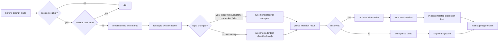

# Intention Hint Plugin

[](https://github.com/openclaw/openclaw)
[](https://opensource.org/licenses/MIT)

An OpenClaw plugin that pre-scans user intent before main-agent replies and injects routing hints via the `before_prompt_build` hook. It also tracks session-level metrics via `after_tool_call` and `agent_end`, then cleans up tracker state and session JSON retention via `session_end`.

## Architecture

```
index.ts
  └─ plugin.ts → createPlugin()
       │
       ├─ file-utils.ts → shared filesystem helpers
       │    └─ packageRoot, resolvePluginDataRoot(), sessionsPath(), ensureDir(), writeJsonAtomic(), readJsonFile(), safeWriteJson(), fileExists()
       │
       ├─ constants.ts → shared defaults
       │    └─ DEFAULT_TIMEOUT_MS, FALLBACK_INTENT, default complexity prompts, UNTRUSTED_CONTEXT_HEADER
       │
       ├─ types.ts → all shared type definitions
       ├─ evolution-types.ts → Evolution review types (ReviewState, ReviewSnapshot, EvolutionFinding, EvolutionSource)
       │
       ├─ intent-loader.ts → runtime catalog
       │    └─ loads intent .md files from $OPENCLAW_STATE_DIR/plugins/intention-hint/intents
       │
       ├─ subagent.ts → topic switch, intent classification, and instruction-writing sub-agents
       │    ├─ resolveCurrentTime() — timezone-aware local time formatting
       │    ├─ buildIntentionEmbeddedRunParams() — builds isolated sub-agent run config
       │    └─ uses constants.ts for FALLBACK_INTENT
       │
       ├─ hooks.ts → createHookHandlers()
       │    ├─ onBeforePromptBuild → resolve intent → write session data → inject generated hint
       │    ├─ onAfterToolCall → record() → write() (tracks tool usage)
       │    ├─ onAgentEnd → record() → aggregate stats → enqueue evolution review
       │    ├─ onSessionEnd → cleanup() + cleanupExpired() (lifecycle cleanup + 14-day retention)
       │    └─ review-queue.ts → ReviewQueue (serialized background evolution reviews)
       │
       ├─ prompt.ts → buildIntentionPrompt() (pure function — no API dependency)
       │    ├─ JSON output format with filename-based intent ids
       │    ├─ parseIntentionResult() — JSON parser with code-block tolerance
       │    ├─ <intent_categories> — auto-derived from ID prefixes
       │    ├─ <current_time> — injects local timezone time
       │    ├─ <conversation_context> — topic-segmented recent turns, omitted when empty
       │    ├─ buildIntentInstructionPrompt() — condenses matched intent Markdown into main-agent instructions
       │    ├─ buildPromptPrefix() — builds injected hint text
       │    └─ uses constants.ts for complexity prompt defaults
       │
       ├─ hooks.ts → attachHistoricalIntents() → limitConversationTurns()
       │    └─ conversation-extract.ts (internal-turn filtering + per-turn historical intent context)
       │
       ├─ session-tracker.ts → SessionTracker (JSON session persistence)
       │    ├─ uses file-utils.ts for fileExists(), readJsonFile(), safeWriteJson()
       │    ├─ uses evolution-types.ts for ReviewState, ReviewSnapshot
       │    └─ $OPENCLAW_STATE_DIR/plugins/intention-hint/sessions/<sessionId>.json
       │
       ├─ stats-aggregator.ts → StatsAggregator (atomic runtime usage aggregation)
       │    ├─ uses file-utils.ts for fileExists(), readJsonFile(), safeWriteJson()
       │    └─ $OPENCLAW_STATE_DIR/plugins/intention-hint/stats.json
       │
       ├─ trigger-checker.ts + review-subagent.ts → Intent Evolution review
       │    ├─ trigger-checker.ts → checkEvolutionTriggers() (seven configurable triggers)
       │    ├─ review-subagent.ts → buildReviewPrompt() + parseReviewFindings() + runReviewSubagent()
       │    └─ backlog-writer.ts + evolution-backlog.ts → $OPENCLAW_STATE_DIR/plugins/intention-hint/evolution.json
       │         ├─ backlog-writer.ts uses file-utils.ts for safeWriteJson()
       │         └─ evolution-backlog.ts uses file-utils.ts for readJsonFile(), writeJsonAtomic()
       │
       ├─ evolution-backlog-command.ts + intent-validation.ts → transactional backlog processing support
       │    └─ skills/intention-hint/references/evolution.md
       │
       ├─ session.ts → session guards (isEnabledForAgent, isEligibleInteractiveSession, etc.)
       │
       └─ config.ts → resolveConfig() (zod schema validation with contextWindow)
            ├─ uses constants.ts for DEFAULT_TIMEOUT_MS and default values
            └─ uses types.ts for config type definitions
```

### Module Responsibilities

| Module                         | Purpose                                                                                                                                       |
| ------------------------------ | --------------------------------------------------------------------------------------------------------------------------------------------- |
| `plugin.ts`                    | Plugin entry point, initializes runtime data, seeds empty intent catalogs from skill assets, and registers hooks on OpenClaw lifecycle events |
| `hooks.ts`                     | Event handlers for prompt building, tool/agent tracking, and session cleanup                                                                  |
| `subagent.ts`                  | Runs tool-free topic switch, intent classification, and instruction-writing sub-agents with model selection                                   |
| `intent-loader.ts`             | Loads and catalogs intent definitions from YAML-frontmatter `.md` files                                                                       |
| `file-utils.ts`                | Shared filesystem helpers — atomic JSON I/O, directory management, path resolution                                                            |
| `constants.ts`                 | Shared defaults — timeouts, fallback intent, complexity prompts, untrusted header                                                             |
| `types.ts`                     | All shared type definitions for plugin, config, intent, result, and turn shapes                                                               |
| `evolution-types.ts`           | Shared types for Evolution pipeline — ReviewState, ReviewSnapshot, EvolutionFinding, EvolutionSource                                          |
| `session-tracker.ts`           | Persist and clean up session data in runtime `sessions/` JSON files                                                                           |
| `stats-aggregator.ts`          | Aggregate idempotent runtime usage statistics into `stats.json`                                                                               |
| `trigger-checker.ts`           | Detect seven configurable Evolution triggers from completed turns                                                                             |
| `review-subagent.ts`           | Build trigger-specific review prompts and run the tool-free review sub-agent                                                                  |
| `review-queue.ts`              | Serialized promise queue for background evolution reviews                                                                                     |
| `backlog-writer.ts`            | Merge review findings atomically into `evolution.json`                                                                                        |
| `evolution-backlog.ts`         | Validate/migrate backlog schema and provide atomic mutation primitives                                                                        |
| `evolution-backlog-command.ts` | List, target, validate, and optimistically complete pending backlog items                                                                     |
| `intent-validation.ts`         | Validate Intent Markdown structure, IDs, targets, and catalog loading                                                                         |
| `conversation-extract.ts`      | Extract and truncate recent conversation turns for intent context                                                                             |
| `prompt.ts`                    | **Core prompt & parser** — builds topic/classification/instruction prompts, parses JSON results, and wraps injected hints                     |
| `session.ts`                   | Session eligibility guards (agent allow-list, chat type, internal run detection)                                                              |
| `config.ts`                    | Zod schema validation with defaults and clamping for plugin configuration                                                                     |

Every `session_end` removes the ended session from tracker memory. Final lifecycle reasons (`new`, `reset`, `idle`, `daily`, `compaction`, and `deleted`) also delete that session's JSON; restart-oriented reasons preserve it for reload. Each `session_end` additionally removes session JSON files under the runtime `sessions/` directory whose modification time is strictly older than 14 days. Cleanup is fail-open and does not touch root-level `stats.json`, `evolution.json`, transcripts, or other plugin data.

### Hook Execution Flow



### Session Data Structure

```typescript
interface SessionData {
  sessionId: string;
  sessionKey?: string;
  agentId?: string;
  current: {
    input?: string;
    intent: {
      input?: RecentTurn[];
      result?: IntentionResult;
    };
    skillsUsed?: SkillRecord[];
    toolCalls?: Array<{
      name: string;
      params: Record<string, unknown>;
      result?: string;
      error?: string;
      durationMs?: number;
    }>;
    result?: string;
    error?: string;
    timestamps?: { start?: string; end?: string };
  };
  history?: (typeof current)[];
}
```

### Runtime Usage Statistics

After a tracked turn is persisted, `agent_end` synchronously updates `$OPENCLAW_STATE_DIR/plugins/intention-hint/stats.json`. The aggregator is observation-only, fail-open, and idempotent by `sessionId + timestamps.start`; it never scans existing session JSON for backfill. Writes use a temporary file and atomic rename. Invalid or corrupt existing stats are preserved and the update is skipped.

The versioned stats document contains:

- `summary`: all-time turn, completion/error, skill/tool assistance, confidence, and `other` totals and rates
- `intents`: per-intent share, confidence, complexity, assistance/error counts, and 7-day activity
- `skills`: actual usage, recommendations parsed from exact `skill: <name>` intent lines, adoption, 7-day activity, lifecycle, and review status
- `routing`: global and per-intent recommendation/adoption counts for turns and individual skill opportunities
- `tools`: calls, assisted turns, errors, average duration, and 7-day calls
- `daily`: UTC daily buckets retained for 90 days
- `processedEvents`: event IDs retained for 90 days to prevent duplicate `agent_end` counting

Rates use `0.0–1.0`. Skill lifecycle is `active` within 30 days, `stale` after 30 days, `archive` after 90 days, or `never_used` when recommended but never used. `needsReview` becomes true after at least five recommendations with adoption below `0.7`. All-time counters do not decrease when rolling data is pruned.

## Installation

This plugin is a workspace package inside the OpenClaw extensions directory. Build it with:

```bash
cd extensions/intention-hint
pnpm install
pnpm run build
```

## Configuration (`openclaw.json`)

```json5
{
  plugins: {
    entries: {
      "intention-hint": {
        enabled: true,
        config: {
          agents: ["main"],
          intentDeny: {
            main: ["memory-*"], // deny matching filename intent IDs for main
            "research-*": ["chat", "typo"],
            "*": ["agent-dispatch"], // global deny for every agent
          },
          model: "google/gemini-3-flash", // lightweight scanner model
          modelFallback: "openai/gpt-5-mini",
          thinking: "medium", // intent classifier subagent thinking level
          allowedChatTypes: ["direct"],
          allowedChatIds: [],
          deniedChatIds: [],
          queryMode: "recent",
          contextWindow: {
            user: { turns: 5, chars: 500 },
            assistant: { turns: 3, chars: 300 },
          },
          timeoutMs: 3000,
          complexityPrompts: {
            low: "Custom low-complexity prompt...",
            medium: "Custom medium-complexity prompt...",
            high: "Custom high-complexity prompt...",
          },
          evolution: {
            enabled: false,
            model: "google/gemini-3-flash",
            modelFallback: "openai/gpt-5-mini",
            thinking: "medium", // evolution review subagent thinking level
            timeoutMs: 30000,
            triggers: {
              skillCandidate: { enabled: true, toolCalls: 5 },
              processGap: { enabled: true, toolFailures: 2 },
              successfulPattern: { enabled: true, toolCalls: 5 },
              satisfactionCheck: { enabled: true, everyTurns: 10 },
              missingIntent: { enabled: true },
              weakIntent: { enabled: true, confidenceBelow: 0.5 },
              behaviorFix: {
                enabled: true,
                keywords: ["不對", "應該是", "wrong", "should be"],
              },
            },
          },
        },
      },
    },
  },
}
```

### Configuration Reference

| Option              | Type       | Default      | Description                                                                                                                 |
| ------------------- | ---------- | ------------ | --------------------------------------------------------------------------------------------------------------------------- |
| `agents`            | `string[]` | `["*"]`      | Which agents trigger the plugin. Use `["*"]` for all agents.                                                                |
| `intentDeny`        | `object`   | `{}`         | Per-agent deny list of intent IDs. Keys support `*` glob patterns.                                                          |
| `model`             | `string`   | —            | Lightweight model for the intention scanner. Falls back to the agent's default if empty.                                    |
| `modelFallback`     | `string`   | —            | Fallback model when `config.model` cannot be resolved.                                                                      |
| `thinking`          | `string`   | `"medium"`   | Thinking level for the intent classifier subagent.                                                                          |
| `allowedChatTypes`  | `string[]` | `["direct"]` | Chat types (direct, group, channel) that allow intent analysis.                                                             |
| `allowedChatIds`    | `string[]` | `[]`         | Allowlist of chat IDs. Empty means no allowlist restriction.                                                                |
| `deniedChatIds`     | `string[]` | `[]`         | Blocklist of chat IDs. Plugin skips intent analysis for listed IDs.                                                         |
| `queryMode`         | `string`   | `"recent"`   | Context window mode: `recent` (recent turns), `message` (latest message only), `full` (full history).                       |
| `contextWindow`     | `object`   | see below    | Turn/char limits for conversation extraction.                                                                               |
| `timeoutMs`         | `number`   | `3000`       | Max wait time for each scanner sub-agent run. Clamped to 250–120000ms.                                                      |
| `complexityPrompts` | `object`   | built-in     | Custom instruction-generation guidance per complexity level.                                                                |
| `evolution`         | `object`   | disabled     | Post-turn trigger review configuration. Findings are stored in `$OPENCLAW_STATE_DIR/plugins/intention-hint/evolution.json`. |

`evolution.thinking` independently controls the Evolution review
subagent's thinking level. Both thinking settings accept `off`, `minimal`,
`low`, `medium`, `high`, `xhigh`, `adaptive`, or `max`.

### Intent Evolution

Intent Evolution is an opt-in observation and proposal pipeline. It does
not edit intent files automatically. When enabled, each completed tracked turn
is checked for seven trigger types:

| Trigger              | Default condition                                      | Intent Markdown correction target                        |
| -------------------- | ------------------------------------------------------ | -------------------------------------------------------- |
| `skill_candidate`    | Current turn has at least 5 tool calls                 | `Skills & Tools`, `Concrete Workflow`, or `Experience`   |
| `process_gap`        | Current turn has at least 2 tool errors                | Guidelines, tool examples, workflow, or pitfalls         |
| `successful_pattern` | Successful tool-heavy or skill-assisted completed turn | `Experience`, `Concrete Workflow`, or Response Strategy  |
| `satisfaction_check` | Every 10th tracked turn                                | Boundaries, examples, Guidelines, or Response Strategy   |
| `missing_intent`     | Classified intent is `other`                           | A narrowly scoped new intent draft                       |
| `weak_intent`        | Classification confidence is below 0.5                 | Frontmatter triggers/examples and boundary clarity       |
| `behavior_fix`       | Current input contains a configured correction keyword | Guidance or workflow that encodes the corrected behavior |

All matching triggers are reviewed in one background, tool-free sub-agent run.
Each trigger receives a distinct review focus and correction goal, and may return
no finding. Valid findings are merged by pending `type + dedupeKey` into the
atomic, event-idempotent `$OPENCLAW_STATE_DIR/plugins/intention-hint/evolution.json` backlog. Review failures are
fail-open and never block or alter the main reply.

The reviewer is intentionally scoped to improving runtime `intents/*.md`, following
the bundled `intention-hint` Skill rules. It receives the full matched intent
definition and a compact frontmatter catalog for collision checks, plus the current turn and up
to nine previous tracked turns with truncated content. Depending on the trigger,
it proposes a new intent draft or targeted changes to frontmatter, Guidelines,
Skills & Tools, Response Strategy, Concrete Workflow, or Experience. It never proposes
changes to skills, tools, AGENTS.md, SOUL.md, or other production files.

`evolution.json` is protected like `stats.json`: both live at the runtime data
root, are not loaded as session state, and are never removed by session
lifecycle or 14-day retention cleanup. Schema v2 findings include `operation` (`create`, `refine`,
`split`, or `merge`) and all affected `targetIntentIds`. Existing schema v1
items migrate to `operation: "unknown"` and empty targets until they can be
grounded safely.

### Intention-Hint Backlog Mode

The bundled `intention-hint` Skill has an explicit-only `backlog` mode that
processes exactly one pending finding per invocation. The mode treats current
Intent Markdown as the source of truth, backs up affected files under `/tmp`,
validates the result, and only then marks the item `processed`. Validation or
optimistic-concurrency failures restore the pre-processing files and leave the
item `pending`. `split`, `merge`, and deletions require user confirmation. The
mode never commits, pushes, dismisses items, or edits the backlog JSON directly.
Detailed transactional steps live in
`skills/intention-hint/references/evolution.md`.

Backlog CLI:

```bash
pnpm run evolution-backlog -- list --json
pnpm run evolution-backlog -- show --id IMP-...
pnpm run evolution-backlog -- set-target --id IMP-... --operation refine --target-intent productivity
pnpm run evolution-backlog -- validate-intents --id productivity
pnpm run evolution-backlog -- mark-processed --id IMP-... --expected-updated-at <timestamp>
```

All mutations validate schema v2 and use a same-directory temporary file plus
atomic rename. `mark-processed` rejects a stale item `updatedAt`.

## Key Design Decisions

### Pure Function Prompt Building

`buildIntentionPrompt()` takes no API dependency. Timezone resolution and time formatting happen in `subagent.ts` via `resolveCurrentTime()`. The pure function receives `currentTime?: string` and injects it directly into the prompt.

### JSON Output Format

The classification sub-agent returns JSON:

```json
{
  "intent": "memory-lookup",
  "reason": "User asked to recall previous conversation",
  "keywords": ["memory", "past discussion"],
  "topic": "memory / past discussion",
  "topicChanged": false,
  "topicChangeReason": "initial",
  "confidence": 0.9,
  "complexity": "medium",
  "suggestion": "Only present when confidence < 0.8"
}
```

- `intent` format: exact filename id, e.g. `memory-lookup` or `other`
- Intent ids are derived from active intent filenames by removing the `.md` suffix
- Fallbacks to `other` if parsed intent not found in catalog
- `keywords` are normalized core nouns or short phrases from the latest user message
- `topic` is a concise natural-language phrase describing the current topic
- `topicChanged=false` with `topicChangeReason="same_topic"` marks same-topic continuation turns that inherited the previous intent
- Topic switch metadata is stored in session history; no separate cache or experience store is written
- Durable session goals are managed by OpenClaw `/goal` and goal tools, not by intention-hint

### Intent Categories

The classification prompt auto-derives categories from intent ID prefixes:

- **2+ intents with same prefix** → `<prefix>-\*: <id1>, <id2>, ...)
- **Standalone intents** → `standalone: <id1>, <id2>, (...)

Example:

```
<intent_categories>
The following categories group intents by their ID prefix:
- memory-*: memory-compare, memory-emotion, memory-lookup, memory-meta, memory-recent, memory-timeline
- research-*: research-general, research-google-dev, research-opensource, research-realtime
- standalone: ani-visual, chat, humanities, image-analysis, image-generation, productivity, summarization, typo, other
</intent_categories>
```

### Topic Switch Checking

Every tracked turn first runs a lightweight topic switch checker using the
latest user message, recent conversation context, and recent session history
(`intent`, `keywords`, `topic`, `topicChanged`, `topicChangeReason`,
`complexity`). If the checker says the topic changed, or there is no historical
intent to inherit, that topic context is passed into the classifier subagent.
If the checker says the topic did not change, the plugin runs a local inherited
intent classifier, reuses the latest historical intent, uses the checker
complexity for the latest message, and records the current turn with
`topicChanged=false` plus `topicChangeReason="same_topic"`. If the checker
fails, the plugin logs and falls back to classifier-only behavior.

### Instruction Generation

After an intent is resolved, the plugin reads the matched intent Markdown body
and runs a short instruction-writing sub-agent. That sub-agent outputs plain text
for the main agent: concrete workflow, relevant skills, useful tools, and durable
Experience notes from the intent when they matter for the latest user message.
The full complexity guidance is provided to this instruction writer, not appended
to the final main-agent prefix.
The generated instruction text replaces direct full intent-body injection. If
instruction generation fails, `buildPromptPrefix()` falls back to the original
matched intent body.

### Time Injection

`<current_time>` block is injected into the classification prompt using the user's configured timezone:

- Resolves timezone via `api.runtime.config?.current?.()?.agents?.defaults?.userTimezone`
- Fallbacks to `Intl.DateTimeFormat().resolvedOptions().timeZone` then `UTC`
- Format: `YYYY-MM-DDTHH:mm:ss (timezone: Asia/Taipei)` — **local time**, not UTC

### Conversation Handling

- The conversation context is omitted entirely when conversation is empty or undefined
- Non-empty context is emitted as `<conversation_context>` with reference-only instructions, then one or more `<topic_segment index="...">` blocks containing oldest-to-newest turns
- Matching historical user turns include a `<historical_intent>` block with prior `intent`, `keywords`, `topic`, `topicChanged`, and `topicChangeReason`; assistant, unmatched, and latest user turns do not
- When a historical user turn has `topicChanged=true`, prompt building closes the previous segment, inserts a `<topic_boundary>` with reason/topic metadata, and starts the next `<topic_segment>`
- Historical records are matched by normalized user-message text, with duplicate messages paired newest-first
- Classification rules use historical intent metadata as context while requiring fresh classification on topic switches
- Same-topic continuation turns are identified by `topicChangeReason="same_topic"` and omit `current.intent.input` to avoid duplicating conversation snapshots, while keeping `current.intent.result` for tool tracking, stats, and Evolution
- Extracted via `conversation-extract.ts` with configurable turn/char limits from `contextWindow` config

### Internal User Turns

OpenClaw-generated inter-session turns, such as subagent completion announcements
and `sessions_send` messages, are not direct end-user intent. The
`before_prompt_build` hook skips them before refreshing config, running the intent
scanner, recording intent data, or returning `prependContext`.

Detection uses the following priority:

1. Structured `message.provenance.kind === "inter_session"` on the latest matching
   user message.
2. OpenClaw's `[Inter-session message] ... isUser=false` marker when provenance is
   unavailable.
3. A complete protected OpenClaw runtime-context envelope containing
   `[Internal task completion event]`.

An explicit `external_user` or `internal_system` provenance is not skipped. A
standalone internal-context delimiter or an incomplete protected envelope is also
not enough to classify a normal user message as internal.

Inter-session user turns and their corresponding assistant replies are excluded
from extracted conversation history, so later direct-user intent scans are not
influenced by internal task-completion traffic.

### Output Parsing

`parseIntentionResult()` handles:

- Plain JSON (no markers)
- JSON wrapped in \`\`\`json ... \`\`\` code blocks (tolerant stripping)
- JSON wrapped in stray \`\`\` markers
- Required field validation (`intent`, `reason`, `confidence`, `complexity`)
- Keyword normalization and deterministic topic derivation when `keywords` are present
- Topic switch metadata merged from the pre-classification checker when available
- `topicChanged` and `topicChangeReason` metadata used to distinguish fresh classifications from inherited same-topic turns
- Confidence range validation (0.0–1.0)
- Complexity enum validation (`low`, `medium`, `high`)
- Optional `suggestion` field (only included when present in JSON)
- Graceful fallback to `undefined` on any parse failure

### Testing

```bash
pnpm test          # typecheck + vitest run
pnpm run typecheck # tsc --noEmit
pnpm run test:unit # vitest run
```

The test suites cover:

- `buildIntentionPrompt()` prompt structure
- `parseIntentionResult()` JSON parsing (plain, code blocks, malformed, missing fields)
- Topic switch prompt parsing and hook ordering before classification
- Instruction prompt generation and fallback hint wrapping
- Filename-based intent ID validation and fallback behavior
- Timezone-aware time formatting
- Config resolution and clamping
- Session tracker persistence
- Intent filtering via deny patterns
- Internal/inter-session turn detection and conversation-history filtering
- Per-turn historical intent matching, duplicate handling, and prompt injection
- Six Evolution triggers, thresholds, and multi-trigger turns
- Intention-hint Skill review prompts, response parsing, and tool-free reviewer runs
- Serialized background reviews and atomic, idempotent evolution backlog writes
- Schema v1-to-v2 migration, structured finding targets, and evolution-backlog command concurrency checks
- Intent Markdown structure/catalog validation and explicit-only intention-hint backlog mode
- Protection of root-level `evolution.json` from session loading and retention cleanup
