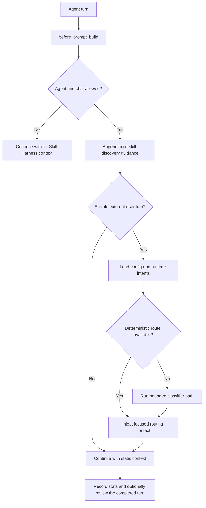

# Skill Harness

[](https://github.com/openclaw/openclaw)
[](https://opensource.org/licenses/MIT)

Skill Harness is an OpenClaw plugin that selects relevant skills and routing guidance before an agent replies. It keeps the runtime skill catalog out of the fixed system prompt, injects only focused candidates for eligible turns, and can optionally improve runtime intent definitions from evidence gathered after completed turns.

It does not replace OpenClaw agents or skills. It provides a routing layer before a reply and, when enabled, a bounded learning loop after it.

## Quick start

Install from a source checkout for local development and testing:

```bash
git clone https://github.com/ani6439walc/openclaw-plugin-skill-harness.git
cd openclaw-plugin-skill-harness
pnpm install
pnpm run build
openclaw plugins install --link .
openclaw plugins enable skill-harness
openclaw plugins doctor
```

`--link` keeps OpenClaw pointed at the checkout, so future local changes can be rebuilt and tested without reinstalling.

Direct `git:` installation is not supported by this repository layout. The compiled `dist/` entry is not tracked in Git, and OpenClaw's Git installer does not run this development build.

If the Gateway is unmanaged or automatic config reload is disabled, restart it after installing or enabling the plugin:

```bash
openclaw gateway restart
openclaw gateway status --deep --require-rpc
openclaw plugins inspect skill-harness --runtime --json
openclaw plugins doctor
```

`openclaw plugins list` and plain `openclaw plugins inspect skill-harness` are cold inventory checks. They do not prove that the running Gateway loaded the plugin hooks and tools.

## What it solves

Large skill catalogs create two practical problems:

- Loading every skill description wastes prompt space and adds irrelevant context.
- Static routing rules miss better workflows, trigger phrases, and boundaries discovered through real use.

Skill Harness addresses both:

1. **Focused context per turn.** Eligible user turns receive focused `<domain_skill_candidates>` and, when justified, a concise instruction hint. The fixed system context does not include the runtime skill inventory.
2. **Evidence-gated routing improvements.** Optional Intent Review distinguishes recommendations from actual adoption and can refine runtime intent Markdown and selected review trigger keywords. It does not train the base model or rewrite skill files.

## How it works



The routing pipeline uses cheap deterministic evidence before helper-model calls. Exact fast paths, high-confidence same-topic continuations, and clear changed-topic matches can avoid classification. Uncertain cases use a conservative candidate projection when evidence supports it; otherwise they fail open to the full eligible catalog.

For lifecycle contracts, projection rules, helper subagents, dynamic prompt shape, and fail-open behavior, read [Architecture](docs/architecture.md).

## Observed local results

One local deployment recorded these operational measurements between 2026-07-08 and 2026-07-19. They are not a synthetic benchmark and should not be treated as a provider-token estimate.

- **840 routed turns:** 96.8% mapped to a named intent rather than the `other` fallback, with 91.0% average classification confidence.
- **193 skill-assisted turns:** 331 recorded skill usages, tracked separately from recommendation telemetry.
- **63.0% measured recommendation adoption:** 17 of 27 recommended-skill opportunities were followed by actual use.
- **Smaller classifier catalog:** on 21 classifier-bound turns, the candidate set fell from 66.0 to 6.1 intents on average, a 90.7% reduction.
- **Smaller rendered catalog:** average catalog size fell from 48,948 to 4,044 Unicode code points, a 91.7% reduction; average local projection time was 1.14 ms.

See [Metrics](docs/metrics.md) for definitions, runtime files, and interpretation limits.

## Basic configuration

Configure Skill Harness in `openclaw.json`:

```json5
{
  plugins: {
    entries: {
      "skill-harness": {
        enabled: true,
        config: {
          agents: ["main"],
          allowedChatTypes: ["direct"],
          model: "google/gemini-3-flash",
          modelFallback: "openai/gpt-5-mini",
          thinking: "medium",
          lowThinkingMode: "fastpath-only",
          queryMode: "recent",
          timeoutMs: 10000,
          instruction: {
            enabled: true,
            thinking: "medium",
            timeoutMs: 20000,
          },
          review: {
            enabled: false,
          },
        },
      },
    },
  },
}
```

### Important options

| Option                             | Default           | Purpose                                                          |
| ---------------------------------- | ----------------- | ---------------------------------------------------------------- |
| `agents`                           | `["main"]`        | OpenClaw agent IDs eligible for scanning.                        |
| `allowedChatTypes`                 | `["direct"]`      | Chat types that may run the scanner.                             |
| `allowedChatIds` / `deniedChatIds` | `[]`              | Optional chat allow-list and deny-list.                          |
| `intentDeny`                       | `{}`              | Per-agent intent deny-list with wildcard-style keys.             |
| `model` / `modelFallback`          | unset             | Scanner model and last-resort resolution fallback.               |
| `thinking`                         | `"medium"`        | Intent-classifier thinking level.                                |
| `lowThinkingMode`                  | `"fastpath-only"` | Behavior when the main agent uses off, minimal, or low thinking. |
| `queryMode` / `contextWindow`      | `"recent"`        | Scanner context and its limits.                                  |
| `timeoutMs`                        | `10000`           | Topic-checker and intent-classifier time budget.                 |
| `instruction.enabled`              | `true`            | Enables post-classification instruction hints.                   |
| `review.enabled`                   | `false`           | Enables post-turn Intent Review.                                 |

Topic Checker, Intent Classifier, Hint Writer, and Intent Review resolve models in this order: explicit configured model, current session model, agent primary model, then configured fallback. A fallback is only a resolution-time last resort; errors, timeouts, parse failures, and validation failures fail open rather than retrying with another model.

## Runtime intents

Runtime intents live under the OpenClaw state directory. With the default local state directory:

```text
~/.openclaw/plugins/skill-harness/intents/*.md
```

On first startup, the plugin seeds bundled examples only when this directory is absent or has no Markdown intent files. Existing runtime intents are never overwritten.

Keep each intent narrow and concrete:

- one user outcome per file
- concrete triggers and examples
- domain metadata that matches the requested outcome
- `fastpath.keywords` only for deterministic shortcuts
- `skills[]` only when the skill genuinely helps
- experience notes for durable pitfalls, commands, and verification steps

The bundled `skill-harness` skill helps agents design, inventory, and extract runtime intent definitions.

## Skill tools

| Tool           | Purpose                                                            |
| -------------- | ------------------------------------------------------------------ |
| `skill_list`   | Broad inventory fallback for broad or uncertain tasks.             |
| `skill_search` | Focused discovery when injected candidates do not fit.             |
| `skill_view`   | Reads a visible skill or allowed support file before use.          |
| `skill_manage` | Authorized write-capable maintenance through the resolved catalog. |

See [Skill tools](docs/skill-tools.md) for visibility, filtering, cache, and search behavior.

## Intent Review

Intent Review is disabled by default. When enabled, it examines completed turns for durable evidence such as successful tool-heavy workflows, repeated tool failures, weak or missing classifications, explicit corrections, and bounded entity-context signals.

Enable it with:

```json5
{
  plugins: {
    entries: {
      "skill-harness": {
        config: {
          review: { enabled: true },
        },
      },
    },
  },
}
```

Review investigates a trigger; it does not treat the trigger as proof. Validated findings can create, refine, split, or merge runtime intents. The reviewer never writes source files, bundled skills, OpenClaw config, memory files, or arbitrary paths.

See [Intent Review](docs/intent-review.md) for safeguards and decision rules.

## Development

```bash
pnpm install
pnpm run format
pnpm run typecheck
pnpm run test
pnpm run build
pnpm pack --dry-run
```

| Command               | Purpose                                                   |
| --------------------- | --------------------------------------------------------- |
| `pnpm run format`     | Format Markdown, JSON, and TypeScript with Prettier.      |
| `pnpm run typecheck`  | TypeScript check without emitting files.                  |
| `pnpm run test`       | Run the Vitest suite.                                     |
| `pnpm run build`      | Compile the plugin to `dist/`.                            |
| `pnpm pack --dry-run` | Inspect package contents before publishing or installing. |

## Troubleshooting

### Plugin does not appear in OpenClaw

```bash
openclaw plugins list
openclaw plugins doctor
pnpm run build
```

### No hints are injected

Check that the plugin is enabled, the current agent and chat type are allowed, the chat ID is not denied, and the scanner model can resolve. With low thinking, `lowThinkingMode: "off"` disables the scanner and `"fastpath-only"` requires a matching fast path. A classifier confidence below `0.8` skips the optional instruction writer but preserves available domain candidates.

### Runtime intents are missing

Start OpenClaw once with the plugin enabled, then inspect:

```bash
ls ~/.openclaw/plugins/skill-harness/intents
```

If the directory exists but is empty, check file permissions and plugin startup logs.

## Further reading

- [Architecture](docs/architecture.md)
- [Metrics](docs/metrics.md)
- [Skill tools](docs/skill-tools.md)
- [Intent Review](docs/intent-review.md)

## License

MIT.
