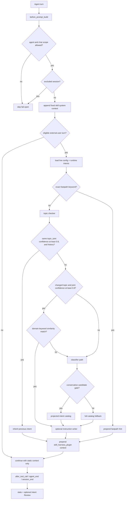

# Skill Harness

[](https://github.com/openclaw/openclaw)
[](https://opensource.org/licenses/MIT)

Skill Harness is an OpenClaw plugin that classifies user intent before the main agent replies, then injects concise routing hints, relevant skill context, and task-specific guidance into the main-agent prompt.

It does not replace OpenClaw's agents. It adds a pre-reply intent-routing and skill-hint layer so each turn can answer questions such as: which skill should be loaded, whether this is a continuation of the same topic, whether the task needs a lightweight answer or a full engineering workflow, and which reusable experience should be preserved.

## What problem does it solve?

OpenClaw already has tools, skills, hooks, and multi-agent workflows, but real usage often runs into these problems:

- **The agent may not know which skill to load**: a user may only say "keep fixing this" or "check the review", leaving the main agent to infer the right workflow from context.
- **Same-topic follow-ups and new tasks can blur together**: a short follow-up may continue the previous task or start a completely different one.
- **A generic system prompt is too coarse**: applying the same instructions to every task can cause over-execution or miss specialized workflows.
- **Useful intent experience needs a home**: successful patterns, recurring mistakes, and missing intent boundaries should be captured after the work is done.
- **Skill recommendations can become noisy**: injecting every skill mentioned by an intent increases prompt noise and makes accidental skill loading more likely.

Skill Harness adds a lightweight classification pass before the main agent runs, so the main agent receives context that is relevant to the current turn instead of a large bundle of generic rules.

## What does this plugin do?

When enabled, Skill Harness provides four main capabilities:

1. **Intent classification**
   - Reads the latest user message and recent conversation context.
   - Classifies the current intent, domain, topic, and confidence. Model-classified turns provide required complexity, while every deterministic route leaves it absent.
   - Handles same-topic continuations, explicit topic switches, short messages, correction fragments, bare names, and similar edge cases.

2. **Skill and hint injection**
   - Appends fixed skill-discovery guidance to authorized main-agent turns.
   - Finds skills related to the matched intent.
   - Prepends dynamic `<domain_skill_candidates>` and an optional `## Instruction Hint` for eligible user turns.
   - Tells the main agent which skills may need to be read and which workflows or pitfalls should be preserved.

3. **Runtime statistics**
   - Records the intent, skills, tools, confidence, known complexity when present, and conservative classifier-projection measurements used for each tracked turn.
   - Aggregates data into `stats.json` so you can see which skills were recommended, adopted, stale, or in need of review.

4. **Intent Review (optional)**
   - Disabled by default.
   - When enabled, checks completed turns for triggers such as successful patterns, tool failures, weak classification, missing intents, and explicit user corrections.
   - Uses a restricted background reviewer to improve runtime intent Markdown when a trigger has enough evidence.

## How it works

Skill Harness works through OpenClaw lifecycle hooks.

Eligible dynamic routing emits an explicit `plugin:skill-harness` lifecycle around its phase events. `pipeline:started` is emitted before any exact fast path or model-backed phase runs; `pipeline:completed` is emitted only after no further phase can run and carries the producer-measured `durationMs`. Unexpected exceptions emit `pipeline:failed` with the same duration contract. Consumers should use this parent lifecycle for overall status and timing rather than treating an individual phase completion as the end of the pipeline.



### 1. Runtime intent catalog

Intent definitions use the OpenClaw runtime state directory. With the default local state directory, they are Markdown files under:

```text
~/.openclaw/plugins/skill-harness/intents/*.md
```

On first install, the plugin seeds example intents from the bundled assets if the runtime intent directory is absent or contains no Markdown intent files. Existing runtime intent Markdown files are never overwritten on startup.

Each intent describes:

- a filename-derived intent ID plus frontmatter metadata such as domain, triggers, examples, fastpath keywords, optional classifier-only `candidate` metadata, and optional `skills[]` dependencies
- workflow guidance for the instruction writer
- pitfalls and experience notes that should be preserved when relevant

### 2. Fast paths before model calls

The plugin prefers cheap deterministic checks before calling helper models:

- exact `fastpath.keywords` match can inject a short hint immediately and leaves complexity absent
- topic checker can inherit the previous intent only for same-topic results with joint confidence at or above `0.8` and available history; inherited results keep the prior intent and confidence while refreshing topic, domain, and keywords from the latest topic check, but always leave complexity absent regardless of the historical value
- uncertain same-topic results and same-topic results without history bypass keyword similarity and reach the classifier path
- domain keyword similarity can route clear changed-topic cases only when the same joint-confidence threshold passes; these deterministic results leave complexity absent rather than synthesizing a default
- turns that reach the classifier use a deterministic conservative candidate projection when the current domain plus high confidence, authorized same-topic history, or exact candidate evidence provides enough support; missing or weak evidence uses the post-deny full catalog without a second classifier call
- projected candidates preserve canonical catalog order and include the predicted domain, `candidate.scope: cross-flow` intents, authorized low-confidence history, and exact matches against manual `candidate.keywords` or normalized intent IDs; denied and removed intents cannot be reintroduced
- exact projection phrases use NFKC, locale-independent lowercasing, and collapsed whitespace with boundary-safe matching; punctuation remains literal, so hyphens and underscores are not interchangeable aliases
- the bounded session manifest records the decision, original/candidate counts, canonical candidate IDs, and per-candidate selection reasons and matched metadata keywords; classifier parse failures and thrown classifier calls still count as eligible projection attempts without inventing an intent result
- low-thinking turns can skip LLM scanner calls while preserving deterministic fastpaths

This keeps routine routing cheap and reduces unnecessary helper-model work.

### 3. Helper subagents

When deterministic routing is not enough, Skill Harness runs bounded helper subagents:

- **topic checker**: returns required `basis`, `reason`, joint `confidence`, keywords, topic, and domain; confidence measures the combined correctness of reason, domain, and keywords, while host code derives the internal `changed` flag from `reason`
- **intent classifier**: returns structured JSON for intent, domain, topic, confidence, keywords, and the final complexity for model-classified turns
- **instruction writer**: runs only when resolved intent confidence is at least `0.8` and treats the resolved intent as the task boundary. When complexity is known, it receives the matching execution-depth calibration; when complexity is absent, it still runs without complexity metadata or an `execution_mode` block. It returns raw JSON with an optional `instruction_hint` plus `additional_candinate_skills`, the sole machine-readable channel for new skill candidates. When existing evidence is insufficient, it chooses one bounded branch: either read one existing candidate, or run one focused `skill_search` (limited to three results) followed by one `skill_view` of the strongest new result. Only newly searched skills that appear in that search result may appear in the array, and it must include the directly viewed skill. The host validates the tool order, results, viewed name, and returned candidates against the embedded-run trace; missing, mismatched, failed, or over-budget evidence discards unverified additional candidates while preserving a parser-valid instruction hint and classifier/domain fail-open guidance. Existing intent/domain candidates are not repeated there. If no incremental guidance is justified, the writer returns `instruction_hint: null` with an empty array; this is a successful no-op, so domain candidates remain available without injecting an instruction hint. Resolved additional skill names are deduplicated into `domain_skill_candidates`; unknown or invisible names are ignored.
- **Intent Review reviewer**: optional post-turn reviewer that improves runtime intents when configured triggers fire

All helper outputs are treated as guidance, not user-visible final answers.

### 4. Static system context and dynamic prompt context

After agent and chat scope checks pass, Skill Harness returns a fixed `appendSystemContext` for the main agent. It requires active skill discovery and documents the four Skill Harness tools, but contains no runtime skill inventory, skill paths, intent result, or generated hint. Internal/inter-session turns, explicit non-user triggers, and turns with an omitted trigger receive this static context without running classification.

Skill Harness returns no context for its own embedded-agent sessions, generic subagent sessions, Intent Review subagents, dreaming sessions, or active-memory sessions. These exclusions take precedence over trigger type. Disabled agents, disallowed or unknown chat types, and chat-ID allow/deny rules also prevent both static and dynamic injection.

Eligible external-user turns may additionally receive dynamic `prependContext`. The dynamic injection is wrapped in:

```xml
<skill_harness_plugin>
  <context_policy>...</context_policy>
  <domain_skill_candidates>
    <skill>
      <name>...</name>
      <description>...</description>
      <path>...</path>
      <related_skills>
        <related_skill>
          <name>...</name>
          <reason>...</reason>
          <direction>current-to-related | related-to-current</direction>
        </related_skill>
      </related_skills>
    </skill>
  </domain_skill_candidates>
  ## Instruction Hint
  ...
</skill_harness_plugin>
```

The policy tells the main agent:

- each domain skill candidate includes its resolved `path` plus direct visible `related_skills` metadata; related skills remain optional rather than automatically required
- irrelevant skill hints should be ignored if classification is wrong
- generated instruction hints are advisory and must still be checked against the latest user request and verified context
- when complexity is known, instruction-writer depth and suggested verification use fixed built-in calibration for that level; missing complexity does not fall back to `medium`. These calibrations do not define main-agent execution, planning, delegation, or scheduling policy

Fixed mandatory guidance is not repeated inside this dynamic block. If an injected candidate or hint does not fit the current task, the static workflow directs the main agent to use focused `skill_search` and then read selected results with `skill_view`.

The static prompt describes the four registered tools with availability-conditional wording and requires the agent to use only tools actually exposed to that turn. Current OpenClaw `before_prompt_build` hooks do not expose the final per-turn tool-name set, so normal main-agent availability of the registered Skill Harness tools is a deployment contract rather than a runtime-detected fact. Restricted runs must obey their narrower tool allowlist and workflow.

### 5. Fail-open design

Skill Harness should improve routing, not block OpenClaw.

If config loading, classification, stats, or review fails, the plugin logs the issue and lets the main agent continue. After static authorization succeeds, dynamic routing failures preserve the fixed system context while omitting the failed hint. Review failures do not block the user reply.

## Installation

### Requirements

- OpenClaw `2026.6.11` or newer
- Node.js environment supported by OpenClaw
- `pnpm`

The package declares compatibility with OpenClaw Plugin API and Gateway `>=2026.6.11`.

### Install from a local checkout

This is the safest path for development and local testing:

```bash
git clone https://github.com/ani6439walc/openclaw-plugin-skill-harness.git
cd openclaw-plugin-skill-harness
pnpm install
pnpm run build
openclaw plugins install --link .
openclaw plugins enable skill-harness
openclaw plugins doctor
```

`--link` keeps OpenClaw pointed at the checkout, so future local edits can be rebuilt and tested without reinstalling.

### Install from a git source

OpenClaw's plugin installer accepts git repository specs. If your OpenClaw install policy allows remote plugin installs:

```bash
openclaw plugins install https://github.com/ani6439walc/openclaw-plugin-skill-harness.git
openclaw plugins enable skill-harness
openclaw plugins doctor
```

If your environment blocks remote plugin installation, clone locally and use the linked install flow above.

### Verify installation

```bash
openclaw plugins list
openclaw plugins inspect skill-harness
openclaw plugins doctor
```

After the plugin starts once, check that runtime data was created. This command uses the default local state directory:

```bash
ls ~/.openclaw/plugins/skill-harness/intents
```

## Basic configuration

Skill Harness is configured through OpenClaw plugin config. A typical `openclaw.json` entry looks like:

```json5
{
  plugins: {
    entries: {
      "skill-harness": {
        enabled: true,
        config: {
          agents: ["main"],
          allowedChatTypes: ["direct"],
          model: "google/gemini-3-flash",
          modelFallback: "openai/gpt-5-mini",
          thinking: "medium",
          lowThinkingMode: "fastpath-only",
          queryMode: "recent",
          timeoutMs: 3000,
          instruction: {
            enabled: true,
            thinking: "medium",
            timeoutMs: 30000,
          },
          review: {
            enabled: false,
          },
        },
      },
    },
  },
}
```

### Important options

| Option                | Default           | What it controls                                                                       |
| --------------------- | ----------------- | -------------------------------------------------------------------------------------- |
| `agents`              | `["main"]`        | Which OpenClaw agent IDs are eligible for scanning.                                    |
| `allowedChatTypes`    | `["direct"]`      | Which chat types may run the scanner: `direct`, `group`, `channel`, or `explicit`.     |
| `allowedChatIds`      | `[]`              | Optional allow-list of chat IDs. Empty means no allow-list restriction.                |
| `deniedChatIds`       | `[]`              | Chat IDs that should always skip Skill Harness.                                        |
| `intentDeny`          | `{}`              | Per-agent deny-list for intent IDs; supports wildcard-style agent keys and intent IDs. |
| `model`               | `null`            | Explicit lightweight scanner model; see resolution order below.                        |
| `modelFallback`       | `null`            | Last-resort scanner model; see resolution order below.                                 |
| `thinking`            | `"medium"`        | Thinking level for the intent classifier helper.                                       |
| `lowThinkingMode`     | `"fastpath-only"` | Behavior when the main agent uses off/minimal/low thinking.                            |
| `queryMode`           | `"recent"`        | Context sent to scanner: latest message, recent turns, or full history.                |
| `contextWindow`       | built-in limits   | Recent user/assistant turn and character limits.                                       |
| `timeoutMs`           | `3000`            | Time budget for each scanner helper run.                                               |
| `instruction.enabled` | `true`            | Whether to generate short instruction hints after intent classification.               |
| `review.enabled`      | `false`           | Whether to run post-turn Intent Review and update runtime intents.                     |

Topic Checker, Intent Classifier, Hint Writer, and Intent Review models all resolve in this order: explicit configured model, current session model, agent primary model, then configured fallback. Topic Checker and Intent Classifier share the top-level `model` and `modelFallback`. Hint Writer and Intent Review inherit those top-level values when their dedicated `instruction.*` or `review.*` model fields are unset. Every fallback is a resolution-time last resort; model errors, timeouts, parse failures, and validation failures fail open without a runtime retry.

## Customizing intents

Runtime intents use OpenClaw's runtime state directory. With the default local state directory, they live here:

```text
~/.openclaw/plugins/skill-harness/intents/*.md
```

Edit these files to teach Skill Harness your own routing boundaries and workflows. Good intent files should be narrow and concrete:

- one clear intent boundary per file
- concrete trigger phrases and examples
- domain metadata that matches the outcome the user wants
- optional `fastpath.keywords` for deterministic shortcut cases
- relevant frontmatter `skills[]` entries only when that skill should actually help
- experience notes that preserve real pitfalls, commands, parameters, or verification steps

The plugin also ships a bundled `skill-harness` skill for designing, inventorying, and extracting intent definitions. Use it when you want an agent to help maintain the runtime intent catalog.

## Skill tools exposed to OpenClaw

Skill Harness registers four OpenClaw tools:

| Tool           | Purpose                                                                                                                             |
| -------------- | ----------------------------------------------------------------------------------------------------------------------------------- |
| `skill_list`   | Broad inventory fallback when the task is broad, terminology is uncertain, or focused search is insufficient.                       |
| `skill_search` | Focused deterministic discovery when injected candidates do not match the task. Results are candidates only.                        |
| `skill_view`   | Reads a visible skill or allowed support file. Read the complete skill before following its workflow.                               |
| `skill_manage` | Authorized, write-capable skill maintenance through the main agent's resolved catalog; prefer focused patches and verify mutations. |

`skill_list`, `skill_search`, and `skill_view` use the same invoking-agent skill-root resolution as prompt hints, so each agent sees its own resolved catalog. Intent metadata used to derive domains and search matches is also filtered for the invoking agent. `skill_manage` resolves existing skills through the main agent and creates new skills under the managed state root.

`skill_list` omits `usage_stats` and `related_skills` by default. Pass `show_stats: true` and/or `show_related: true` to include those fields. `skill_list` and `skill_view` resolve the skill roots for the invoking agent, and `skill_view` always includes `related_skills`, including both declared and incoming visible relations.

`skill_search` requires at least one non-empty `query`, `source`, `domains`, or `keywords` criterion. It defaults to 20 results and caps `limit` at 100. Search is case-insensitive, applies Unicode normalization, treats `domains` as a case-insensitive OR filter, and returns match evidence by default. Pass `show_matches: false` for a compact response, or opt into `usage_stats` and `related_skills` with `show_stats: true` and `show_related: true`. Search results help callers choose a candidate; callers should still use `skill_view` before following a skill workflow. Search does not replace the `before_prompt_build` routing pipeline.

### Visibility policy

Skill Harness deliberately treats `skill_list`, `skill_search`, and `skill_view` as an inventory of the invoking agent's resolved skill roots. It does **not** apply OpenClaw's `agents.defaults.skills` or `agents.list[].skills` allowlists while indexing those roots. The invoking agent still selects its workspace roots, but the tool result remains an unfiltered inventory from those roots, subject to source precedence and disabled bundled skill entries. Do not add `resolveAgentSkillsFilter()` or equivalent per-agent allowlist filtering without an explicit product decision and matching migration, documentation, and tests.

The index cache follows OpenClaw's `skills.load` watcher settings. When `watch: true` and `watchDebounceMs` is a valid non-negative number, `watchDebounceMs` becomes the cache TTL; otherwise Skill Harness retains the 60-second default. This is cache polling rather than a filesystem watcher, so a skill file change is observed on the next list, search, or view operation after the selected TTL expires.

## Runtime files

Skill Harness keeps package files and runtime state separate. The runtime data root is derived from OpenClaw's resolved state directory; the paths below show the default local location.

| Path                                            | Purpose                                                                    |
| ----------------------------------------------- | -------------------------------------------------------------------------- |
| `~/.openclaw/plugins/skill-harness/intents/`    | Editable runtime intent catalog.                                           |
| `~/.openclaw/plugins/skill-harness/sessions/`   | Per-session JSON snapshots for audit and review context.                   |
| `~/.openclaw/plugins/skill-harness/stats.json`  | Schema-v2 intent, skill, tool, routing, projection, and daily usage stats. |
| `~/.openclaw/plugins/skill-harness/review.json` | Intent Review trigger keywords and processed event outcomes.               |

Session cleanup preserves the ended session and only removes expired `sessions/*.json` files. It does not delete root-level `stats.json`, root-level `review.json`, intent files, skills, transcripts, or package files.

`stats.json` schema v2 adds bounded classifier-projection aggregates: eligible/projected/full-fallback counts and rates, average original/candidate intent counts and rendered catalog code points, average projection duration, reason counts, and daily projection counters. Complexity buckets count only turns with known complexity, so `low + medium + high` may be lower than the intent's total turn count. Classifier-bound attempts remain eligible when result parsing or classifier execution fails, but those attempts do not increment intent-turn summaries. Valid v1 files migrate on the next recorded turn without losing existing intent, skill, tool, routing, daily, or processed-event data. Invalid files remain untouched and fail open. Skill usage readers remain version-agnostic and accept both schemas.

## Intent Review

Intent Review is disabled by default. When enabled, it watches completed turns for signals such as:

- many tool calls that suggest a reusable skill candidate
- repeated tool failures that indicate a process gap
- successful tool-heavy patterns worth preserving
- weak or missing intent classification
- explicit user correction phrases
- bounded entity-context learning signals

When a trigger fires, a background reviewer runs against the runtime intent directory only. It may create, refine, split, or merge runtime `intents/*.md`. It validates the staged catalog before applying targeted changes and records the outcome in `review.json`. It does not write source files, bundled skills, OpenClaw config, memory files, or arbitrary filesystem paths.

The reviewer evaluates each requested trigger independently. Trigger activation starts an investigation but is not evidence by itself; after trigger-specific evidence, durability, scope, and existing coverage qualify a correction, the reviewer prefers the smallest valid change over a no-finding result. The staged workspace copy is authoritative for current intent content, while the queued review snapshot remains historical turn and routing evidence. Every accepted review run must contain a valid positive or no-finding decision for every requested trigger; omitted or schema-invalid decisions are recorded as `schema-rejected` with sanitized `missing-trigger-decision` counts.

## Development

From the repository root:

```bash
pnpm install
pnpm run format
pnpm run typecheck
pnpm run test
pnpm run build
pnpm pack --dry-run
```

Command meanings:

| Command               | Purpose                                                   |
| --------------------- | --------------------------------------------------------- |
| `pnpm run format`     | Format Markdown, JSON, and TypeScript with Prettier.      |
| `pnpm run typecheck`  | TypeScript check without emitting files.                  |
| `pnpm run test`       | Run the Vitest suite.                                     |
| `pnpm run build`      | Compile the plugin to `dist/`.                            |
| `pnpm pack --dry-run` | Inspect package contents before publishing or installing. |

## Troubleshooting

### Plugin does not appear in OpenClaw

Run:

```bash
openclaw plugins list
openclaw plugins doctor
```

Then confirm the package was built:

```bash
pnpm run build
```

### No hints are injected

Check these common causes:

- plugin is disabled in `openclaw.json`
- current agent ID is not listed in `agents`
- chat type is not listed in `allowedChatTypes`
- chat ID is blocked by `deniedChatIds`
- main agent uses low thinking and `lowThinkingMode` is `off` or `fastpath-only` without a fastpath match
- scanner model cannot be resolved and no fallback is configured
- classifier confidence is below `0.8`, which skips the optional instruction writer while preserving available domain candidates

### Runtime intents are missing

Start OpenClaw once with the plugin enabled, then inspect the default local runtime location:

```bash
ls ~/.openclaw/plugins/skill-harness/intents
```

If the directory exists but is empty, verify file permissions and plugin startup logs.

## License

MIT.
