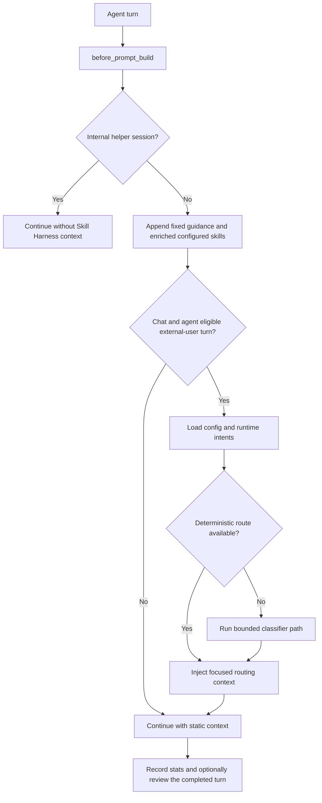

# Skill Harness

[](https://github.com/openclaw/openclaw)
[](https://opensource.org/licenses/MIT)

Skill Harness is an OpenClaw plugin that selects relevant skills and routing guidance before an agent replies. It keeps the runtime skill catalog out of the fixed system prompt, injects only focused candidates for eligible turns, and can optionally improve runtime intent definitions from evidence gathered after completed turns.

It does not replace OpenClaw agents or skills. It provides a routing layer before a reply and, when enabled, a bounded learning loop after it.

## Quick start

Install from a source checkout for local development and testing:

```bash
git clone https://github.com/ani6439walc/openclaw-plugin-skill-harness.git
cd openclaw-plugin-skill-harness
pnpm install
pnpm run build
openclaw plugins install --link .
openclaw plugins enable skill-harness
openclaw plugins doctor
```

`--link` keeps OpenClaw pointed at the checkout, so future local changes can be rebuilt and tested without reinstalling.

Direct `git:` installation is not supported by this repository layout. The compiled `dist/` entry is not tracked in Git, and OpenClaw's Git installer does not run this development build.

If the Gateway is unmanaged or automatic config reload is disabled, restart it after installing or enabling the plugin:

```bash
openclaw gateway restart
openclaw gateway status --deep --require-rpc
openclaw plugins inspect skill-harness --runtime --json
openclaw plugins doctor
```

`openclaw plugins list` and plain `openclaw plugins inspect skill-harness` are cold inventory checks. They do not prove that the running Gateway loaded the plugin hooks and tools.

## What it solves

Large skill catalogs create two practical problems:

- Loading every skill description wastes prompt space and adds irrelevant context.
- Static routing rules miss better workflows, trigger phrases, and boundaries discovered through real use.

Skill Harness addresses both:

1. **Focused routing context per turn.** Eligible user turns receive the selected intent, its one routing-guidance sentence, direct matched-intent skill candidates, and bounded skill experiences. The fixed system context does not include the runtime skill inventory.
2. **Evidence-gated routing improvements.** Optional Intent Review distinguishes recommendations from actual adoption and can refine runtime intent Markdown and selected review trigger keywords. It does not train the base model or rewrite skill files.
3. **Session-local recommendation curation.** The enabled-by-default background curator refines a topic epoch's direct skill candidates and bounded experience references without changing intent definitions, skill files, or Review state.

## How it works


```mermaid
graph TD
  A[Agent turn] --> B[before_prompt_build]
  B --> C{Internal helper session?}
  C -->|Yes| Z[Continue without Skill Harness context]
  C -->|No| D[Append fixed guidance and enriched configured skills]
  D --> E{Chat and agent eligible external-user turn?}
  E -->|No| M[Continue with static context]
  E -->|Yes| F[Load config and runtime intents]
  F --> G{Deterministic route available?}
  G -->|Yes| H[Inject focused routing context]
  G -->|No| I[Run bounded classifier path]
  I --> H
  H --> M
  M --> N[Record stats and optionally review the completed turn]
```

Every non-excluded normal agent turn receives static skill-discovery context, regardless of chat allow/deny scope. Its `<configured_skills>` block is the ordered union of explicit `agents.*.skills` configuration and skills discovered from that agent's workspace `skills/` tree; explicit order is preserved, workspace-only skills are appended, and the workspace winner is used for duplicate names. The plugin `agents` option and chat scope limit dynamic intent routing only. The routing pipeline uses cheap deterministic evidence before helper-model calls. Exact fast paths, high-confidence same-topic continuations, and clear changed-topic matches can avoid classification. Uncertain cases use a conservative candidate projection when evidence supports it; otherwise they fail open to the full eligible catalog.

For lifecycle contracts, projection rules, helper subagents, dynamic prompt shape, and fail-open behavior, read [Architecture](docs/architecture.md).

## Observed local results

One local deployment recorded these operational measurements between 2026-07-08 and 2026-07-19. They are not a synthetic benchmark and should not be treated as a provider-token estimate. They predate the session-curation cutover, so they are a historical baseline rather than a measured before/after comparison for the current curation behavior.

- **840 routed turns:** 96.8% mapped to a named intent rather than the `other` fallback, with 91.0% average classification confidence.
- **193 skill-assisted turns:** 331 recorded skill usages, tracked separately from recommendation telemetry.
- **63.0% measured recommendation adoption:** 17 of 27 recommended-skill opportunities were followed by actual use.
- **Smaller classifier catalog:** on 21 classifier-bound turns, the candidate set fell from 66.0 to 6.1 intents on average, a 90.7% reduction.
- **Smaller rendered catalog:** average catalog size fell from 48,948 to 4,044 Unicode code points, a 91.7% reduction; average local projection time was 1.14 ms.

See [Metrics](docs/metrics.md) for definitions, runtime files, and interpretation limits.

## Basic configuration

Configure Skill Harness in `openclaw.json`:

```json5
{
  plugins: {
    entries: {
      "skill-harness": {
        enabled: true,
        config: {
          agents: ["main"],
          allowedChatTypes: ["direct"],
          model: "google/gemini-3-flash",
          modelFallback: "openai/gpt-5-mini",
          thinking: "medium",
          lowEffortRoutingMode: "fastpath-only",
          queryMode: "recent",
          timeoutMs: 5000,
          curation: {
            enabled: true,
          },
          review: {
            enabled: false,
          },
        },
      },
    },
  },
}
```

### Important options

| Option                                 | Default           | Purpose                                                                                             |
| -------------------------------------- | ----------------- | --------------------------------------------------------------------------------------------------- |
| `agents`                               | `["main"]`        | OpenClaw agent IDs eligible for scanning.                                                           |
| `allowedChatTypes`                     | `["direct"]`      | Chat types that may run the scanner.                                                                |
| `allowedChatIds` / `deniedChatIds`     | `[]`              | Optional chat allow-list and deny-list.                                                             |
| `model` / `modelFallback`              | unset             | Scanner model and last-resort resolution fallback.                                                  |
| `thinking`                             | `"medium"`        | Intent-classifier thinking level.                                                                   |
| `lowEffortRoutingMode`                 | `"fastpath-only"` | Routing behavior when the main agent uses off, minimal, or low reasoning effort.                    |
| `queryMode` / `contextWindow`          | `"recent"`        | Scanner context and its limits.                                                                     |
| `timeoutMs`                            | `5000`            | Topic-checker and intent-classifier time budget.                                                    |
| `curation.enabled`                     | `true`            | Enables session-local direct-skill and experience recommendation curation, independently of Review. |
| `curation.model` / `modelFallback`     | unset             | Optional dedicated curator model and resolution fallback.                                           |
| `curation.thinking` / `timeoutSeconds` | `"medium"` / `30` | Curator thinking level and time budget in seconds.                                                  |

| `review.enabled` | `false` | Enables post-turn Intent Review. |
| `review.timeoutSeconds` | `300` | Intent Review time budget in seconds. |
| `review.triggers.skillPlacement.enabled` | `true` | Reviews one eligible resolved skill for placement in a runtime intent when Review is enabled. |

Topic Checker, Intent Classifier, background Curator, and Intent Review resolve models in this order: their explicit configured model, the top-level model when applicable, current session model, agent primary model, then their configured fallback. A fallback is only a resolution-time last resort; errors, timeouts, parse failures, and validation failures fail open rather than retrying with another model.

### Upgrade from the removed instruction writer

This release intentionally removes `plugins.entries.skill-harness.config.instruction`. OpenClaw validates the strict plugin config schema before the plugin runtime loads, so a retained `instruction` block prevents the upgraded plugin from loading.

Before upgrading, remove the entire legacy `instruction: { ... }` block from `plugins.entries.skill-harness.config`. There is no automatic migration or compatibility parser. Do not copy its writer model, thinking, timeout, or trigger settings into `curation`: curation is a separate session-local recommendation feature with different behavior.

## Runtime intents

Runtime intents live under the OpenClaw state directory. With the default local state directory:

```text
~/.openclaw/plugins/skill-harness/intents/*.md
~/.openclaw/plugins/skill-harness/experiences/<skill>/<entry>.md
```

On first startup, the plugin seeds bundled examples only when this directory is absent or has no Markdown intent files. Existing runtime intents are never overwritten.

Intent files remain YAML-frontmatter-only routing definitions. Experience files are separate, skill-scoped Markdown records with `skill`, `summary`, and `keywords` frontmatter; they are injected only when a session-local curation record selects the matching direct skill and experience reference.

### Runtime Review state

Intent Review keeps its runtime state at the data-root level:

```text
~/.openclaw/plugins/skill-harness/review.json             # schema v6
~/.openclaw/plugins/skill-harness/keyword-coverage.json   # schema v1
```

This plugin version supports only those current schemas. It does not migrate, recover, or rewrite legacy `review.json` schema v5 state. Upgrade a legacy installation through a compatible release before installing this version; otherwise Review and keyword coverage state remain fail-open rather than being converted automatically.

Keep each intent narrow and concrete:

- one user outcome per file
- concrete triggers and examples
- domain metadata that matches the requested outcome
- `fastpath.keywords` only for deterministic shortcuts
- `skills[]` only when the skill genuinely helps
- one durable `guidance` sentence for routing behavior

### Human maintenance skill

The bundled `skill-harness` skill is the explicit human-maintenance surface for runtime intents, Review keyword evidence, and privacy-safe runtime health analysis. It has five modes:

- `inventory` — audit the complete resolved skill/tool/intent catalog, cluster capabilities by user goal, and identify coverage gaps after a calibration checkpoint;
- `design` — create, refine, rename, split, or merge one intent through a staged preview and confirmation workflow;
- `extract` — score intent complexity, identify independent responsibilities, and draft skill blueprints plus a slimmed intent after approval;
- `keyword-audit` — generate a private, report-only cross-session analysis of Review keyword matches, misses, and collisions, then propose a bounded delta without writing runtime state.
- `runtime-health` — generate a private, report-only aggregate snapshot of Review outcomes, coverage state, v3/v4 stats, session retention, curation state, and agent-artifact growth without exposing retained text or modifying runtime state.

This skill does not manually repeat production-owned work: per-turn classification and routing injection, startup seeding, trigger-driven intent edits, trigger-keyword persistence, skill-placement review, stats aggregation, or session cleanup. Broad routing changes and skill extraction remain human-owned because they require semantic calibration and explicit write approval.

## Skill tools

| Tool               | Purpose                                                            |
| ------------------ | ------------------------------------------------------------------ |
| `skill_list`       | Broad inventory fallback for broad or uncertain tasks.             |
| `skill_search`     | Focused discovery when injected candidates do not fit.             |
| `skill_view`       | Reads a visible skill or allowed support file before use.          |
| `skill_manage`     | Authorized write-capable maintenance through the resolved catalog. |
| `skill_experience` | Searches bounded runtime experiences for currently visible skills. |

See [Skill tools](docs/skill-tools.md) for visibility, filtering, cache, and search behavior.

## Intent Review

Intent Review is disabled by default. When enabled, it examines completed turns for durable evidence such as successful tool-heavy workflows, repeated tool failures, weak or missing classifications, explicit corrections, and bounded entity-context signals.

Enable it with:

```json5
{
  plugins: {
    entries: {
      "skill-harness": {
        config: {
          review: { enabled: true },
        },
      },
    },
  },
}
```

Review investigates a trigger; it does not treat the trigger as proof. Validated findings can create, refine, split, or merge runtime intents; autonomous standalone deletion is not supported. The host derives a canonical operation from a uniquely classifiable staged file lifecycle before applying it, so an incorrect model label does not discard an otherwise valid change. It never guesses when targets are both created and deleted, and it keeps standalone deletion unsupported. The reviewer never writes source files, bundled skills, OpenClaw config, memory files, or arbitrary paths.

The `successful-pattern`, `behavior-fix`, and `entity-context` triggers may also return a JSON-only trigger-keyword finding. Each finding is limited to its own requested trigger and at most three additions and three removals. The host validates and deduplicates the delta, records it under the independently locked `keyword-coverage.json`, writes atomically, and refreshes the live keyword cache; the reviewer never edits runtime state itself.

This automatic keyword learning is event-driven, not a corpus audit. Each keyword-capable trigger must first pass its structural gates **and match an existing keyword** before it can request a keyword finding. Separately, opt-in keyword coverage runs every configured accepted-turn cadence, scans retained sessions for bounded target-specific addition gaps or complete cross-session removal evidence, and uses a tool-free two-stage reviewer. Failed epochs retry every five accepted turns without blocking the main agent. The bundled `keyword-audit` mode covers that evidence gap as a private report-and-proposal workflow, but it does not persist approved changes manually.

The `skill-placement` trigger consumes current per-agent resolved-inventory observations. It selects at most one skill per accepted turn, prioritizes an existing low-adoption `needsReview` signal, and otherwise requires 20 continuous observations with zero recommendations and zero usage. The host resolves and supplies only the selected skill's bounded content plus the complete intent catalog; the placement reviewer may refine exactly one existing runtime intent and cannot inspect, create, or modify skills. `applied` and `nofinding` outcomes atomically record the skill epoch; failed or invalid review runs release it for retry.

See [Intent Review](docs/intent-review.md) for safeguards and decision rules.

## Development

```bash
pnpm install
pnpm run format
pnpm run typecheck
pnpm run test
pnpm run build
pnpm pack --dry-run
```

| Command               | Purpose                                                   |
| --------------------- | --------------------------------------------------------- |
| `pnpm run format`     | Format Markdown, JSON, and TypeScript with Prettier.      |
| `pnpm run typecheck`  | TypeScript check without emitting files.                  |
| `pnpm run test`       | Run the Vitest suite.                                     |
| `pnpm run build`      | Compile the plugin to `dist/`.                            |
| `pnpm pack --dry-run` | Inspect package contents before publishing or installing. |

## Current implementation status

The current plugin registers the complete runtime lifecycle: prompt construction,
tool-call tracking, persisted tool results, agent finalization/end, and session
cleanup. It also registers `skill_list`, `skill_search`, `skill_view`,
`skill_manage`, and `skill_experience`.

On startup, the plugin initializes its runtime data root, loads the runtime
intent catalog, and seeds bundled example intents only when the runtime catalog
has no Markdown files. Existing runtime intents are not overwritten.

Routing is fail-open. Eligible turns first use deterministic exact-keyword
routing; the classifier path runs only when a scanner model resolves and the
turn is not excluded by the configured low-effort mode. Every eligible normal
agent still receives the fixed skill-discovery context even when dynamic intent
routing is skipped or fails.

Session-local curation is enabled by default and is queued in the background.
Intent Review is disabled by default; when enabled, its runtime edits and
keyword-coverage writes are serialized so concurrent reviews cannot race on the
runtime catalog.

`pnpm run typecheck` and `pnpm run test` verify the checkout. They do not prove
that a running OpenClaw Gateway has loaded this build or that its live plugin
configuration and runtime data are healthy; use the runtime inspection commands
in the troubleshooting section for that verification.

## Troubleshooting

### Plugin does not appear in OpenClaw

```bash
openclaw plugins list
openclaw plugins doctor
pnpm run build
```

### No hints are injected

Check that the plugin is enabled, the current agent and chat type are allowed, the chat ID is not denied, and the scanner model can resolve. With low reasoning effort, `lowEffortRoutingMode: "off"` disables the scanner and `"fastpath-only"` requires a matching fast path. A classifier confidence below `0.8` remains conservative and injects only routing context derived from the selected intent's direct skills.

### Runtime intents are missing

Start OpenClaw once with the plugin enabled, then inspect:

```bash
ls ~/.openclaw/plugins/skill-harness/intents
```

If the directory exists but is empty, check file permissions and plugin startup logs.

## Further reading

- [Architecture](docs/architecture.md)
- [Metrics](docs/metrics.md)
- [Skill tools](docs/skill-tools.md)
- [Intent Review](docs/intent-review.md)

## License

MIT.

---

_🌸 Powered by Ani, Wan Jiun Wei © 2026_
