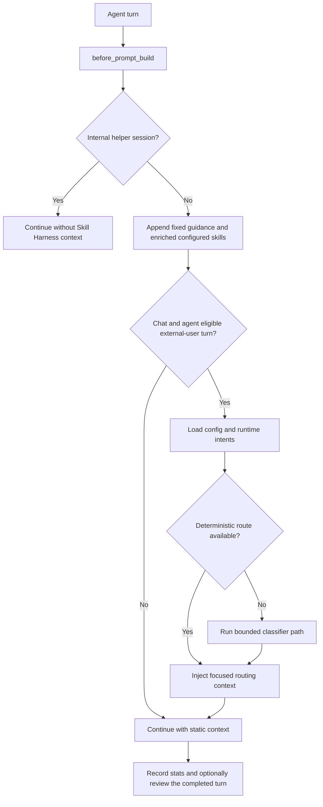

# Skill Harness

[](https://github.com/openclaw/openclaw)
[](https://opensource.org/licenses/MIT)

Skill Harness is an OpenClaw plugin that selects relevant skills and routing guidance before an agent replies. It keeps the runtime skill catalog out of the fixed system prompt, injects only focused candidates for eligible turns, and can optionally improve runtime intent definitions from evidence gathered after completed turns.

It does not replace OpenClaw agents or skills. It provides a routing layer before a reply and, when enabled, a bounded learning loop after it.

## Quick start

Install from a source checkout for local development and testing:

Development and CI use the pnpm release declared by `packageManager` in
`package.json`. Keep that field as the single version source for local tooling
and `pnpm/action-setup`; do not duplicate the version in workflow YAML.

```bash
git clone https://github.com/ani6439walc/openclaw-plugin-skill-harness.git
cd openclaw-plugin-skill-harness
pnpm install --frozen-lockfile
pnpm run typecheck
pnpm run test
pnpm run build
pnpm pack --dry-run
openclaw plugins install --link .
```

`--link` keeps OpenClaw pointed at the checkout, so future local changes can be rebuilt and tested without reinstalling.

Before enabling the plugin, add its mandatory QMD services to `openclaw.json`. Replace every placeholder with a reachable OpenAI-compatible endpoint and model:

```json5
{
  plugins: {
    entries: {
      "skill-harness": {
        enabled: false,
        config: {
          qmd: {
            embedding: {
              baseUrl: "https://your-embedding-endpoint/v1",
              model: "your-embedding-model",
            },
            expansion: {
              baseUrl: "https://your-openai-compatible-endpoint/v1",
              model: "your-expansion-model",
            },
          },
        },
      },
    },
  },
}
```

Then enable and inspect the plugin:

```bash
openclaw plugins enable skill-harness
openclaw plugins doctor
```

Direct `git:` installation is not supported by this repository layout. The compiled `dist/` entry is not tracked in Git, and OpenClaw's Git installer does not run this development build.

If the Gateway is unmanaged or automatic config reload is disabled, restart it after configuring or enabling the plugin:

```bash
openclaw gateway restart
openclaw gateway status --deep --require-rpc
openclaw plugins inspect skill-harness --runtime --json
openclaw plugins doctor
```

`openclaw plugins list` and plain `openclaw plugins inspect skill-harness` are cold inventory checks. They do not prove that the running Gateway loaded the plugin hooks and tools.

## What it solves

Large skill catalogs create two practical problems:

- Loading every skill description wastes prompt space and adds irrelevant context.
- Static routing rules miss better workflows, trigger phrases, and boundaries discovered through real use.

Skill Harness addresses both:

1. **Focused routing context per turn.** Eligible user turns receive the selected intent, its one routing-guidance sentence, direct matched-intent skill candidates, and candidate-scoped `<skill_experience>` metadata (identity and keywords only) nested under the matching `<skill>`. The fixed system context does not include the runtime skill inventory.
2. **Evidence-gated routing improvements.** Optional Intent Review distinguishes recommendations from actual adoption and can refine runtime intent Markdown and selected review trigger keywords. It does not train the base model or rewrite skill files.
3. **Session-local recommendation curation.** The enabled-by-default background curator refines a topic epoch's direct skill candidates and may select up to three high-relevance experience references for the next turn's expanded reference context, without changing intent definitions, skill files, or Review state. The curator prompt receives both user and assistant conversation history, prioritizes the union of previously injected candidates and direct intent skills ranked by usage statistics, and supplements with same-domain exploration skills up to 15 candidates. Applied curation outcomes persist under the triggering turn's `turn.curationResult` and aggregate into global `stats.json` curation metrics.

## How it works


```mermaid
graph TD
  A[Agent turn] --> B[before_prompt_build]
  B --> C{Internal helper session?}
  C -->|Yes| Z[Continue without Skill Harness context]
  C -->|No| D[Append fixed guidance and enriched configured skills]
  D --> E{Chat and agent eligible external-user turn?}
  E -->|No| M[Continue with static context]
  E -->|Yes| F[Load config and runtime intents]
  F --> G{Deterministic route available?}
  G -->|Yes| H[Inject focused routing context]
  G -->|No| I[Run bounded classifier path]
  I --> H
  H --> M
  M --> N[Record stats and optionally review the completed turn]
```

Every non-excluded normal agent turn receives static skill-discovery context, regardless of chat allow/deny scope. Its `<configured_skills>` block is the ordered union of explicit `agents.*.skills` configuration and skills discovered from that agent's workspace `skills/` tree; explicit order is preserved, workspace-only skills are appended, and the workspace winner is used for duplicate names. The plugin `agents` option and chat scope limit dynamic intent routing only. QMD is mandatory for dynamic routing: local exact matching remains the cheapest shortcut, while QMD owns hybrid retrieval, expansion, and final ranking.

### Architecture and routing contract

Eligible dynamic routing emits `plugin:skill-harness` parent lifecycle events: `pipeline:started` before deterministic or model-backed work begins, then exactly one `pipeline:completed` or `pipeline:failed` after no further phase can run. Terminal events carry the producer-measured `durationMs`; individual phase events are progress details, not the pipeline result.

The routing stages are:

1. Resolve canonical agent and session identity, then exclude helper, generic subagent, Review, dreaming, and active-memory sessions from all injection.
2. Append fixed skill-discovery guidance and enriched configured skills to every remaining agent turn.
3. Gate dynamic routing by configured agent, chat scope, external-user turn, and interactive-session status.
4. Load live configuration and runtime intents. Route in this order: normalized whole-message `fastpath.keywords` equality, topic triage, valid same-topic inheritance, domain-restricted QMD topic-keyword retrieval, then one QMD hybrid trigger/example search. A topic change prevents only same-topic inheritance; it does not skip either QMD stage or force classifier use.
5. Domain-restricted QMD topic-keyword retrieval runs only when topic-triage confidence meets `routing.qmd.minTopicConfidence` (default `0.8`) and uses lexical `fastpath.keywords` matches only. A top result strictly over `routing.qmd.directRouteMinScore` (default `0.85`) routes directly; otherwise it falls through to hybrid retrieval and never supplies classifier candidates itself.
6. Hybrid trigger/example QMD uses its default query-expansion policy without HyDE and does not rerank results. When topic triage meets `routing.qmd.minTopicConfidence`, its expansion context is compact and ordered as `domain=…; keywords=…; topic=…`. Raw conversation, history, intent candidates, and intent bodies are not passed to QMD. Its top result strictly over `routing.qmd.directRouteMinScore` routes directly. Scores from `routing.qmd.smallCandidateMinScore` through that direct threshold give the classifier a small candidate set; scores from `routing.qmd.minCandidateScore` through under the small threshold give it a larger set. Empty, stale, failed, or below the inclusive candidate floor runs one full-catalog classifier call.
7. Hybrid-QMD classifier candidates preserve canonical catalog order and consist only of QMD-ranked hits, `candidate.scope: cross-flow` intents, and valid intents from the last two session turns.
8. Inject the selected intent, its one guidance sentence, direct candidates, and candidate-scoped experience metadata; then record the completed turn and run configured background work.

Exact `fastpath.keywords` uses host-local NFKC/lowercase/whitespace-normalized whole-message equality; it does not invoke QMD. Same-topic inheritance requires history, `routing.sameTopic.minConfidence` joint confidence (default `0.8`), and a topic-triage domain equal to the current catalog domain of the historical intent. Topic-keyword retrieval indexes only `fastpath.keywords` in one QMD collection per domain. QMD snapshot files live under `qmd/intents/` and its SQLite database under `qmd/intent-routing.sqlite`; they refresh in the background, so a cold or unhealthy index fails open to the classifier.

Runtime state is separate from the package at `~/.openclaw/plugins/skill-harness/`. The static prompt never includes a runtime inventory. Dynamic context contains only the selected intent, optional classifier-produced complexity, guidance, direct candidates, and nested experience metadata. The plugin is fail-open: configuration, classification, statistics, curation, and Review failures are logged while the main agent continues with whichever fixed or dynamic context remains available.

### Session-local recommendation curation

After routing chooses an intent, the host creates a revision-0 curation record for that topic epoch. Cold start ranks only the intent's visible direct skills from successful same-agent, same-intent observations retained for 14 days: four exploitation candidates plus up to two randomly sampled exploration candidates. An independent background curator runs after each three additional successful turns in the same epoch and can persist at most six visible direct candidates and three high-relevance experience identities. It never edits intents, skills, Review state, or trigger-keyword state, and it does not gate immediate experience metadata injection—only the bounded body expansion on the following turn.

## Basic configuration

Configure Skill Harness in `openclaw.json`:

```json5
{
  plugins: {
    entries: {
      "skill-harness": {
        enabled: true,
        config: {
          agents: ["main"],
          allowedChatTypes: ["direct"],
          model: "google/gemini-3-flash",
          modelFallback: "openai/gpt-5-mini",
          thinking: "medium",
          lowEffortRoutingMode: "fastpath-only",
          queryMode: "recent",
          timeoutMs: 5000,
          qmd: {
            embedding: {
              baseUrl: "https://your-embedding-endpoint/v1",
              model: "your-embedding-model",
              apiKey: "${QMD_EMBEDDING_API_KEY}",
            },
            expansion: {
              baseUrl: "https://your-openai-compatible-endpoint/v1",
              model: "your-expansion-model",
              apiKey: "${QMD_EXPANSION_API_KEY}",
            },
          },
          // Optional. Omit this entire block to keep these defaults.
          routing: {
            sameTopic: {
              minConfidence: 0.8,
            },
            qmd: {
              minTopicConfidence: 0.8,
              directRouteMinScore: 0.85,
              smallCandidateMinScore: 0.65,
              minCandidateScore: 0.35,
            },
          },
          curation: {
            enabled: true,
          },
          review: {
            enabled: false,
          },
        },
      },
    },
  },
}
```

### Important options

| Option                                      | Default            | Purpose                                                                                               |
| ------------------------------------------- | ------------------ | ----------------------------------------------------------------------------------------------------- |
| `agents`                                    | `["main"]`         | OpenClaw agent IDs eligible for dynamic intent routing.                                               |
| `allowedChatTypes`                          | `["direct"]`       | Chat types that may run dynamic routing.                                                              |
| `allowedChatIds` / `deniedChatIds`          | `[]`               | Optional chat allow-list and deny-list for dynamic routing.                                           |
| `model` / `modelFallback`                   | unset              | Scanner model and last-resort resolution fallback.                                                    |
| `thinking`                                  | `"medium"`         | Intent-classifier thinking level.                                                                     |
| `lowEffortRoutingMode`                      | `"fastpath-only"`  | Routing behavior when the main agent uses off, minimal, or low reasoning effort.                      |
| `queryMode` / `contextWindow`               | `"recent"`         | Scanner context and its limits.                                                                       |
| `timeoutMs`                                 | `5000`             | Topic-checker and intent-classifier time budget.                                                      |
| `qmd.embedding` / `expansion`               | required           | Remote endpoint and model for mandatory QMD hybrid routing; `apiKey` is optional for keyless proxies. |
| `qmd.timeoutMs`                             | `timeoutMs`        | Per-request QMD embedding and expansion timeout.                                                      |
| `qmd.skillSearch.collectionWeights`         | `1/1/1`            | Relative RRF weights for skill `meta`, `body`, and `references` collections during `skill_search`.    |
| `qmd.skillSearch.scheduleCooldownMs`        | `5000`             | Minimum delay between background rebuild schedules for the same agent skill-search index.             |
| `routing.sameTopic.minConfidence`           | `0.8`              | Minimum topic-triage confidence for same-topic intent inheritance only.                               |
| `routing.qmd.minTopicConfidence`            | `0.8`              | Minimum topic-triage confidence for QMD topic-keyword retrieval and trigger/example QMD context.      |
| `routing.qmd.directRouteMinScore`           | `0.85`             | Strictly-greater QMD score required for either QMD direct route.                                      |
| `routing.qmd.smallCandidateMinScore`        | `0.65`             | Inclusive QMD score that selects the small classifier candidate set.                                  |
| `routing.qmd.minCandidateScore`             | `0.35`             | Inclusive QMD score floor for any QMD classifier candidate projection.                                |
| `curation.enabled`                          | `true`             | Enables session-local direct-skill and experience recommendation curation, independently of Review.   |
| `curation.model` / `modelFallback`          | unset              | Optional dedicated curator model and resolution fallback.                                             |
| `curation.thinking` / `timeoutSeconds`      | `"medium"` / `30`  | Curator thinking level and time budget in seconds.                                                    |
| `review.enabled`                            | `false`            | Enables post-turn Intent Review.                                                                      |
| `review.thinking` / `timeoutSeconds`        | `"medium"` / `300` | Intent Review thinking level and time budget in seconds.                                              |
| `review.keywordCoverage.everyAcceptedTurns` | `50`               | Cadence for automatic cross-session keyword-coverage review.                                          |
| `review.triggers.skillPlacement.enabled`    | `true`             | Enables bounded placement review for one eligible resolved skill.                                     |
| `review.triggers.*.enabled`                 | `true`             | Enables the individual ordinary Review trigger; thresholds remain in the plugin manifest.             |

Topic Checker, Intent Classifier, background Curator, and Intent Review resolve models in this order: their explicit configured model, the top-level model when applicable, current session model, agent primary model, then their configured fallback. A fallback is only a resolution-time last resort; errors, timeouts, parse failures, and validation failures fail open rather than retrying with another model.

Every `routing` score must be between `0` and `1`, and `minCandidateScore ≤ smallCandidateMinScore ≤ directRouteMinScore`. Invalid routing settings reject plugin configuration rather than being silently changed or ignored.

### Upgrade from the removed instruction writer to mandatory QMD routing

This release requires `plugins.entries.skill-harness.config.qmd` before OpenClaw loads the plugin. Before upgrading, add `embedding` and `expansion`; each endpoint requires a reachable `baseUrl` and `model`. Remove any legacy `rerank` entry because the strict schema no longer accepts it. There is no classifier-only compatibility mode, and a missing or incomplete `qmd` block fails strict schema validation before the plugin runtime starts.

This release also removes `plugins.entries.skill-harness.config.instruction`. OpenClaw validates the strict plugin config schema before the plugin runtime loads, so a retained `instruction` block prevents the upgraded plugin from loading.

After adding QMD, remove the entire legacy `instruction: { ... }` block from `plugins.entries.skill-harness.config`. There is no automatic migration or compatibility parser. Do not copy its writer model, thinking, timeout, or trigger settings into `curation`: curation is a separate session-local recommendation feature with different behavior.

## Runtime intents

Runtime intents live under the OpenClaw state directory. With the default local state directory:

```text
~/.openclaw/plugins/skill-harness/intents/*.md
~/.openclaw/plugins/skill-harness/experiences/<skill>/<entry>.md
```

On first startup, the plugin seeds bundled examples only when this directory is absent or has no Markdown intent files. Existing runtime intents are never overwritten.

Intent files use YAML frontmatter only for routing metadata; their complete plain-text Markdown body is the one routing `guidance` sentence. Experience files are separate, skill-scoped Markdown records with `skill`, `summary`, and `keywords` frontmatter. Every record whose skill is a current direct candidate is injected immediately as identity-and-keyword metadata. Session curation may select at most three high-relevance records; on the next turn their bounded bodies are added with a `session_curation_recommendation` marker that says they are only possibly relevant. The main agent reads any unexpanded record, or a selected record's full body, through `skill_experience`, passing the matching skill and identity as the query.

### Runtime Review state

Intent Review keeps its runtime state at the data-root level:

```text
~/.openclaw/plugins/skill-harness/review.json             # schema v7
~/.openclaw/plugins/skill-harness/keyword-coverage.json   # schema v1
```

This plugin version supports only those current schemas. It does not migrate, recover, or rewrite legacy `review.json` schema v6-or-older state. Upgrade a legacy installation through a compatible release before installing this version; otherwise Review and keyword coverage state remain fail-open rather than being converted automatically.

Keep each intent narrow and concrete:

- one user outcome per file
- concrete triggers and examples
- domain metadata that matches the requested outcome
- `fastpath.keywords` only for deterministic shortcuts
- `skills[]` only when the skill genuinely helps
- one durable plain-text body sentence for routing behavior

### Human maintenance skill

The bundled `skill-harness` skill is the explicit human-maintenance surface for runtime intents, Review keyword evidence, and privacy-safe runtime health analysis. It has five modes:

- `inventory` — audit the complete resolved skill/tool/intent catalog, cluster capabilities by user goal, and identify coverage gaps after a calibration checkpoint;
- `design` — create, refine, rename, split, or merge one intent through a staged preview and confirmation workflow;
- `extract` — score intent complexity, identify independent responsibilities, and draft skill blueprints plus a slimmed intent after approval;
- `keyword-audit` — generate a private, report-only cross-session analysis of Review keyword matches, misses, and collisions, then propose a bounded delta without writing runtime state.
- `runtime-health` — generate a private, report-only aggregate snapshot of Review outcomes, coverage state, v3/v4 stats, session retention, curation state, and agent-artifact growth without exposing retained text or modifying runtime state.

This skill does not manually repeat production-owned work: per-turn classification and routing injection, startup seeding, trigger-driven intent edits, trigger-keyword persistence, skill-placement review, stats aggregation, or session cleanup. Broad routing changes and skill extraction remain human-owned because they require semantic calibration and explicit write approval.

## Skill tools

| Tool               | Purpose                                                            |
| ------------------ | ------------------------------------------------------------------ |
| `skill_list`       | Broad inventory fallback for broad or uncertain tasks.             |
| `skill_search`     | QMD hybrid discovery when injected candidates do not fit.          |
| `skill_view`       | Reads a visible skill or allowed support file before use.          |
| `skill_manage`     | Authorized write-capable maintenance through the resolved catalog. |
| `skill_experience` | Searches bounded runtime experiences for currently visible skills. |

`skill_experience` accepts an optional query of at most 500 Unicode code points. It searches at most six visible skills, returns at most three entries, caps each body at 2,000 code points, and caps all returned bodies at 5,000 code points. It reports unavailable requested skills separately and does not expose a catalog-wide experience inventory.

`skill_list`, `skill_search`, and `skill_view` inventory every skill in the invoking agent's resolved roots. This intentionally does not apply OpenClaw's `agents.defaults.skills` or `agents.list[].skills` allowlists: visibility follows root precedence and disabled bundled-skill entries only. Prompt-time automatic configured-skill injection is narrower and includes explicit configured names plus workspace skills.

`skill_list` omits usage and related-skill data unless `show_stats: true` or `show_related: true` is supplied; `skill_view` always includes visible related skills. Related-skill declarations are discovery metadata for the skill tools only: they do not expand the dynamic routing candidate list. `skill_search` requires a non-empty natural-language `query`, defaults to 20 results, caps the limit at 100, and retrieves visible skills through the managed QMD skill index over three content-only collections: skill metadata (`name` + `description`), `SKILL.md` body text with YAML frontmatter stripped, and `references/` file bodies with YAML frontmatter stripped. Synthetic identity sidecars stay beside those docs for provenance and rebuild fingerprinting, but are not indexed. Usage statistics and chunk evidence are omitted unless `show_stats: true` or `show_evidence: true` is supplied. If the index is still building or unavailable, the tool returns a structured `skill search index is not ready` error instead of falling back to lexical search.

## Intent Review

Intent Review is disabled by default. When enabled, it examines completed turns for durable evidence such as successful tool-heavy workflows, repeated tool failures, weak or missing classifications, explicit corrections, and bounded entity-context signals.

Enable it with:

```json5
{
  plugins: {
    entries: {
      "skill-harness": {
        config: {
          review: { enabled: true },
        },
      },
    },
  },
}
```

Review investigates a trigger; it does not treat the trigger as proof. Validated findings can create, refine, split, or merge runtime intents; autonomous standalone deletion is not supported. The host derives a canonical operation from a uniquely classifiable staged file lifecycle before applying it, so an incorrect model label does not discard an otherwise valid change. It never guesses when targets are both created and deleted, and it keeps standalone deletion unsupported. The reviewer never writes source files, bundled skills, OpenClaw config, memory files, or arbitrary paths.

The `successful-pattern`, `behavior-fix`, and `entity-context` triggers may also return a JSON-only trigger-keyword finding. Each finding is limited to its own requested trigger and at most three additions and three removals. The host validates and deduplicates the delta, records it under the independently locked `keyword-coverage.json`, writes atomically, and refreshes the live keyword cache; the reviewer never edits runtime state itself.

This automatic keyword learning is event-driven, not a corpus audit. Each keyword-capable trigger must first pass its structural gates **and match an existing keyword** before it can request a keyword finding. Separately, opt-in keyword coverage runs every configured accepted-turn cadence, scans retained sessions for bounded target-specific addition gaps or complete cross-session removal evidence, and uses a tool-free two-stage reviewer. Failed epochs retry every five accepted turns without blocking the main agent. The bundled `keyword-audit` mode covers that evidence gap as a private report-and-proposal workflow, but it does not persist approved changes manually.

### Review safeguards and skill placement

A trigger starts an investigation; it is not evidence by itself. The reviewer evaluates trigger-specific evidence, durability, scope, and existing coverage, then makes the smallest valid change or records a no-finding result. Validated intent changes may create, refine, split, or merge runtime intent files, but standalone deletion is unsupported. Review can create at most one new skill experience for a successfully observed, still-visible skill; existing experiences are never refined or deleted by Review.

Every requested trigger needs a valid positive or no-finding decision. Missing or malformed decisions are recorded as `schema-rejected` with sanitized `missing-trigger-decision` counts. The staged workspace is authoritative for current intent content; the queued snapshot is historical evidence only. The reviewer cannot write source files, bundled skills, OpenClaw configuration, memory files, or arbitrary paths.

`skill-placement` is narrower than ordinary Review. After an accepted stats event, the host selects at most one currently visible skill: an existing `needsReview` candidate first, otherwise one with 20 continuous inventory observations and both recommendation and usage counts at zero. The epoch identity is internal and includes the telemetry era, canonical agent and skill name, source, winner/content fingerprints, and first-seen turn. Only `applied` and `nofinding` complete an epoch; all preparation, queue, reviewer, validation, and persistence failures release its reservation for retry.

For a placement run, the reviewer receives the complete intent catalog plus one bounded, host-resolved skill snapshot. It may refine exactly one existing intent's `skills[]` frontmatter and, only when necessary, its one-sentence guidance. It cannot create, delete, merge, rename, or modify skills. The host re-resolves the selected skill for the same tracked agent before enqueueing, validates the staged change and current runtime state under the intent lock, and writes the Review event and completed epoch atomically to schema-v7 `review.json`.

## Runtime files and metrics

Skill Harness keeps package files and runtime state separate. The paths below use the default local state directory.

| Path                                                      | Purpose                                                                                    |
| --------------------------------------------------------- | ------------------------------------------------------------------------------------------ |
| `~/.openclaw/plugins/skill-harness/intents/`              | Editable runtime intent catalog.                                                           |
| `~/.openclaw/plugins/skill-harness/experiences/`          | Skill-scoped runtime experiences; current candidates expose identity/keyword metadata.     |
| `~/.openclaw/plugins/skill-harness/sessions/`             | Per-session JSON snapshots for audit and Review context.                                   |
| `~/.openclaw/plugins/skill-harness/agents/*/sessions/`    | Embedded-agent session artifacts.                                                          |
| `~/.openclaw/plugins/skill-harness/stats.json`            | Schema-v4 intent, skill, tool, routing, projection, inventory, and daily telemetry.        |
| `~/.openclaw/plugins/skill-harness/review.json`           | Schema-v7 current-only Review outcomes, experience writes, and completed placement epochs. |
| `~/.openclaw/plugins/skill-harness/keyword-coverage.json` | Schema-v1 trigger-keyword coverage state and epochs.                                       |

Session cleanup preserves the ended main-session record and removes only expired session JSON plus embedded-agent `*.session.jsonl`, `*.session.trajectory.jsonl`, and `*.session.trajectory-path.json` artifacts. It does not delete root-level runtime state, intents, skills, unrelated transcripts, or package files. Retired intent-state fields such as `instructionText` are stripped when retained sessions are loaded; this cleanup never controls routing.

### Interpreting observations

Local observations are operational measurements, not synthetic benchmarks. A recommendation opportunity is a top-level skill injected into the final direct candidate block, and adoption is that candidate's same-turn use. Related-skill metadata and routing-guidance prose do not count as recommendations. Rendered catalog size is Unicode code points rather than provider-billed tokens; provider tokenization and other plugins' context are outside this measurement scope. A projection can be eligible even if later classifier execution or parsing fails, and ordinary Review outcomes remain owned by `review.json`, never synthesized in `stats.json`.

### Schema-v4 statistics and attribution boundary

Schema v4 retains prior aggregates and adds attribution only from newly accepted turns. `attribution.startedAt` marks the exact UTC boundary. Per-day maps record intent outcomes, intent routing, skill routing, and tool errors; top-level tool latency uses fixed `unknown`, `0-99`, `100-499`, `500-999`, `1000-4999`, and `5000+` millisecond buckets. Each daily attribution map permits 64 encoded `value:<trimmed-name>` keys and then aggregates further names into the reserved `__other__` key.

Valid schema-v1, v2, and v3 files migrate atomically on the next recorded turn without backfilling historical attribution. Windows starting before `attribution.startedAt` therefore cannot support historical attribution comparisons. Inventory observations are agent-scoped: source, winning-path and content fingerprints, observation times and counts, same-turn usage, and recommendations form an epoch. Source, winner, content, or visibility-continuity changes begin a new epoch; the fingerprints remain internal and are never exposed by skill tools.

## Development

```bash
pnpm install --frozen-lockfile
pnpm run format
pnpm run typecheck
pnpm run test
pnpm run build
pnpm pack --dry-run
```

| Command               | Purpose                                                       |
| --------------------- | ------------------------------------------------------------- |
| `pnpm run format`     | Format Markdown, JSON, and TypeScript with Prettier.          |
| `pnpm run typecheck`  | TypeScript check without emitting files.                      |
| `pnpm run test`       | Run the Vitest suite.                                         |
| `pnpm run build`      | Compile the plugin to `dist/`; it does not delete old output. |
| `pnpm pack --dry-run` | Inspect package contents before publishing or installing.     |

Because the current build command invokes `tsc` directly, it does not prune
stale files already present in `dist/`. Always inspect `pnpm pack --dry-run`
after a build before publishing or linking a changed package.

### Navigate the codebase

The implementation is organized by responsibility—plugin assembly, turn
pipeline, intent/prompt contracts, skills and experiences, durable session and
statistics state, and asynchronous Intent Review. The exact symbol and test
locations are intentionally not maintained as a static file list: they move as
the design evolves.

For development work, start from the relevant domain in
[AGENTS.md](AGENTS.md), then use CodeGraph to establish the current source,
call paths, impact radius, and colocated tests:

```bash
codegraph status .
codegraph explore --path . 'before_prompt_build classification intent routing'
```

If the first query is too broad or misses, narrow it with `codegraph query` and
`codegraph node`, then trace relationships with `codegraph callers`, `callees`,
or `impact`. Use `affected` only as a file-level backstop; it cannot prove
test-case coverage. Do not run index-changing commands such as `init`, `index`,
or `sync` without explicit authorization.

## Current implementation status

The current plugin registers the complete runtime lifecycle: prompt construction,
tool-call tracking, persisted tool results, agent finalization/end, and session
cleanup. It also registers `skill_list`, `skill_search`, `skill_view`,
`skill_manage`, and `skill_experience`.

On startup, the plugin initializes its runtime data root, loads the runtime
intent catalog, and seeds bundled example intents only when the runtime catalog
has no Markdown files. Existing runtime intents are not overwritten.

Routing is fail-open. Eligible turns first use deterministic exact-keyword
routing, then QMD retrieval after topic triage. The classifier runs only when
no high-confidence QMD route is available, a scanner model resolves, and the
turn is not excluded by the configured low-effort mode. Every eligible normal
agent still receives the fixed skill-discovery context even when dynamic intent
routing is skipped or fails.

Session-local curation is enabled by default and is queued in the background; applied revisions are written to per-turn `turn.curationResult` state and aggregated into schema-v4 `stats.json` curation metrics.
Intent Review is disabled by default; when enabled, its runtime edits and
keyword-coverage writes are serialized so concurrent reviews cannot race on the
runtime catalog.

`pnpm run typecheck` and `pnpm run test` verify the checkout. They do not prove
that a running OpenClaw Gateway has loaded this build or that its live plugin
configuration and runtime data are healthy; use the runtime inspection commands
in the troubleshooting section for that verification.

## Troubleshooting

### Plugin does not appear in OpenClaw

```bash
openclaw plugins list
openclaw plugins doctor
pnpm run build
```

### No routing context is injected

Check that the plugin is enabled, the current agent and chat type are allowed, the chat ID is not denied, and the scanner model can resolve. With low reasoning effort, `lowEffortRoutingMode: "off"` disables the scanner and `"fastpath-only"` requires a matching fast path. A classifier confidence below `0.8` remains conservative and injects only routing context derived from the selected intent's direct skills.

### Runtime intents are missing

Start OpenClaw once with the plugin enabled, then inspect:

```bash
ls ~/.openclaw/plugins/skill-harness/intents
```

If the directory exists but is empty, check file permissions and plugin startup logs.

## Documentation scope

This README is the canonical project documentation. Implementation and operating constraints for coding agents remain in [AGENTS.md](AGENTS.md); the bundled `skill-harness` skill contains the human-maintenance workflows.

## License

MIT.

---

_🌸 Powered by Ani, Wan Jiun Wei © 2026_
