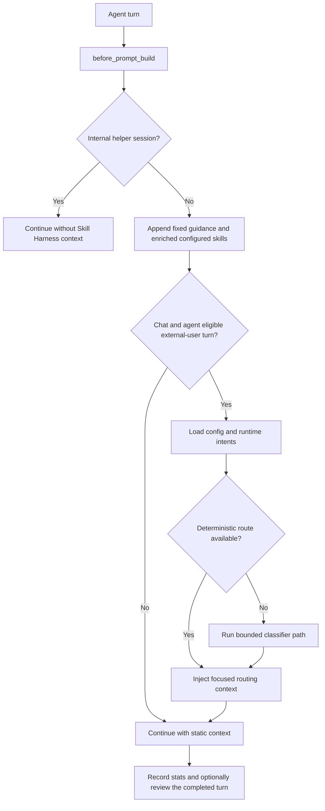

# Skill Harness

[](https://github.com/openclaw/openclaw)
[](https://opensource.org/licenses/MIT)

Skill Harness is an OpenClaw plugin that selects relevant skills and routing guidance before an agent replies. It keeps the runtime skill catalog out of the fixed system prompt, injects only focused intent-matched skills for eligible turns, and can optionally improve runtime intent definitions from evidence gathered after completed turns.

It does not replace OpenClaw agents or skills. It provides a routing layer before a reply and, when enabled, a bounded learning loop after it.

## Quick start

Install from a source checkout for local development and testing:

Development and CI use the pnpm release declared by `packageManager` in
`package.json`. Keep that field as the single version source for local tooling
and `pnpm/action-setup`; do not duplicate the version in workflow YAML.

```bash
git clone https://github.com/ani6439walc/openclaw-plugin-skill-harness.git
cd openclaw-plugin-skill-harness
pnpm install --frozen-lockfile
pnpm run typecheck
pnpm run test
pnpm run build
pnpm pack --dry-run
openclaw plugins install --link .
```

`--link` keeps OpenClaw pointed at the checkout, so future local changes can be rebuilt and tested without reinstalling.

Before enabling the plugin, add its mandatory QMD services to `openclaw.json`. Replace every placeholder with a reachable OpenAI-compatible endpoint and model:

```json5
{
  plugins: {
    entries: {
      "skill-harness": {
        enabled: false,
        config: {
          qmd: {
            embedding: {
              // Specify model as 'provider/model' to auto-resolve baseUrl & apiKey from OpenClaw config,
              // or provide explicit baseUrl, model, and optional apiKey (dimension defaults to 1536):
              model: "bifrost/text-embedding-3-small",
            },
            expansion: {
              model: "bifrost/gpt-4o-mini",
            },
          },
        },
      },
    },
  },
}
```

Then enable and inspect the plugin:

```bash
openclaw plugins enable skill-harness
openclaw plugins doctor
```

Direct `git:` installation is not supported by this repository layout. The compiled `dist/` entry is not tracked in Git, and OpenClaw's Git installer does not run this development build.

If the Gateway is unmanaged or automatic config reload is disabled, restart it after configuring or enabling the plugin:

```bash
openclaw gateway restart
openclaw gateway status --deep --require-rpc
openclaw plugins inspect skill-harness --runtime --json
openclaw plugins doctor
```

`openclaw plugins list` and plain `openclaw plugins inspect skill-harness` are cold inventory checks. They do not prove that the running Gateway loaded the plugin hooks and tools.

## What it solves

Large skill catalogs create two practical problems:

- Loading every skill description wastes prompt space and adds irrelevant context.
- Static routing rules miss better workflows, trigger phrases, and boundaries discovered through real use.

Skill Harness addresses both:

1. **Focused routing context per turn.** Eligible user turns receive the selected intent, its one routing-guidance sentence, intent-matched skills, and intent-matched `<skill_experience>` metadata (identity and keywords only) nested under the matching `<skill>`. The fixed system context does not include the runtime skill inventory.
2. **Evidence-gated routing improvements.** Optional Intent Review distinguishes recommendations from actual adoption, can autonomously maintain runtime intent Markdown, and may create at most one validated experience for a currently visible skill observed in the completed turn. It does not train the base model or rewrite skill files.

## How it works


```mermaid
graph TD
  A[Agent turn] --> B[before_prompt_build]
  B --> C{Internal helper session?}
  C -->|Yes| Z[Continue without Skill Harness context]
  C -->|No| D[Append fixed guidance and enriched configured skills]
  D --> E{Chat and agent eligible external-user turn?}
  E -->|No| M[Continue with static context]
  E -->|Yes| F[Load config and runtime intents]
  F --> G{Deterministic route available?}
  G -->|Yes| H[Inject focused routing context]
  G -->|No| I[Run bounded classifier path]
  I --> H
  H --> M
  M --> N[Record stats and optionally review the completed turn]
```

Every non-excluded normal agent turn receives static skill-discovery context, regardless of chat allow/deny scope. Its `<configured_skills>` block is the ordered union of plugin-owned `workingSetSkills` and skills discovered from that agent's workspace `skills/` tree: the agent-specific working set precedes shared `defaults`, workspace-only skills append, and duplicate names retain their explicit-list position while resolving to the workspace-precedence skill content. Native OpenClaw `agents.*.skills` lists are not a plugin source after cutover. Skills are formatted compactly without `<path>` tags (`<skill name="...">\n  ${description}\n</skill>`); agents inspect paths dynamically via `skill_list` or `skill_view` when needed. The plugin `scope.agents` option and chat scope limit dynamic intent routing only. QMD is mandatory for dynamic routing, powering Step 1 lexical BM25 keyword matching, Step 2 hybrid example/keyword retrieval with expansion, and candidate scoring for Step 3 fallback classification.

### Architecture and routing contract

Eligible dynamic routing emits `plugin:skill-harness` parent lifecycle events: `pipeline:started` before deterministic or model-backed work begins, then exactly one `pipeline:completed` or `pipeline:failed` after no further phase can run. Terminal events carry the producer-measured `durationMs`; individual phase events are progress details, not the pipeline result.

The routing stages are:

1. Resolve canonical agent and session identity, then exclude helper, generic subagent, Review, dreaming, and active-memory sessions from all injection.
2. Append fixed skill-discovery guidance and enriched configured skills to every remaining agent turn.
3. Gate dynamic routing by configured agent, chat scope, external-user turn, and interactive-session status.
4. Route via the 3-stage pipeline:
   - **Step 1 (QMD Keyword BM25)**: Evaluates lexical BM25 match against the indexed intent `keywords` collection via `searchKeywords` (`searchLex`). A top score $\ge \text{directRouteMinScore}$ (default `0.85`) routes directly as `qmd-keyword`, bypassing LLM classification.
   - **Step 2 (QMD Hybrid Example/Keyword Search)**: If Step 1 does not direct-route, performs hybrid semantic/BM25 retrieval over intent examples and keywords with conversation context expansion. A top score $\ge \text{directRouteMinScore}$ (default `0.85`) routes directly as `qmd-hybrid`, bypassing LLM classification.
   - **Step 3 (Fallback Intent Classifier)**: If neither direct route matches, projects candidate intents meeting $\ge \text{minCandidateScore}$ (default `0.35`) into a focused candidate manifest (falling back to full catalog if insufficient trusted hits), and invokes a single LLM intent classifier call with prompt context (`llm-classifier`).
5. Inject the selected intent, its one guidance sentence, intent-matched skills, and intent-matched experience metadata; then record the completed turn and run configured background work.

QMD intent snapshots and their SQLite database live under `qmd/intents/`; searchable `examples/*.md` and `keywords/*.md` contain plain text, while `<intent>-<n>.md.identity.yml` sidecars hold identity metadata and are ignored by QMD collections. The `intent-routing.sqlite` database and `intent-routing.json` metadata stay in the same snapshot directory. They refresh in the background, so a cold or unhealthy index fails open to the classifier.

Runtime state is separate from the package at `~/.openclaw/plugins/skill-harness/`. The static prompt never includes a runtime inventory. Dynamic context contains only the selected intent, guidance, intent-matched skills, and nested experience metadata. The plugin is fail-open: configuration, classification, statistics, and Review failures are logged while the main agent continues with whichever fixed or dynamic context remains available.

#### Context injection format

**Static configured skills (appended to system context)**:

```markdown
### Configured skills

When relevant, load with `skill_view` before proceeding:

<configured_skills>
<skill name="browser">
Automate web browsing and interaction.
</skill>
</configured_skills>
```

**Dynamic routing context (prepended before user message)**:

```text
[Tue 2026-09-08 11:35 GMT+8]

Inferred intent and intent-matched skills (advisory, non-user input; load with `skill_view` if relevant):
<skill_harness_plugin>
<intent name="format">
Format the specified files following repository style conventions.
</intent>
<intent_matched_skills>
<skill name="code-formatter">
Run Prettier, ESLint, or language formatters.
<skill_experience>
<identity>format-config</identity>
<keywords>["prettier", "eslint", "tabs"]</keywords>
</skill_experience>
</skill>
</intent_matched_skills>
</skill_harness_plugin>

Format index.ts using prettier
```

The prompt layout minimizes token consumption:

- Dynamic routing context is separated from preceding turn metadata by a blank line, introduced by a concise single-line advisory header (`Inferred intent and intent-matched skills (advisory, non-user input; load with \`skill_view\` if relevant):`when intent-matched skills exist, or`Inferred user intent from conversation (advisory, non-user input):`when intent-only) preceding`<skill_harness_plugin>`.
- `<intent name="${intent}">` merges the intent name and guidance into a single tag.
- Skill file paths are omitted from prompt injection; agents inspect `path` dynamically via `skill_list` or `skill_view`.
- Redundant policy blocks and legacy headers are eliminated.
- The renderer does not emit `<<<BEGIN_SKILL_HARNESS_CONTEXT>>>` or OpenClaw reserved delimiters; conversation sanitization treats those markers only as input boundaries.
- `<intent_matched_skills>` nests intent-matched `<skill_experience>` identity and keyword metadata; full experience records can be retrieved on demand via `skill_experience`.

## Basic configuration

Configure Skill Harness in `openclaw.json`:

```json5
{
  plugins: {
    entries: {
      "skill-harness": {
        enabled: true,
        config: {
          scope: {
            agents: ["main"],
            chatTypes: ["direct"],
          },
          workingSetSkills: {
            defaults: ["safe-default"],
            agents: {
              main: ["agent-first"],
            },
          },
          routing: {
            classifier: {
              model: "google/gemini-3-flash",
              modelFallback: "openai/gpt-5-mini",
              thinking: "medium",
              queryMode: "recent",
              timeoutMs: 5000,
            },
            thresholds: {
              directRouteMinScore: 0.85,
              minCandidateScore: 0.35,
            },
          },
          skills: {
            search: {
              collectionWeights: {
                meta: 1,
                body: 1,
                references: 1,
              },
            },
          },
          qmd: {
            embedding: {
              baseUrl: "https://your-embedding-endpoint/v1",
              model: "your-embedding-model",
              apiKey: "${QMD_EMBEDDING_API_KEY}",
            },
            expansion: {
              baseUrl: "https://your-openai-compatible-endpoint/v1",
              model: "your-expansion-model",
              apiKey: "${QMD_EXPANSION_API_KEY}",
            },
          },
          review: {
            enabled: false,
          },
        },
      },
    },
  },
}
```

### Important options

| Option                                               | Default                        | Purpose                                                                                                                                                                                                                                                                                                                   |
| ---------------------------------------------------- | ------------------------------ | ------------------------------------------------------------------------------------------------------------------------------------------------------------------------------------------------------------------------------------------------------------------------------------------------------------------------- |
| `scope.agents`                                       | `["main"]`                     | OpenClaw agent IDs eligible for dynamic intent routing.                                                                                                                                                                                                                                                                   |
| `scope.chatTypes`                                    | `["direct"]`                   | Chat types that may run dynamic routing (`"direct"`, `"group"`, `"channel"`, `"explicit"`).                                                                                                                                                                                                                               |
| `scope.allowedChatIds` / `deniedChatIds`             | `[]`                           | Optional chat allow-list and deny-list for dynamic routing.                                                                                                                                                                                                                                                               |
| `workingSetSkills.defaults` / `agents.<id>`          | `[]` / `{}`                    | Plugin-owned static configured-skill source. The resolved per-agent order is agent-specific entries followed by shared defaults; workspace-only skills append. Unknown or malformed members are rejected.                                                                                                                 |
| `routing.thresholds.directRouteMinScore`             | `0.85`                         | Inclusive QMD score required for direct routing bypass in Step 1 and Step 2.                                                                                                                                                                                                                                              |
| `routing.thresholds.minCandidateScore`               | `0.35`                         | Inclusive QMD score floor for classifier candidate projection in Step 3.                                                                                                                                                                                                                                                  |
| `routing.classifier.model` / `modelFallback`         | unset                          | Scanner model and last-resort resolution fallback.                                                                                                                                                                                                                                                                        |
| `routing.classifier.thinking`                        | `"medium"`                     | Intent-classifier thinking level.                                                                                                                                                                                                                                                                                         |
| `routing.classifier.queryMode` / `contextWindow`     | `"recent"` / unset             | Scanner context and its limits.                                                                                                                                                                                                                                                                                           |
| `routing.classifier.timeoutMs`                       | `5000`                         | Intent-classifier time budget in milliseconds.                                                                                                                                                                                                                                                                            |
| `skills.search.collectionWeights`                    | `1/1/1`                        | Relative RRF weights for skill `meta`, `body`, and `references` collections during `skill_search`.                                                                                                                                                                                                                        |
| `qmd.embedding` / `expansion`                        | required                       | Remote endpoint and model for mandatory QMD hybrid routing. Supports OpenClaw `provider/model` syntax (e.g. `bifrost/text-embedding-3-small`) to auto-resolve `baseUrl` and `apiKey` from OpenClaw's `models.providers`. Explicit `baseUrl` and `apiKey` remain supported. `embedding.dimension` defaults to `1536`.      |
| `qmd.timeoutMs`                                      | `routing.classifier.timeoutMs` | Per-request QMD embedding and expansion timeout.                                                                                                                                                                                                                                                                          |
| `qmd.indexRefreshIntervalSeconds`                    | `300`                          | Seconds between source checks for QMD intent and skill indexes; `0` disables subsequent automatic checks. A completed intent index is reopened read-only after Gateway restart when its persisted catalog and QMD configuration fingerprint still matches; stale, incomplete, or unreadable state rebuilds automatically. |
| `review.enabled`                                     | `false`                        | Enables post-turn Intent Review.                                                                                                                                                                                                                                                                                          |
| `review.model` / `review.modelFallback`              | unset                          | Review model and last-resort resolution fallback (defaults to classifier model/fallback if unset).                                                                                                                                                                                                                        |
| `review.thinking` / `timeoutSeconds`                 | `"medium"` / `300`             | Intent Review thinking level and time budget in seconds.                                                                                                                                                                                                                                                                  |
| `review.triggers.intentHealthCheck.everyTurns`       | `10`                           | Fixed cadence for a bounded post-turn intent health check.                                                                                                                                                                                                                                                                |
| `review.triggers.routingUncertainty.confidenceBelow` | `0.5`                          | Confidence below which fallback/uncertain routing receives bounded review.                                                                                                                                                                                                                                                |
| `review.triggers.capabilityFit`                      | enabled, `5` / `2`             | Tool-call/failure threshold and stats-selected-skill evidence for bounded capability review.                                                                                                                                                                                                                              |

Intent Classifier and Intent Review resolve models in this order: their explicit configured model (`routing.classifier.model` or `review.model`), current session model, agent primary model, then their configured fallback (`routing.classifier.modelFallback` or `review.modelFallback`). A fallback is only a resolution-time last resort; errors, timeouts, parse failures, and validation failures fail open rather than retrying with another model.

### Upgrade from the removed instruction writer to mandatory QMD routing

This release requires `plugins.entries.skill-harness.config.qmd` before OpenClaw loads the plugin. Before upgrading, add `embedding` and `expansion`; each endpoint requires `model` (which can use OpenClaw's `provider/model` syntax or pair with an explicit `baseUrl`). Remove any legacy `rerank` entry because the strict schema no longer accepts it. There is no classifier-only compatibility mode, and a missing or incomplete `qmd` block fails strict schema validation before the plugin runtime starts.

This release also removes `plugins.entries.skill-harness.config.instruction`. OpenClaw validates the strict plugin config schema before the plugin runtime loads, so a retained `instruction` block prevents the upgraded plugin from loading.

After adding QMD, remove the entire legacy `instruction: { ... }` block from `plugins.entries.skill-harness.config`. There is no automatic migration or compatibility parser.

## Runtime intents

Runtime intents live under the OpenClaw state directory. With the default local state directory:

```text
~/.openclaw/plugins/skill-harness/intents/*.md
~/.openclaw/plugins/skill-harness/experiences/<skill>/<entry>.md
```

On first startup, the plugin seeds bundled examples only when this directory is absent or has no Markdown intent files. Existing runtime intents are never overwritten.

Intent files use YAML frontmatter only for routing metadata; their complete plain-text Markdown body is the one routing `guidance` sentence. Experience files are separate, skill-scoped Markdown records with `skill`, `summary`, and `keywords` frontmatter. Every record whose skill is currently intent-matched is injected immediately as identity-and-keyword metadata. The main agent reads any record's full body through `skill_experience`, passing the matching skill and identity as the query.

### Runtime Review state

Intent Review keeps its runtime state at the data-root level:

```text
~/.openclaw/plugins/skill-harness/review.json  # schema v8
```

This plugin version supports the current schema-v8 Review log. It migrates compatible schema-v7 Review records by retaining ordinary processed events and placement epochs while discarding retired keyword-learning fields; malformed or older state remains fail-open.

Keep each intent narrow and concrete:

- one user outcome per file
- fixed frontmatter key order: `domain`, `triggers`, `examples`, `keywords`, `skills`
- concrete triggers and examples formatted as complete sentences
- domain metadata that matches the requested outcome
- `keywords` (top-level string array) for exact/similarity BM25 routing shortcuts
- `skills[]` written strictly in lowercase only when the skill genuinely helps
- one durable plain-text body sentence for routing behavior

Example intent file (`~/.openclaw/plugins/skill-harness/intents/format.md`):

```yaml
---
domain: "development"
triggers:
  - "User wants to format code or fix linting layout"
examples:
  - "format this file"
  - "run prettier on src/"
keywords:
  - "format"
  - "prettier"
skills:
  - "code-formatter"
---
Format the specified files following repository style conventions.
```

### Human maintenance skill

The bundled `skill-harness` skill has an initialization path plus three explicit, user-triggered modes:

- first-install initialization checks whether `~/.openclaw/plugins/skill-harness/intents/` is missing or empty, then the plugin copies `skills/skill-harness/assets/*.md` without overwriting an existing catalog;
- `inventory` bootstraps or re-audits the complete catalog through discovery, capability mapping, clustering, calibration, and gap drafting;
- `design` creates, renames, or refines one intent through an interview, format checks, and an explicit staged delivery;
- `runtime-health` runs the private, report-only runtime health audit for Review outcomes, per-intent route reasons and scores, QMD state, retention, and disk growth.

The skill does not manually analyze complexity, split, merge, or delete runtime intents. Those evidence-backed lifecycle decisions belong to the Intent Review reviewer subagent; standalone deletion is limited to one existing obsolete intent per finding.

## Skill tools

Skill Harness registers four runtime tools for agents to discover, search, view, and inspect skills:

| Tool               | Purpose                                                              |
| ------------------ | -------------------------------------------------------------------- |
| `skill_list`       | Broad inventory fallback for broad or uncertain tasks.               |
| `skill_search`     | QMD hybrid discovery when injected intent-matched skills do not fit. |
| `skill_view`       | Reads a visible skill or allowed support file before use.            |
| `skill_experience` | Searches bounded runtime experiences for currently visible skills.   |

### Tool parameters and specifications

- **`skill_list`**: Lists all available skills across bundled, workspace, and configured roots.
  - **Inputs**: None.
  - **Returns**: `{ skills: Array<{ name, description, path, source }> }`.
  - **Note**: Because prompt injection (`<configured_skills>` and `<intent_matched_skills>`) omits file paths to conserve tokens, agents obtain the filesystem `path` through `skill_list` or view skill contents and reference files directly via `skill_view`.

- **`skill_search`**: Hybrid semantic/lexical discovery over skill metadata, full bodies, and references via QMD.
  - **Inputs**:
    - `query` (string, required): Task description or search keywords.
    - `show_evidence` (boolean, optional, default `true`): When `true`, returns matching chunk text evidence for each hit. Set to `false` to omit snippets.
    - `show_related` (boolean, optional, default `false`): When `true`, returns related skills based on domain and capability links.
  - **Returns**: `{ results: Array<{ name, description, path, score, evidence?, related_skills? }> }`.

- **`skill_view`**: Inspects the full `SKILL.md` or an allowed support file of a visible skill.
  - **Inputs**:
    - `name` (string, required): Name of the visible skill.
    - `path` (string, optional): Relative path to a support file within the skill directory (e.g., `references/...`).
  - **Returns**: `{ name, content, path }`.

- **`skill_experience`**: Searches bounded runtime experiences for currently visible skills.
  - **Inputs**:
    - `query` (string, optional): Search query (at most 500 Unicode code points).
  - Searches at most six visible skills, returns at most three entries, caps each body at 2,000 code points, and caps all returned bodies at 5,000 code points. Reports unavailable requested skills separately and does not expose a catalog-wide experience inventory.

`skill_list`, `skill_search`, and `skill_view` inventory every skill in the invoking agent's resolved roots. Core visibility follows root precedence and disabled bundled-skill entries only; it is unchanged by this migration. Prompt-time automatic configured-skill injection is narrower and uses plugin-owned `workingSetSkills` plus workspace skills, not native OpenClaw agent skill lists.

## Intent Review

Intent Review is disabled by default. When enabled, it examines completed turns for bounded health, routing-uncertainty, and capability-fit evidence. It never affects the route already selected for that turn; a validated edit to `keywords` or `examples` refreshes the QMD index for later turns, while `triggers`, `guidance`, and `skills` edits do not.

Enable it with:

```json5
{
  plugins: {
    entries: {
      "skill-harness": {
        config: {
          review: { enabled: true },
        },
      },
    },
  },
}
```

Review investigates a trigger; it does not treat the trigger as proof. Validated findings can create, refine, split, merge, or delete runtime intents. Standalone deletion is limited to one existing obsolete intent per finding and is checked against the staged file lifecycle before the host applies it. The host derives a canonical operation from a uniquely classifiable staged lifecycle, so an incorrect model label does not discard an otherwise valid change. It never guesses when targets are both created and deleted. The reviewer never writes source files, bundled skills, OpenClaw config, memory files, or arbitrary paths.

`intent-health-check` runs at its configured cadence; `routing-uncertainty` examines fallback or low-confidence routing; `capability-fit` examines bounded tool or selected-skill evidence. A trigger starts an investigation, not proof. QMD retrieval surfaces are only an intent's `keywords` and `examples`; `triggers` remains fallback-classifier context.

### Review safeguards and skill placement

A trigger starts an investigation; it is not evidence by itself. The reviewer evaluates trigger-specific evidence, durability, scope, and existing coverage, then makes the smallest valid change or records a no-finding result. Intent-health and routing-uncertainty reviews may autonomously create, refine, split, merge, or delete runtime intent files when the catalog evidence supports the operation. Review can create at most one new skill experience for a successfully observed, still-visible skill; existing experiences are never refined or deleted by Review.

Every requested trigger needs a valid positive or no-finding decision. Missing or malformed decisions are recorded as `schema-rejected` with sanitized `missing-trigger-decision` counts. The staged workspace is authoritative for current intent content; the queued snapshot is historical evidence only. The reviewer cannot write source files, bundled skills, OpenClaw configuration, memory files, or arbitrary paths.

`capability-fit` placement evidence is narrower than ordinary Review. After an accepted stats event, the host selects at most one currently visible skill: an existing `needsReview` candidate first, otherwise one with 20 continuous inventory observations and both intent-matched-turn and usage counts at zero. The epoch identity is internal and includes the telemetry era, canonical agent and skill name, source, winner/content fingerprints, and first-seen turn. Only `applied` and `nofinding` complete an epoch; all preparation, queue, reviewer, validation, and persistence failures release its reservation for retry.

For a placement run, the reviewer receives the complete intent catalog plus one bounded, host-resolved skill snapshot. It may refine exactly one existing intent's `skills[]` frontmatter and, only when necessary, its one-sentence guidance. It cannot create, delete, merge, rename, or modify skills. The host re-resolves the selected skill for the same tracked agent before enqueueing, validates the staged change and current runtime state under the intent lock, and writes the Review event and completed epoch atomically to schema-v8 `review.json`.

Review embedded runs use `sessionPersistence: "detached"`; the host removes only the isolated temporary workspace in `finally` and does not explicitly call `deleteSession`.

## Runtime files and metrics

Skill Harness keeps package files and runtime state separate. The paths below use the default local state directory.

| Path                                                   | Purpose                                                                                                                      |
| ------------------------------------------------------ | ---------------------------------------------------------------------------------------------------------------------------- |
| `~/.openclaw/plugins/skill-harness/intents/`           | Editable runtime intent catalog.                                                                                             |
| `~/.openclaw/plugins/skill-harness/experiences/`       | Skill-scoped runtime experiences; intent-matched skills expose identity/keyword metadata.                                    |
| `~/.openclaw/plugins/skill-harness/sessions/`          | Per-session JSON snapshots for audit and Review context.                                                                     |
| `~/.openclaw/plugins/skill-harness/agents/*/sessions/` | Embedded-agent session artifacts.                                                                                            |
| `~/.openclaw/plugins/skill-harness/stats.json`         | Fresh schema-v6 intent, route-reason score, intent-matched skill, tool, routing, projection, inventory, and daily telemetry. |
| `~/.openclaw/plugins/skill-harness/review.json`        | Schema-v8 Review outcomes, experience writes, and completed placement epochs; compatible v7 records migrate on load.         |

Session cleanup preserves the ended main-session record and removes only expired session JSON plus embedded-agent `*.session.jsonl`, `*.session.trajectory.jsonl`, and `*.session.trajectory-path.json` artifacts. It does not delete root-level runtime state, intents, skills, unrelated transcripts, or package files. Retired intent-state fields such as `instructionText` are stripped when retained sessions are loaded; this cleanup never controls routing.

### Interpreting observations

Local observations are operational measurements, not synthetic benchmarks. An intent-matched skill opportunity is a top-level skill injected into the final `<intent_matched_skills>` block, and adoption is that skill's same-turn use. Related-skill metadata and routing-guidance prose do not count as adoption. Rendered catalog size is Unicode code points rather than provider-billed tokens; provider tokenization and other plugins' context are outside this measurement scope. A projection can be eligible even if later classifier execution or parsing fails, and ordinary Review outcomes remain owned by `review.json`, never synthesized in `stats.json`.

### Fresh schema-v6 statistics and attribution boundary

Schema v6 starts a fresh telemetry cohort. It records per-intent selected route reasons (`qmd-keyword`, `qmd-hybrid`, and `llm-classifier`) with count, average score, minimum score, and maximum score. QMD scores use the selected retrieval hit score; classifier scores use classifier confidence. This is a selected-route confidence measure, not an attempt-level success rate. Per-day maps record intent outcomes, intent routing, intent-matched skill routing, and tool errors; top-level tool latency uses fixed `unknown`, `0-99`, `100-499`, `500-999`, `1000-4999`, and `5000+` millisecond buckets. Each daily attribution map permits 64 encoded `value:<trimmed-name>` keys and then aggregates further names into the reserved `__other__` key.

The runtime-health projection keeps one canonical `routing` block, one canonical `projection` block, and names retained processed events as `retainedProcessedEventCount`. It omits the duplicate `routingEffectiveness` / `projectionEfficiency` aliases and the internal `dailyDynamicKeyCardinality` diagnostic.

Schema v6 does not migrate or rewrite schema-v1 through schema-v5 files: older telemetry is rejected fail-open and remains untouched. Inventory observations are agent-scoped: source, winning-path and content fingerprints, observation times and counts, same-turn usage, and intent-matched skill opportunities form an epoch. Source, winner, content, or visibility-continuity changes begin a new epoch; the fingerprints remain internal and are never exposed by skill tools.

### Live cutover boundary

Changing a live OpenClaw configuration is a separate, confirmation-gated operation. Prepare and validate a sealed migration batch first; before applying it, require explicit confirmation naming the batch, its precondition, the target `openclaw.json`, any conditional telemetry reset, Gateway restart impact, and rollback pair. Until that confirmation, do not edit native agent skill lists or runtime state. After the confirmed cutover, `workingSetSkills` is the plugin's only static source and the native lists are intentionally empty.

Historical assembled prompt forms, including the retired candidate-skills header and `<skill_candidates>` wrapper, are recognized only by conversation sanitization so retained text cannot be reclassified as current context. They are not emitted by the current renderer.

## Development

```bash
pnpm install --frozen-lockfile
pnpm run format
pnpm run typecheck
pnpm run test
pnpm run build
pnpm pack --dry-run
```

| Command               | Purpose                                                       |
| --------------------- | ------------------------------------------------------------- |
| `pnpm run format`     | Format Markdown, JSON, and TypeScript with Prettier.          |
| `pnpm run typecheck`  | TypeScript check without emitting files.                      |
| `pnpm run test`       | Run the Vitest suite.                                         |
| `pnpm run build`      | Compile the plugin to `dist/`; it does not delete old output. |
| `pnpm pack --dry-run` | Inspect package contents before publishing or installing.     |

Because the current build command invokes `tsc` directly, it does not prune
stale files already present in `dist/`. Always inspect `pnpm pack --dry-run`
after a build before publishing or linking a changed package.

### Navigate the codebase

The implementation is organized by responsibility—plugin assembly, turn
pipeline, intent/prompt contracts, skills and experiences, durable session and
statistics state, and asynchronous Intent Review. The exact symbol and test
locations are intentionally not maintained as a static file list: they move as
the design evolves.

For development work, start from the relevant domain in
[AGENTS.md](AGENTS.md), then use CodeGraph to establish the current source,
call paths, impact radius, and colocated tests:

```bash
codegraph status .
codegraph explore --path . 'before_prompt_build classification intent routing'
```

If the first query is too broad or misses, narrow it with `codegraph query` and
`codegraph node`, then trace relationships with `codegraph callers`, `callees`,
or `impact`. Use `affected` only as a file-level backstop; it cannot prove
test-case coverage. Do not run index-changing commands such as `init`, `index`,
or `sync` without explicit authorization.

## Current implementation status

The current plugin registers the complete runtime lifecycle: prompt construction,
tool-call tracking, persisted tool results, agent finalization/end, and session
cleanup. It also registers `skill_list`, `skill_search`, `skill_view`,
and `skill_experience`.

On startup, the plugin initializes its runtime data root, loads the runtime
intent catalog, and seeds bundled example intents only when the runtime catalog
has no Markdown files. Existing runtime intents are not overwritten.

Routing is fail-open. Eligible turns evaluate the 3-stage pipeline: Step 1 checks
QMD BM25 lexical matches against indexed intent `keywords`; Step 2 performs QMD
hybrid search over intent `examples` and `keywords` with conversation expansion; Step 3
projects candidate intents and invokes a single LLM intent classifier call only
when no direct QMD match reaches the threshold. Every eligible normal agent still receives
fixed skill-discovery context even when dynamic intent routing is skipped or fails.

Intent Review is disabled by default; when enabled, its runtime intent edits are
serialized so concurrent reviews cannot race on the runtime catalog.

`pnpm run typecheck` and `pnpm run test` verify the checkout. They do not prove
that a running OpenClaw Gateway has loaded this build or that its live plugin
configuration and runtime data are healthy; use the runtime inspection commands
in the troubleshooting section for that verification.

## Troubleshooting

### Plugin does not appear in OpenClaw

```bash
openclaw plugins list
openclaw plugins doctor
pnpm run build
```

### No routing context is injected

Check that the plugin is enabled, the current agent and chat type are allowed, the chat ID is not denied, and the classifier model can resolve.

### Runtime intents are missing

Start OpenClaw once with the plugin enabled, then inspect:

```bash
ls ~/.openclaw/plugins/skill-harness/intents
```

If the directory exists but is empty, check file permissions and plugin startup logs.

## Documentation scope

This README is the canonical project documentation. Implementation and operating constraints for coding agents remain in [AGENTS.md](AGENTS.md); the bundled `skill-harness` skill contains the human-maintenance workflows.

## License

MIT.

---

_🌸 Powered by Ani, Wan Jiun Wei © 2026_
