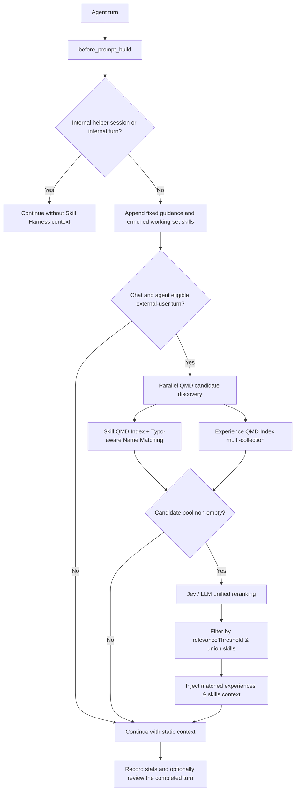

# Skill Harness

[](https://github.com/openclaw/openclaw)
[](https://opensource.org/licenses/MIT)

Skill Harness is an OpenClaw plugin that discovers and selects relevant skills and historical experiences before an agent replies. It keeps the runtime skill catalog out of the fixed system prompt, injects only focused matched skills and experiences for eligible turns via the `before_prompt_build` hook, and can optionally improve runtime definitions from evidence gathered after completed turns.

It does not replace OpenClaw agents or skills. It provides a routing layer before a reply and, when enabled, a bounded learning loop after it.

## Quick start

Install from a source checkout for local development and testing:

Development and CI use the pnpm release declared by `packageManager` in
`package.json`. Keep that field as the single version source for local tooling
and `pnpm/action-setup`; do not duplicate the version in workflow YAML.

```bash
git clone https://github.com/ani6439walc/openclaw-plugin-skill-harness.git
cd openclaw-plugin-skill-harness
pnpm install --frozen-lockfile
pnpm run typecheck
pnpm run test
pnpm run build
pnpm run test:plugin-loader
pnpm pack --dry-run
openclaw plugins install --link .
```

`--link` keeps OpenClaw pointed at the checkout, so future local changes can be rebuilt and tested without reinstalling.

Before enabling the plugin, configure both mandatory QMD services and the TypeSafe Jev selector in `openclaw.json`. The provider prefixes below must resolve through your OpenClaw provider configuration (or use explicit endpoint credentials).

```json5
{
  plugins: {
    entries: {
      "skill-harness": {
        enabled: false,
        config: {
          jev: {
            model: "typesafe/jev-latest",
          },
          qmd: {
            embedding: {
              // Specify model as 'provider/model' to auto-resolve baseUrl & apiKey from OpenClaw config,
              // or provide explicit baseUrl, model, and optional apiKey (dimension defaults to 1536):
              model: "bifrost/text-embedding-3-small",
            },
            expansion: {
              model: "bifrost/gpt-4o-mini",
            },
          },
        },
      },
    },
  },
}
```

Before enabling, migrate native static selections and shared directories as described under [Static working-set migration](#static-working-set-migration): full startup defaults to normalizing native skill lists and clearing `skills.load.extraDirs`. Then enable and inspect the plugin:

```bash
openclaw plugins enable skill-harness
openclaw plugins doctor
```

Direct `git:` installation is not supported by this repository layout. The compiled `dist/` entry is not tracked in Git, and OpenClaw's Git installer does not run this development build.

If the Gateway is unmanaged or automatic config reload is disabled, restart it after configuring or enabling the plugin:

```bash
openclaw gateway restart
openclaw gateway status --deep --require-rpc
openclaw plugins inspect skill-harness --runtime --json
openclaw plugins doctor
```

`openclaw plugins list` and plain `openclaw plugins inspect skill-harness` are cold inventory checks. They do not prove that the running Gateway loaded the plugin hooks and tools.

## What it solves

Large skill catalogs create two practical problems:

- Loading every skill description wastes prompt space and adds irrelevant context.
- Static routing rules miss better workflows, trigger phrases, and boundaries discovered through real use.

Skill Harness addresses both:

1. **Focused routing context per turn.** Eligible user turns retrieve candidate skills (via typo-aware name matching and `SkillQmdIndex`) and experiences (via `SkillExperienceQmdIndex` multi-collection search) in parallel, then use at most one constrained unified selection call (Jev / LLM) to choose relevant skills and experiences. The resulting prompt emits decoupled `<matched_experiences>` and `<matched_skills>` blocks (where skills represent the union of directly selected skills and skills associated with selected experiences). The fixed system context does not include the runtime skill inventory.
2. **Evidence-gated routing improvements.** Optional Review evaluates completed turns for capability-fit and routing-uncertainty evidence, and can autonomously curate skill experiences in runtime storage. It does not train the base model or rewrite skill files.

## How it works


```mermaid
graph TD
  A[Agent turn] --> B[before_prompt_build]
  B --> C{Internal helper session or internal turn?}
  C -->|Yes| Z[Continue without Skill Harness context]
  C -->|No| D[Append fixed guidance and enriched working-set skills]
  D --> E{Chat and agent eligible external-user turn?}
  E -->|No| M[Continue with static context]
  E -->|Yes| F[Parallel QMD candidate discovery]
  F --> G[Skill QMD Index + Typo-aware Name Matching]
  F --> H[Experience QMD Index multi-collection]
  G --> I{Candidate pool non-empty?}
  H --> I
  I -->|No| M
  I -->|Yes| J[Jev / LLM unified reranking]
  J --> K[Filter by relevanceThreshold & union skills]
  K --> L[Inject matched experiences & skills context]
  L --> M
  M --> N[Record stats and optionally review the completed turn]
```

Every non-excluded normal agent turn receives static skill-discovery context, regardless of chat allow/deny scope. Inter-session deliveries and internal-system turns are excluded using the hook's current-turn `inputProvenance`; older hosts fall back to transcript provenance or the runtime prompt marker. Its `<working_set_skills>` block is the ordered union of plugin-owned `skills.workingSet` and skills discovered from that agent's workspace `skills/` and workshop trees: the agent-specific working set precedes shared `defaults`, then workspace-only and workshop-only skills append in that order. `skills.includeWorkspaceSkills` and `skills.includeWorkshopSkills` control those automatic additions independently; they do not remove skills from discovery or explicit working sets. Duplicate names retain their first position and resolve according to root precedence before automatic-source filtering. If a workshop winner is excluded by `includeWorkshopSkills: false`, a same-name workspace skill does not replace it; an explicit working-set entry can still select the winner. Native OpenClaw `agents.*.skills` lists are not a plugin source after cutover. Skills are formatted compactly without `<path>` tags (`<skill name="...">\n  ${description}\n</skill>`); agents inspect paths dynamically via `skill_list` or `skill_view` when needed. The plugin `routing.scope.agents` option and chat scope limit dynamic routing only. QMD is mandatory for dynamic routing, powering symmetrical skill retrieval (over meta, body, and references) and experience retrieval (over keywords, summary, and body) to feed candidate pools for Jev/LLM reranking.

### Skill discovery directories and precedence

Every agent resolves the following skill roots in order; unavailable directories are simply skipped:

1. **Workshop** — `~/.openclaw/agents/<agentId>/agent/workshop-skills/`
2. **Workspace** — `<agent workspace>/skills/`
3. **Project agent** — `<agent workspace>/.agents/skills/`
4. **Personal agent** — `~/.agents/skills/`
5. **Managed** — `~/.openclaw/skills/`
6. **Shared** — each configured `plugins.entries.skill-harness.config.skills.sharedRoots` directory, in configured order
7. **Plugin links** — `~/.openclaw/plugin-skills/` (OpenClaw-generated plugin links)
8. **Bundled** — OpenClaw's built-in skills directory, resolved from `OPENCLAW_BUNDLED_SKILLS_DIR`, the running Gateway checkout, or the installed `openclaw` package
9. **Package fallback** — the Skill Harness package's `skills/` directory

If the same skill name appears in more than one directory, the **first directory above wins**. Within one root, discovery is alphabetical; shared roots override plugin and bundled skills, plugin links win over the Skill Harness package fallback, and bundled OpenClaw skills win over that fallback. Shared roots are visible to every agent but never grant access to another agent's workspace or workshop tree.

The static cutover boundary is explicit: `plugins.entries.skill-harness.config.skills.workingSet` is the only plugin-owned static skill source. By default startup normalizes `agents.defaults.skills` to `[]`, removes `agents.entries.<id>.skills`, and clears `skills.load.extraDirs`; configure intentionally shared directories with `plugins.entries.skill-harness.config.skills.sharedRoots` instead. Unknown or missing names in `skills.workingSet` are filtered when the prompt is built, while automatic workspace and workshop additions follow their respective include flags.

### Architecture and routing contract

Eligible dynamic routing emits `plugin:skill-harness` parent lifecycle events: `pipeline:started` before deterministic or model-backed work begins, then exactly one `pipeline:completed` or `pipeline:failed` after no further phase can run. Terminal events carry the producer-measured `durationMs`; individual phase events are progress details, not the pipeline result.

Each eligible routing run also emits `name-match:completed` for deterministic skill name matching, `search:completed` and `experience-search:completed` for the two parallel QMD searches, and `rerank:completed` for unified Jev selection. The user-facing `result` arrays contain matched skill names, qualified QMD skill names, the deduplicated skills associated with qualified experiences, and finally injected skill names, respectively. `name-match.reason` lists matched tokens. Search reasons use `#1 <skill-or-experience-id> · RRF <score>` for the highest ranked qualified hit, while search confidence is that hit's semantic score. `rerank.reason` lists stages that contributed at least one final skill, and its confidence is Jev's returned confidence. An `error` string appears when a stage fails, times out, or is unavailable. Search events also retain bounded hit IDs and semantic scores, the threshold, and the qualified candidate count for diagnostics. Jev already includes skills associated with selected experiences in `selectedSkills`; final injection further filters to visible skills. Name matching supplies candidate tokens to QMD query expansion before the two searches start, and the search events can arrive in either order. Events contain no query text, snippets, or experience bodies.

The routing stages are:

1. Resolve canonical agent and session identity, then exclude helper, generic subagent, Review, dreaming, and active-memory sessions, plus inter-session and internal-system turns, from all injection.
2. Append fixed skill-discovery guidance and enriched working-set skills to every remaining agent turn.
3. Gate dynamic routing by configured agent, chat scope, external-user turn, and interactive-session status.
4. Run input skill discovery and experience retrieval in parallel:
   - Skill candidates come from deterministic typo-aware name matching and direct `SkillQmdIndex` retrieval (over metadata, bodies, and references with `minCandidateScore` default `0.6`).
   - Experience candidates come from `SkillExperienceQmdIndex` multi-collection retrieval (over `keywords: 1.0`, `summary: 0.8`, `body: 0.5` with `minCandidateScore` default `0.4`).
5. The unified selector evaluates canonical skills and experiences from the candidate pools using Jev/LLM reranking against `relevanceThreshold` (default `0.6`), capping at `maxInjectedSkills` (default `8`) and `maxInjectedExperiences` (default `4`). An empty candidate pool needs no LLM call (0-call short-circuit); `maxInjectedSkills: 0` short-circuits skill discovery while experience retrieval remains enabled unless `maxInjectedExperiences` is also zero. Experience candidate thresholds use semantic evidence scores; RRF scores only determine ranking.
6. Final injected skills are the visible union of selector-selected skills and skills associated with selector-selected experiences, capped by `maxInjectedSkills`. A zero skill limit permits experiences-only context.
7. Render decoupled optional `<matched_experiences>` and `<matched_skills>` blocks, record the completed turn in session tracking, and schedule configured background work.

Skill and experience snapshots contain indexed document content only; identity sidecars are not generated. Skill hit paths resolve through the visible names in the existing agent mapping, which preserves original spelling and restores hashed long-name directories. Unknown or ambiguous segments are omitted, and agent visibility still applies. Experience IDs come from document paths and associated skills from the catalog. Full-registration refresh removes legacy `.identity.yml` and `.identity.json` sidecars without changing database paths or unchanged document text. The experience format fingerprint triggers one refresh; discovery never migrates or rebuilds snapshots. Older lowercased skill mappings may not resolve mixed-case hashed names until full registration refreshes the mapping. No manual runtime cleanup is needed.

QMD skill and experience snapshots and their SQLite databases live under `qmd/skills/` and `qmd/experiences/`. They refresh in the background. A cold or unhealthy index contributes no QMD candidates; name matches or candidates from the other index can still reach Jev. With no candidates, routing skips Jev and injects no dynamic context.

OpenClaw 2026.9.6 or later is required. Skill index identity uses the plugin's original installation directory, so captured plugin generations reuse existing indexes under `qmd/skills/indexes/`. Background indexing runs only during full registration; disposing a generation stops polling and retries and closes its QMD stores after active work finishes. Discovery instances open completed indexes read-only on demand and wait for initialization before searching. Missing, stale, or incomplete indexes remain unavailable until the full instance updates them; discovery never rebuilds or embeds. Existing indexes do not need to be deleted when upgrading. Older experience metadata fingerprints that included connection settings receive one normal background refresh from full registration; discovery remains unavailable until that refresh completes.

Runtime state is separate from the package at `~/.openclaw/plugins/skill-harness/`. The static prompt never includes a runtime inventory. Dynamic context contains decoupled selected experiences and selected skills; it never emits separate intent tags or input-skill wrappers. The plugin is fail-open: runtime routing, statistics, and Review failures are logged while the main agent continues with whichever fixed or dynamic context remains available. Invalid plugin configuration can prevent loading at the manifest validation boundary.

The dynamic deadline is the maximum enabled skill/experience search budget plus `routing.timeoutMs` for Jev plus 1,500 ms overhead (21,500 ms by default). Disabled searches contribute no budget. The host hook registers a 121,500 ms ceiling, the maximum allowed by the schema, so live budget increases remain usable. Internal timeout preserves completed static context and omits dynamic context. Host cancellation and turn identity checks prevent stale asynchronous work from committing injection state or emitting duplicate terminal events.

QMD store connection settings are tracked separately from index identity. Endpoint, credentials, expansion/Jev settings, and request timeout changes drain active searches, updates, and embedding work before reopening the same database with the latest settings. Pending changes coalesce; new operations wait for the switch. Reopening failures fail open without falling back to old credentials. Connection comparison data stays in memory; discovery instances still never rebuild indexes. Embedding model/dimension changes retain their existing index invalidation rules.

Entire skill directories may be symlinks, including targets outside the workspace. `realpath(skillDir)` defines the effective root for `SKILL.md`, supported-file listings, reads, and QMD snapshots. Links within that root are allowed; links escaping it, broken or cyclic links, and non-regular files are rejected. Existing supported-directory and relative-path restrictions still apply; there is no external support-directory allowlist.

#### Context injection format

**Static working-set skills (appended to system context)**:

```markdown
### Working set skills

When relevant, load with `skill_view` before proceeding:
<working_set_skills>
<skill name="browser">
Automate web browsing and interaction.
</skill>
</working_set_skills>
```

**Dynamic routing context (prepended before user message)**:

```text
[Tue 2026-09-08 11:35 GMT+8]

Inferred relevant skills and experiences from conversation (advisory, non-user input; load with `skill_view` or `skill_experience` if relevant):
<skill_harness_plugin>
<matched_experiences>
<experience id="format-config" skills="code-formatter">
Prettier and ESLint configuration patterns for formatting code.
</experience>
</matched_experiences>
<matched_skills>
<skill name="code-formatter">
Run Prettier, ESLint, or language formatters.
</skill>
</matched_skills>
</skill_harness_plugin>

Format index.ts using prettier
```

The prompt layout minimizes token consumption:

- Dynamic routing context is separated from preceding turn metadata by a blank line. The single-line advisory header shown above precedes `<skill_harness_plugin>`; skills-only and experiences-only variants name just the relevant loading tool.
- `<matched_experiences>` contains selected experiences with their IDs, declared associated skills, and summaries; full experience bodies can be retrieved on demand via `skill_experience`.
- `<matched_skills>` contains the union of selected skills and skills declared by selected experiences.
- Skill file paths are omitted from prompt injection; agents inspect `path` dynamically via `skill_list` or `skill_view`.
- Redundant policy blocks, `<intent>` tags, and legacy headers are eliminated.
- The renderer does not emit `<<<BEGIN_SKILL_HARNESS_CONTEXT>>>` or OpenClaw reserved delimiters; conversation sanitization treats those markers only as input boundaries.
- The renderer does not emit a `<skill_metadata>` wrapper or `<path>` elements. Skill descriptions and experience values are escaped before insertion, so skill files cannot create prompt-level XML tags.

## Basic configuration

Configure Skill Harness in `openclaw.json`:

```json5
{
  plugins: {
    entries: {
      "skill-harness": {
        enabled: true,
        config: {
          skills: {
            workingSet: {
              defaults: ["safe-default"],
              agents: {
                main: ["agent-first"],
              },
            },
            search: {
              collectionWeights: {
                meta: 3,
                body: 2,
                references: 1,
              },
            },
          },
          routing: {
            scope: {
              agents: ["main"],
              chatTypes: ["direct"],
            },
            queryMode: "recent",
            timeoutMs: 5000,
            experiences: {
              search: {
                minCandidateScore: 0.4,
              },
              relevanceThreshold: 0.6,
              maxInjectedExperiences: 4,
            },
            skills: {
              search: {
                minCandidateScore: 0.6,
              },
              nameMatch: {
                maxEditDistance: 2,
                minJaccardScore: 0.5,
                genericTokens: [],
              },
              relevanceThreshold: 0.6,
              maxInjectedSkills: 8,
            },
          },
          qmd: {
            embedding: {
              baseUrl: "https://your-embedding-endpoint/v1",
              model: "your-embedding-model",
              apiKey: "${QMD_EMBEDDING_API_KEY}",
            },
            expansion: {
              baseUrl: "https://your-openai-compatible-endpoint/v1",
              model: "your-expansion-model",
              apiKey: "${QMD_EXPANSION_API_KEY}",
            },
          },
          jev: {
            model: "typesafe/jev-latest",
          },
          review: {
            enabled: false,
          },
        },
      },
    },
  },
}
```

### Important options

| Option                                               | Default                                         | Purpose                                                                                                                                                                                                                                                                                                                                             |
| ---------------------------------------------------- | ----------------------------------------------- | --------------------------------------------------------------------------------------------------------------------------------------------------------------------------------------------------------------------------------------------------------------------------------------------------------------------------------------------------- |
| `routing.scope.agents`                               | `["main"]`                                      | OpenClaw agent IDs eligible for dynamic routing.                                                                                                                                                                                                                                                                                                    |
| `routing.scope.chatTypes`                            | `["direct"]`                                    | Chat types that may run dynamic routing (`"direct"`, `"group"`, `"channel"`, `"explicit"`).                                                                                                                                                                                                                                                         |
| `routing.scope.allowedChatIds` / `deniedChatIds`     | `[]`                                            | Optional chat allow-list and deny-list for dynamic routing.                                                                                                                                                                                                                                                                                         |
| `skills.workingSet.defaults` / `agents.<id>`         | `[]` / `{}`                                     | Plugin-owned static working-set source. The resolved per-agent order is agent-specific entries followed by shared defaults, then enabled workspace/workshop additions. Unknown fields or malformed values are rejected; unavailable skill names are filtered at prompt time.                                                                        |
| `skills.includeWorkspaceSkills`                      | `true`                                          | Whether to automatically discover and append workspace-only skills (`<workspaceDir>/skills/`) to the static working set. Setting to `false` suppresses workspace skills auto-loading.                                                                                                                                                               |
| `skills.includeWorkshopSkills`                       | `true`                                          | Whether to automatically discover and append agent-specific workshop skills (`.openclaw/agents/<agentId>/agent/workshop-skills/`) to the static working set. Setting to `false` suppresses agent workshop skills auto-loading.                                                                                                                      |
| `skills.suppressNativeSkillPrompt`                   | `true`                                          | When enabled, automatically ensures `agents.defaults.skills` is `[]` and removes `agents.entries.*.skills` in `openclaw.json` on startup to suppress duplicate native OpenClaw `<available_skills>` prompts. Setting to `false` disables this native-list mutation; `suppressNativeExtraDirs` independently controls extra-directory normalization. |
| `routing.experiences.search.minCandidateScore`       | `0.4`                                           | Inclusive semantic-evidence score required for a retrieved experience to enter the candidate pool.                                                                                                                                                                                                                                                  |
| `routing.experiences.search.timeoutMs`               | `qmd.timeoutMs`                                 | Optional millisecond override for prompt-build experience retrieval; defaults to `qmd.timeoutMs`.                                                                                                                                                                                                                                                   |
| `routing.experiences.relevanceThreshold`             | `0.6`                                           | Inclusive relevance threshold for candidate experience selection.                                                                                                                                                                                                                                                                                   |
| `routing.experiences.maxInjectedExperiences`         | `4`                                             | Maximum selected experiences injected into context; zero disables experience retrieval.                                                                                                                                                                                                                                                             |
| `routing.queryMode` / `contextWindow`                | `"recent"` / 5 turns, 1,000 characters per role | Query context and per-message limits for user and assistant history (`routing.contextWindow`).                                                                                                                                                                                                                                                      |
| `routing.timeoutMs`                                  | `5000`                                          | Jev selection request timeout in milliseconds; QMD discovery has separate budgets.                                                                                                                                                                                                                                                                  |
| `routing.skills.search.minCandidateScore`            | `0.6`                                           | Inclusive semantic-evidence threshold for a retrieved skill to be eligible for injection; it never uses RRF rank score.                                                                                                                                                                                                                             |
| `routing.skills.search.timeoutMs`                    | `qmd.timeoutMs`                                 | Optional millisecond override for prompt-build retrieval and query expansion; defaults to `qmd.timeoutMs`.                                                                                                                                                                                                                                          |
| `routing.skills.nameMatch.maxEditDistance`           | `2`                                             | Maximum classic Levenshtein distance for a name token typo.                                                                                                                                                                                                                                                                                         |
| `routing.skills.nameMatch.minJaccardScore`           | `0.5`                                           | Inclusive typo-aware token-set Jaccard threshold.                                                                                                                                                                                                                                                                                                   |
| `routing.skills.nameMatch.genericTokens`             | `[]`                                            | Normalized terms that block only a one-token auto-match; multi-token matching remains available.                                                                                                                                                                                                                                                    |
| `routing.skills.relevanceThreshold`                  | `0.6`                                           | Inclusive relevance threshold for candidate skill selection.                                                                                                                                                                                                                                                                                        |
| `routing.skills.maxInjectedSkills`                   | `8`                                             | Maximum final visible skills, including experience-associated skills; zero disables skill discovery and skill injection.                                                                                                                                                                                                                            |
| `skills.sharedRoots`                                 | `[]`                                            | Absolute local skill directories intentionally shared with every agent. They are resolved after managed roots and before plugin links, bundled skills, and the package fallback; duplicate names retain the higher-precedence root.                                                                                                                 |
| `skills.suppressNativeExtraDirs`                     | `true`                                          | On startup, clears OpenClaw `skills.load.extraDirs`; migrate intentionally shared paths to `skills.sharedRoots`.                                                                                                                                                                                                                                    |
| `skills.search.collectionWeights`                    | `3/2/1`                                         | Relative RRF weights for skill `meta`, `body`, and `references` collections during `skill_search`.                                                                                                                                                                                                                                                  |
| `qmd.embedding` / `expansion`                        | required                                        | Remote endpoint and model for mandatory QMD hybrid routing. Supports OpenClaw `provider/model` syntax (e.g. `bifrost/text-embedding-3-small`) to auto-resolve `baseUrl` and `apiKey` from OpenClaw's `models.providers`. Explicit `baseUrl` and `apiKey` remain supported. `embedding.dimension` defaults to `1536`.                                |
| `qmd.timeoutMs`                                      | `15000`                                         | Per-request QMD embedding and expansion timeout; also the default prompt-build candidate retrieval budget unless the corresponding `routing.skills.search.timeoutMs` or `routing.experiences.search.timeoutMs` overrides it.                                                                                                                        |
| `qmd.indexRefreshIntervalSeconds`                    | `300`                                           | Seconds between source checks for QMD experience and skill indexes; 0 disables subsequent automatic checks. Stale, incomplete, or unreadable state rebuilds automatically.                                                                                                                                                                          |
| `jev.model` / `baseUrl` / `apiKey`                   | required (`model`)                              | Mandatory TypeSafe Jev provider for unified skill and experience candidate selection. Supports `provider/model` syntax to auto-resolve `baseUrl` and `apiKey`.                                                                                                                                                                                      |
| `review.enabled`                                     | `false`                                         | Enables post-turn Review.                                                                                                                                                                                                                                                                                                                           |
| `review.model` / `review.modelFallback`              | unset                                           | Review model and last-resort resolution fallback (defaults to current session model or agent primary model if unset).                                                                                                                                                                                                                               |
| `review.thinking` / `timeoutSeconds`                 | `"medium"` / `300`                              | Review thinking level and time budget in seconds.                                                                                                                                                                                                                                                                                                   |
| `review.triggers.experienceHealthCheck.everyTurns`   | `10`                                            | Fixed cadence for a bounded post-turn experience health check (legacy alias: `intentHealthCheck`).                                                                                                                                                                                                                                                  |
| `review.triggers.routingUncertainty.confidenceBelow` | `0.5`                                           | Confidence below which fallback/uncertain routing receives bounded review.                                                                                                                                                                                                                                                                          |
| `review.triggers.capabilityFit`                      | enabled, `5` / `2`                              | Tool-call/failure threshold and stats-selected-skill evidence for bounded capability review.                                                                                                                                                                                                                                                        |

Review resolves models in this order: explicit configured model (`review.model`), current session model, agent primary model, then configured fallback (`review.modelFallback`). Unified routing uses mandatory TypeSafe Jev (`jev.model`) for constrained selection; errors, timeouts, and validation failures fail open without fallback retries.

### Upgrade from the removed instruction writer to mandatory QMD routing

The manifest requires both `plugins.entries.skill-harness.config.qmd` and top-level `jev` before OpenClaw loads the plugin. Configure `jev.model` for TypeSafe selection; a runtime compatibility parser does not make legacy `qmd.jev` valid in the manifest. Before upgrading, add QMD `embedding` and `expansion`; each endpoint requires `model` (which can use OpenClaw's `provider/model` syntax or pair with an explicit `baseUrl`). Remove any legacy `rerank` entry because the strict schema no longer accepts it. There is no classifier-only compatibility mode, and a missing or incomplete `qmd` block fails strict schema validation before the plugin runtime starts.

This release also removes `plugins.entries.skill-harness.config.instruction`. OpenClaw validates the strict plugin config schema before the plugin runtime loads, so a retained `instruction` block prevents the upgraded plugin from loading.

After adding QMD, remove the entire legacy `instruction: { ... }` block from `plugins.entries.skill-harness.config`. There is no automatic migration or compatibility parser.

### Static working-set migration

Move static skill selections into the plugin-owned `skills.workingSet` block:

```json5
{
  agents: {
    defaults: { skills: [] },
    entries: {
      main: { skills: [] },
    },
  },
  plugins: {
    entries: {
      "skill-harness": {
        config: {
          skills: {
            workingSet: {
              defaults: ["safe-default"],
              agents: { main: ["agent-first"] },
            },
          },
        },
      },
    },
  },
}
```

The plugin resolves an agent-specific list before shared defaults, then appends workspace-only and workshop-only skills when their include flags are enabled. By default startup applies this cutover to `openclaw.json`: it empties `agents.defaults.skills`, removes every `agents.entries.<id>.skills`, and empties `skills.load.extraDirs`. Move directories that should be visible to every agent to `plugins.entries.skill-harness.config.skills.sharedRoots`; agent-local workspace and workshop directories remain automatic and retain precedence.

## Runtime experiences

Runtime experiences live under the OpenClaw state directory. With the default local state directory:

```text
~/.openclaw/plugins/skill-harness/experiences/<id>/
  skills.md
  summary.md
  keywords.md
  body.md
```

Experiences are created organically by the Experience Review subagent from reviewed tool and routing evidence, or authored on demand by the user. There are zero pre-seeded experiences.

Experiences are stored as decoupled multi-to-multi folders (`experiences/<id>/`) containing plain text files:

- `summary.md`: concise summary of the workflow or solution pattern (max 240 code points).
- `keywords.md`: keywords for fast lexical/keyword retrieval (max 12 keywords, max 64 code points each).
- `body.md`: complete reusable workflow steps, gotchas, and guidelines (max 12,000 code points).
- `skills.md` (optional): associated skill names (one per line) that this experience activates.

Relevant experiences are retrieved via `SkillExperienceQmdIndex`, evaluated by Jev/LLM, and injected into prompt context as `<matched_experiences>`. The agent can query detailed experience contents through `skill_experience`.

### Runtime Review state

Review keeps its runtime state at the data-root level:

```text
~/.openclaw/plugins/skill-harness/review.json  # schema v8
```

This plugin version supports the current schema-v8 Review log, preserving historical intent-review events and completed placement epochs on subsequent writes. It migrates compatible schema-v7 Review records by retaining ordinary processed events and placement epochs while discarding retired keyword-learning fields; malformed or older state remains fail-open.

### Human maintenance skill

The bundled `skill-harness` skill has two explicit, user-triggered modes:

- `experience`: inspects, drafts, refines, or prunes skill experiences under `<dataRoot>/experiences/<id>/` following `references/experience.md`; the read-only `scripts/validate-experiences.mjs` reuses the production validator with a complete per-agent visible-skill map;
- `runtime-health`: runs the private, report-only audit for runtime statistics, skill query/injection/adoption, experience retrieval, completed Review outcomes, both QMD indexes, retention, and disk growth using `scripts/runtime-health-audit.py` and `references/runtime-health-audit.md`.

From the package root, run `python3 skills/skill-harness/scripts/runtime-health-audit.py --days 7 --output /tmp/skill-harness-runtime-health.json`. The additive `analysis` report compares the last seven complete UTC days with the preceding seven, separates cumulative telemetry from daily and retained-session observations, and reports missing data rather than treating it as zero. `--days` accepts 1–90; retained sessions normally cover only about 14 days. Missing stats or Review logs yield unavailable sections; present unsupported schemas still fail the audit. `runtime.qmd.skills` adds aggregate managed skill-index health while existing experience-QMD fields remain compatible.

These diagnostics support bounded checks of metadata, retrieval thresholds, relevance thresholds and injection limits; they never change settings. Skill adoption is recorded same-turn use, not routing accuracy. QMD injected-skill aggregates include experience-source skills, so they do not measure pure skill-search conversion. Review outcomes cover completed events and cannot reveal queue/running state. Reports cannot prove Gateway loaded the plugin. Keep output private and refer to the bundled workflow for coverage, denominators, and experiment guidance.

For manual experiences, build a source checkout first (`pnpm run build`), then run `node skills/skill-harness/scripts/validate-experiences.mjs --experiences-dir /path/to/staged/experiences --visible-skills-file /path/to/private/visible-skills.json`. Installed packages contain the required built modules. The visibility JSON maps all configured agent IDs to complete visible skill-name arrays; validate in each agent’s context rather than extrapolating from a single agent. Exit 0 means valid against that supplied map; exit 1 reports input or experience errors without emitting experience bodies.

## Skill tools

Skill Harness registers four runtime tools for agents to discover, search, view, and inspect skills:

| Tool               | Purpose                                                            |
| ------------------ | ------------------------------------------------------------------ |
| `skill_list`       | Broad inventory fallback for broad or uncertain tasks.             |
| `skill_search`     | QMD hybrid discovery when injected skills do not fit.              |
| `skill_view`       | Reads a visible skill or allowed support file before use.          |
| `skill_experience` | Searches shared runtime experiences, optionally by visible skills. |

### Tool parameters and specifications

- **`skill_list`** lists visible skills with pagination. Optional inputs: `offset` (default `0`), `limit` (default `150`, capped at `500`), `show_stats` and `show_related` (both default `false`). Returns `{ success, total, count, offset, limit, has_more, next_offset?, skills }`. Each skill includes `name`, `description`, `source`, and `path`, with optional `usage_stats` and `related_skills`.
- **`skill_search`** searches metadata, bodies, and references. Requires a non-empty `query` (trimmed and truncated to 1,000 Unicode code points). Optional inputs: `limit` (default `20`, capped at `100`), `show_evidence` (default `true`), `show_stats` and `show_related` (default `false`). Returns `{ success, query, total, count, limit, skills }`; each skill contains `name`, `description`, `source`, `score`, and requested optional evidence/statistics/relations. Search results omit paths; use `skill_list` or `skill_view` for paths. An unavailable index returns `success: false`.
- **`skill_view`** requires `name`; optional `file_path` reads a relative support file under `references/`, `templates/`, `scripts/`, `assets/`, or `examples/`. A full skill response includes `success`, `name`, `description`, `content`, `path`, `skill_dir`, `linked_files`, usage statistics, relations, source, and readiness. A support-file response includes `success`, `name`, `file`, `content`, `file_type`, and relations.
- **`skill_experience`** accepts `query` (at most 500 Unicode code points), `skills` (1–6 names), or both. Requested skill names are checked against the invoking agent's visible inventory. Returns `{ success, requested_skills, unavailable_skills, entries }`, with at most three entries, 2,000 code points per body and 5,000 total body code points. Query search tries QMD, then falls back to catalog search if no matches remain; it does not invoke Jev.

Experience storage and its QMD index are shared across agents. Query-only `skill_experience` searches and dynamic experience retrieval are not filtered by agent skill visibility; only explicit skill filters and final injected skill names apply that visibility check. Do not treat experience storage as an agent-private boundary.

`skill_list`, `skill_search`, and `skill_view` inventory every skill in the invoking agent's resolved roots. Core visibility follows root precedence and disabled bundled-skill entries only; it is unchanged by this migration. Prompt-time automatic working-set injection is narrower and uses plugin-owned `skills.workingSet` plus enabled workspace/workshop additions, not native OpenClaw agent skill lists.

## Review

Review is disabled by default. When enabled, it examines completed turns for bounded health, routing-uncertainty, and capability-fit evidence. It never affects the route already selected for that turn.

Enable it with:

```json5
{
  plugins: {
    entries: {
      "skill-harness": {
        config: {
          review: { enabled: true },
        },
      },
    },
  },
}
```

Review investigates a trigger; it does not treat the trigger as proof. Validated findings can create, refine, or delete runtime skill experiences under `<dataRoot>/experiences/<id>/`. The reviewer never writes source files, bundled skills, OpenClaw config, memory files, or arbitrary paths.

`experience-health-check` (legacy alias `intent-health-check`) runs at its configured cadence; `routing-uncertainty` examines low-confidence routing; `capability-fit` examines tool-call/tool-failure thresholds and inventory-selected low-adoption or unused skill epochs. Tool errors do not establish successful recovery; the tracker does not associate failed calls with later recovery. A trigger starts an investigation, not proof.

### Review safeguards

A trigger starts an investigation; it is not evidence by itself. The reviewer evaluates trigger-specific evidence, durability, scope, and existing coverage, then makes the smallest valid change or records a no-finding result. Review findings produce `targetKind: "skill-experience"` updates to create, refine, or delete skill experiences.

Every requested trigger needs a valid positive or no-finding decision. Missing or malformed decisions are recorded as `schema-rejected`. The reviewer operates within a temporary workspace with enforced workspace-only file access. Every changed experience must have a positive finding, and every declared target must change. Only changed entries are validated against eligible skills, so unrelated existing entries do not block updates. Writeback rejects concurrent changes to the same experience and applies file removals as well as additions and edits.

Review scheduling uses `IntentReviewScheduler` to debounce runs after a turn finishes (default 30-second idle delay). A new candidate for the same agent/session replaces the previous pending candidate and resets its timer, with pending entries capped by LRU eviction (default 32 sessions). Before executing, the scheduler checks if the system is actively processing embedded runs (`isSystemActive`); if busy or another Review is in flight, review is postponed by a 30-second retry delay. Each scheduler runs at most one Review at a time. If OpenClaw Gateway is shutting down (`isDraining`), pending reviews abort immediately without executing. Review runs execute in the background detached from the hook scope (`runDetachedFromWorkScope`) with `sessionPersistence: "detached"`, and the host removes only the isolated temporary workspace in `finally` and does not explicitly call `deleteSession`.

## Runtime files and metrics

Skill Harness keeps package files and runtime state separate. The paths below use the default local state directory.

| Path                                                   | Purpose                                                                                                                  |
| ------------------------------------------------------ | ------------------------------------------------------------------------------------------------------------------------ |
| `~/.openclaw/plugins/skill-harness/experiences/`       | Decoupled runtime skill experiences (`summary.md`, `keywords.md`, `body.md`, `skills.md`).                               |
| `~/.openclaw/plugins/skill-harness/sessions/`          | Per-session JSON snapshots for audit and Review context.                                                                 |
| `~/.openclaw/plugins/skill-harness/agents/*/sessions/` | Embedded-agent session artifacts.                                                                                        |
| `~/.openclaw/plugins/skill-harness/stats.json`         | Schema-v7 skill, tool, routing, projection, inventory, and daily telemetry, with historical intent compatibility fields. |
| `~/.openclaw/plugins/skill-harness/review.json`        | Schema-v8 Review outcomes, experience writes, and completed placement epochs; compatible v7 records migrate on load.     |

Session cleanup preserves the ended main-session record and removes only expired session JSON plus embedded-agent `*.session.jsonl`, `*.session.trajectory.jsonl`, and `*.session.trajectory-path.json` artifacts. It does not delete root-level runtime state, intents, skills, unrelated transcripts, or package files. New routing state persists `matchedSkills`, `matchedExperiences`, `confidence`, and `inputSkillDiscovery` at the session-state top level, including empty selections. `inputSkillDiscovery.experienceRetrieval` records whether experience search completed, was unavailable, timed out, or failed, along with the candidate threshold, returned IDs and semantic scores, and the number that passed the threshold. Compare those candidates with `matchedExperiences` to see whether selection removed them. Statistics and Review accept these turns without requiring an intent. Historical session intent state retains `intentMatchedSkills`; a session containing retired fields such as `recommendedSkills` is rejected in its entirety on load, without migration. Other unknown intent fields that pass validation are not automatically removed.

### Interpreting observations

Local observations are operational measurements, not synthetic benchmarks. An intent-matched skill opportunity is a top-level skill injected into the final `<matched_skills>` block, and adoption is that skill's same-turn use. Related-skill metadata and routing-guidance prose do not count as adoption. Rendered catalog size is Unicode code points rather than provider-billed tokens; provider tokenization and other plugins' context are outside this measurement scope. A projection can be eligible even if later classifier execution or parsing fails, and ordinary Review outcomes remain owned by `review.json`, never synthesized in `stats.json`.

Recorded skill usage requires a successful complete `skill_view` response, or successful `read`/`exec` output containing parseable skill frontmatter with a nonempty name. Failed tools, `ls`, empty output, and unrecognizable truncated content do not count. An `exec` command ending in a `SKILL.md` path is not evidence by itself. Usage is deduplicated within the turn. Existing statistics are neither recalculated nor rewritten; historical adoption can include false positives from the earlier path-based interpretation.

### Fresh schema-v7 statistics and attribution boundary

Schema v7 starts a fresh telemetry cohort. Current turns record top-level selections, confidence, skill/tool usage, routing adoption, projection, inventory, and daily aggregates without creating an intent. Historical `state.intent.result` can still populate per-intent route reasons (`qmd-keyword`, `qmd-hybrid`, and `llm-classifier`) with count, average score, minimum score, and maximum score; those compatibility fields do not imply current intent classification. QMD evidence uses retrieval hit scores; selector confidence comes from Jev. `skillDiscovery` separately records input skill matching: name-match and QMD search candidates, QMD semantic-score distribution, collection hit distribution (`meta`, `body`, `references`) for retrieved candidates and final injected skills, pre-injection candidate and injection counts, fallback reasons, and duration summaries. It does not retain user requests, snippets, QMD explanations, or per-hit score lists. Per-day maps include the same aggregate input skill-match telemetry alongside intent outcomes, intent routing, intent-matched skill routing, and tool errors; top-level tool latency uses fixed `unknown`, `0-99`, `100-499`, `500-999`, `1000-4999`, and `5000+` millisecond buckets. Each daily attribution map permits 64 encoded `value:<trimmed-name>` keys and then aggregates further names into the reserved `__other__` key.

The runtime-health projection keeps one canonical `routing` block, one canonical `projection` block, and names retained processed events as `retainedProcessedEventCount`. It omits the duplicate `routingEffectiveness` / `projectionEfficiency` aliases and the internal `dailyDynamicKeyCardinality` diagnostic.

Schema v7 does not migrate or rewrite schema-v1 through schema-v6 files: older telemetry is rejected fail-open and remains untouched. Inventory observations are agent-scoped: source, winning-path and content fingerprints, observation times and counts, same-turn usage, and intent-matched skill opportunities form an epoch. Source, winner, content, or visibility-continuity changes begin a new epoch; the fingerprints remain internal and are never exposed by skill tools.

### Live cutover boundary

Changing a live OpenClaw configuration is a separate, confirmation-gated operation. Prepare and validate a sealed migration batch first; before applying it, require explicit confirmation naming the batch, its precondition, the target `openclaw.json`, any conditional telemetry reset, Gateway restart impact, and rollback pair. Until that confirmation, do not edit native agent skill lists or runtime state. After the confirmed cutover, `skills.workingSet` is the plugin's only static source and the native lists are intentionally empty.

Retired candidate-skills headers and the `<skill_candidates>` wrapper are not emitted by the current renderer. Sanitization targets the current routing block and known OpenClaw runtime envelopes so retained runtime text cannot be reclassified as current user context.

### Conversation-history sanitization

Conversation history is sanitized at the message boundary before routing context is assembled. The sanitizer removes the current OpenClaw timestamp plus `Conversation info: ⟦openclaw:ctx⟧` fenced JSON envelope, the legacy `Sender (untrusted metadata)` form, Skill Harness routing blocks, active-memory blocks, and OpenClaw internal runtime delimiters. It also reduces an OpenClaw assembled-context envelope to the text after `</conversation_context>` and `Current user request:` when that form is present.

The history extractor keeps role-tagged user and assistant messages separate. A user entry containing only runtime metadata sanitizes to empty and is ignored; its following assistant message can still complete the preceding external user turn. Inter-session or internal task-completion user entries and their following assistant payloads are excluded. Sanitization removes injected wrappers but does not emit them again, and the current renderer never writes `<skill_metadata>`.

## Development

```bash
pnpm install --frozen-lockfile
pnpm run format
pnpm run typecheck
pnpm run test
pnpm run build
pnpm run test:plugin-loader
python3 skills/skill-harness/scripts/test-runtime-health-audit.py
python3 skills/skill-harness/scripts/test-validate-experiences.py
python3 .github/scripts/test_jules_pr_review.py
pnpm pack --dry-run
```

| Command                       | Purpose                                                       |
| ----------------------------- | ------------------------------------------------------------- |
| `pnpm run format`             | Format Markdown, JSON, and TypeScript with Prettier.          |
| `pnpm run typecheck`          | TypeScript check without emitting files.                      |
| `pnpm run test`               | Run the Vitest suite.                                         |
| `pnpm run build`              | Compile the plugin to `dist/`; it does not delete old output. |
| `pnpm run test:plugin-loader` | Load the built entry using Node.                              |
| `pnpm pack --dry-run`         | Inspect package contents before publishing or installing.     |

Because the current build command invokes `tsc` directly, it does not prune
stale files already present in `dist/`. Always inspect `pnpm pack --dry-run`
after a build before publishing or linking a changed package.

### Navigate the codebase

Start with these implementation boundaries, then trace callers and colocated `*.test.ts` files with `rg`:

| Source                                                  | Responsibility                                                                               |
| ------------------------------------------------------- | -------------------------------------------------------------------------------------------- |
| `src/plugin.ts`, `index.ts`, `api.ts`                   | Registration, live configuration, lifecycle ownership, and SDK boundary.                     |
| `src/config.ts`, `src/types.ts`, `openclaw.plugin.json` | Runtime defaults/types and the strict public configuration contract.                         |
| `src/hooks/`                                            | Turn eligibility, candidate discovery, prompt assembly, lifecycle events, and tool tracking. |
| `src/classification/`                                   | Conversation sanitization, prompt rendering, and constrained Jev selection.                  |
| `src/skills/`, `src/experiences/`, `src/qmd/`           | Visible skill roots/tools, experience validation/catalog, and managed search indexes.        |
| `src/session/`, `src/stats/`                            | Persisted turn state, retention, usage, and aggregate telemetry.                             |
| `src/review/`, `src/subagent-runtime.ts`                | Post-turn scheduling, isolated review execution, validation, and writeback.                  |
| `skills/skill-harness/`                                 | User-triggered maintenance procedures and report/validation helpers.                         |

CI runs on Node.js 24 and 26. In addition to typecheck, Vitest, and build, it checks Prettier, loads the built plugin, runs the runtime-health and experience-validator Python suites plus `.github/scripts/test_jules_pr_review.py`, and inspects the package with `pnpm pack --dry-run`. Run the experience-validator suite after building because it imports production modules from `dist/`.

## Current implementation status

The current plugin registers the complete runtime lifecycle: prompt construction,
tool-call tracking, persisted tool results, agent finalization/end, and session
cleanup. It also registers `skill_list`, `skill_search`, `skill_view`,
and `skill_experience`.

On startup, the plugin initializes its runtime data root for sessions, experiences, QMD
indexes, and statistics. Experiences are created dynamically by Review or authored on demand.

Routing is fail-open. Eligible turns run parallel candidate discovery: skill evidence
(combining typo-aware name matching and managed `SkillQmdIndex` retrieval) and experience
evidence (managed `SkillExperienceQmdIndex` multi-collection retrieval). When candidates exist,
a single unified Jev/LLM reranking call selects relevant skills and experiences against
relevance thresholds; an empty candidate pool short-circuits without a model call.
Every eligible normal agent still receives fixed skill-discovery context even when
dynamic routing is skipped or fails.

That fixed context is rendered from plugin-owned `skills.workingSet` plus enabled workspace
and workshop additions. Dynamic context records the final selected skills and experiences in session and
stats state; it does not reuse OpenClaw's native agent skill lists, emit separate intent tags or
skill metadata wrappers, or fall back to an unvetted heuristic skill list.

Review is disabled by default; when enabled, review runs execute in the background
with isolated temporary workspaces.

`pnpm run typecheck` and `pnpm run test` verify the checkout. They do not prove
that a running OpenClaw Gateway has loaded this build or that its live plugin
configuration and runtime data are healthy; use the runtime inspection commands
in the troubleshooting section for that verification.

## Troubleshooting

### Plugin does not appear in OpenClaw

```bash
openclaw plugins list
openclaw plugins doctor
pnpm run build
```

### No routing context is injected

Check that the plugin is enabled, the current agent and chat type are allowed, the chat ID is not denied, and the QMD endpoints and `jev.model` resolve. Check index readiness, candidate thresholds, relevance thresholds, and injection limits. Empty candidate pools or failed Jev selection intentionally produce no dynamic context.

### Runtime experiences

Inspect:

```bash
ls ~/.openclaw/plugins/skill-harness/experiences
```

When optional Review is enabled (disabled by default), experiences can be created automatically by the Review subagent after tool-call/tool-failure thresholds, inventory evidence, or routing uncertainty trigger an investigation, or can be added manually under `~/.openclaw/plugins/skill-harness/experiences/<id>/`.

## Documentation scope

This README is the canonical project documentation. Implementation and operating constraints for coding agents remain in [AGENTS.md](AGENTS.md); the bundled `skill-harness` skill contains the human-maintenance workflows.

## License

MIT.

---

_🌸 Powered by Ani, Wan Jiun Wei © 2026_
