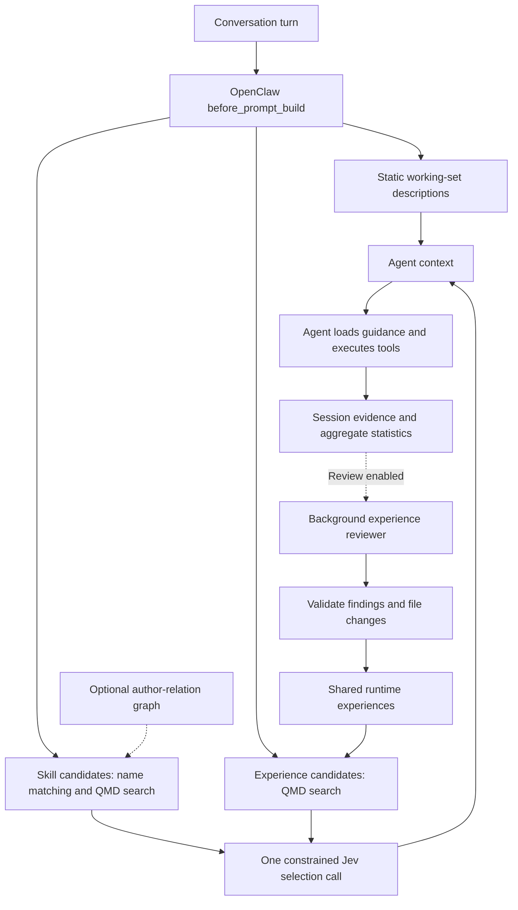

# Skill Harness

[](https://github.com/openclaw/openclaw)
[](https://opensource.org/licenses/MIT)

Skill Harness is an OpenClaw plugin that helps agents find relevant skills and reuse experience from previous work. Before an agent replies, it searches skills and experiences, selects the relevant candidates, and adds compact guidance to the conversation. An optional reviewer turns evidence from completed turns into reusable experience for future tasks.

The project combines **skill discovery**, **experience retrieval**, and **experience curation** around existing OpenClaw agents. Skills remain ordinary skill files; experience lives separately in runtime storage.

## Why this project exists

As a skill library grows, listing every skill in every prompt consumes context and makes it harder to find the right workflow. Short descriptions also leave out details that matter for selection: applicability, prerequisites, operating steps, and failure conditions often appear only in the full skill document.

Repeated work introduces another problem. An agent may solve the same issue again without retaining the useful procedure, while indiscriminate memory capture accumulates duplicate or outdated advice.

Skill Harness addresses these problems with:

- **On-demand discovery:** search skill metadata, bodies, and reference files before selecting a bounded set for the current task.
- **Reusable experience:** retrieve past procedures independently of skill discovery, including standalone guidance without skill associations.
- **Progressive loading:** inject descriptions and experience summaries; let the agent load detailed instructions when relevant.
- **Evidence-based curation:** optionally review completed turns, check existing coverage, and create, refine, merge, or delete experience when the evidence supports a change.

For example, a request to diagnose a deployment can surface a relevant operations skill alongside an experience describing a previously verified diagnostic sequence. The agent loads the skill through `skill_view`, queries further experience through `skill_experience`, and applies the guidance to the current environment.

## Research context

These papers provide context for the design choices and related directions. The table distinguishes the research ideas from the behavior implemented here; the papers' benchmark results are not measurements of this plugin.

| Paper                                                                                                                          | Research idea                                                                                                     | Relationship to Skill Harness                                                                                                                                                                |
| ------------------------------------------------------------------------------------------------------------------------------ | ----------------------------------------------------------------------------------------------------------------- | -------------------------------------------------------------------------------------------------------------------------------------------------------------------------------------------- |
| [SkillRouter: Skill Routing for LLM Agents at Scale](https://arxiv.org/abs/2603.22455)                                         | Skill bodies contain routing evidence that names and descriptions can miss; retrieve candidates before reranking. | Searches metadata, bodies, and references, then uses one constrained Jev selection call. Uses QMD and Jev rather than SkillRouter's trained retrieval/reranking models.                      |
| [SkillDAG: Self-Evolving Typed Skill Graphs for LLM Skill Selection at Scale](https://arxiv.org/abs/2606.03056)                | Typed directed relations add structure to skill selection, and execution can inform graph evolution.              | Offers an imported author-relation graph and optional bounded candidate expansion. Relations remain unverified hints; runtime review curates experiences rather than evolving graph edges.   |
| [Compositional Skill Routing for LLM Agents: Decompose, Retrieve, and Compose (SkillWeaver)](https://arxiv.org/abs/2606.18051) | Complex tasks can require decomposition, retrieval, and dependency-aware composition of multiple skills.          | Selects multiple relevant skills; task decomposition and executable DAG planning remain related work, outside the current routing pipeline.                                                  |
| [SkillOpt: Executive Strategy for Self-Evolving Agent Skills](https://arxiv.org/abs/2605.23904)                                | Bounded document edits can improve an agent's external state when accepted through validation.                    | Reviewer changes pass schema, content, operation, and concurrency checks. This is experience curation; it does not optimize skill files using scored rollouts or held-out performance tests. |

## Architecture


```mermaid
flowchart TD
  U[Conversation turn] --> H[OpenClaw before_prompt_build]
  H --> W[Static working-set descriptions]
  H --> S[Skill candidates: name matching and QMD search]
  H --> E[Experience candidates: QMD search]
  G[Optional author-relation graph] -.-> S
  S --> J[One constrained Jev selection call]
  E --> J
  W --> C[Agent context]
  J --> C
  C --> A[Agent loads guidance and executes tools]
  A --> T[Session evidence and aggregate statistics]
  T -. Review enabled .-> R[Background experience reviewer]
  R --> V[Validate findings and file changes]
  V --> X[Shared runtime experiences]
  X --> E
```

| Component           | Role                                                                                                                 |
| ------------------- | -------------------------------------------------------------------------------------------------------------------- |
| Skill catalog       | Resolves the invoking agent's visible skills and provides discovery/loading tools.                                   |
| QMD indexes         | Hybrid retrieval over skill metadata, bodies and references, and experience keywords, summaries and bodies.          |
| Jev selector        | Evaluates the combined candidate pool against the conversation and configured relevance thresholds.                  |
| Prompt integration  | Adds a static working set and compact, advisory dynamic context through OpenClaw hooks.                              |
| Experience reviewer | Optionally examines completed turns and proposes validated experience changes.                                       |
| Runtime state       | Stores experiences, session evidence, review outcomes, managed indexes, and aggregate telemetry outside the package. |

### Before a reply

1. Add skill-discovery guidance and the configured static working-set descriptions. Automatic workspace/workshop additions can be controlled separately.
2. For eligible agents and chats, search skill and experience candidates in parallel using the conversation context. Skill discovery combines typo-aware name matching with QMD retrieval.
3. If candidates exist, make one constrained Jev selection call. An empty pool skips selection entirely.
4. Inject selected experience summaries and the visible union of directly selected skills and skills associated with selected experiences, subject to the configured limits.
5. The agent uses `skill_view` to load skill instructions and `skill_experience` to search detailed experience before applying relevant guidance.

Dynamic context contains optional `<matched_experiences>` and `<matched_skills>` blocks. It is labeled advisory, non-user input. Full skill documents and the entire catalog are not automatically inserted.

Runtime search or selection failures let the main agent continue with available static context. Failed selection does not inject an unchecked fallback list. Invalid configuration can still prevent the plugin from loading.

### After a completed turn

Review is disabled by default. When enabled, experience-health cadence, uncertain routing, or capability-fit evidence can schedule a background investigation. A trigger does not itself prove that an experience should be written.

The reviewer checks existing coverage before creating an entry, prefers refining an existing procedure, and can merge overlapping experiences or remove guidance proven obsolete, useless, or superseded. A no-finding outcome is valid. Changes are checked against the declared operation, actual file changes, eligible observed skills, and concurrent updates before writeback.

Review operates on experience copies in a temporary workspace. Filesystem tools are workspace-restricted; `exec` follows the host execution policy and has no additional shell sandbox supplied by this plugin. Its prompt limits commands to experience maintenance. Review does not train model weights or authorize edits to skill sources.

## Installation and setup

Use OpenClaw **2026.9.6 or later**, Node.js suitable for that installation, and the pnpm version declared in [`package.json`](package.json). Development CI uses Node.js 24 and 26.

### 1. Build and install

```bash
git clone https://github.com/ani6439walc/openclaw-plugin-skill-harness.git
cd openclaw-plugin-skill-harness
pnpm install --frozen-lockfile
pnpm run build
openclaw plugins install --link .
```

The linked installation uses this checkout. Rebuild after changing source files. Direct `git:` installation is unsupported because the compiled `dist/` entry is not tracked and the Git installer does not perform this build.

### 2. Configure model services

Merge this entry into your existing `openclaw.json`:

```json5
{
  plugins: {
    entries: {
      "skill-harness": {
        enabled: false,
        config: {
          qmd: {
            embedding: { model: "bifrost/text-embedding-3-small" },
            expansion: { model: "bifrost/gpt-4o-mini" },
          },
          jev: { model: "typesafe/jev-latest" },
        },
      },
    },
  },
}
```

All three model settings are required. The example's `bifrost` and `typesafe` providers must already exist in OpenClaw's provider configuration. `provider/model` resolves endpoint and credentials from that configuration. Alternatively, configure `baseUrl`, `model`, and `apiKey` explicitly on each endpoint. `qmd.embedding.dimension` defaults to `1536`; set it to match your embedding model.

#### Shared document embedding cache and Voyage

Set optional `qmd.embeddingCacheDir` to share document embeddings across skill and experience stores, agents, and processes that use the same directory. Without it, QMD uses its in-memory cache. The plugin forwards the directory unchanged after trimming whitespace; it does not append agent or generation names. QMD expands `~`; relative paths use the process working directory, **not** `dataRoot`. Prefer an absolute path on persistent disk, or tmpfs such as `/dev/shm` when RAM usage and loss on reboot are acceptable.

The QMD cache retains successful document embeddings for up to two hours, bounded to 2,000 entries / 64 MiB of payload (SQLite adds overhead). Identity, credentials, and exact formatted input must match. It does not persist query embeddings or expansion results. Cache misses sharing a directory serialize while the remote request runs; waiting respects the request timeout. Cache failure falls back to ordinary embedding, so this is not a permanent exactly-once guarantee. Changing the directory reopens stores after active operations drain without changing index fingerprints or rebuilding vectors. Read-only discovery does not create the disk cache.

For native Voyage, merge this complete model configuration into the plugin config, retaining your configured expansion and Jev providers:

```json5
{
  qmd: {
    embeddingCacheDir: "/dev/shm/skill-harness-qmd-embeddings",
    embedding: { model: "voyageai/voyage-4", dimension: 1024 },
    expansion: { model: "bifrost/gpt-4o-mini" },
  },
  jev: { model: "typesafe/jev-latest" },
}
```

`voyage/` and `voyageai/` resolve to the official endpoint and `VOYAGE_API_KEY` from the Gateway environment when explicit or configured provider values are absent. Set `dimension: 1024` explicitly: the plugin retains its existing `1536` default. QMD supplies Voyage's native `input_type` and `output_dimension` fields ([Voyage API reference](https://docs.voyageai.com/reference/embeddings-api)). A custom gateway must accept that native protocol; a provider prefix selects connection settings, not the HTTP protocol.

#### Upgrading existing Voyage indexes

QMD `2026.10.6` uses a native Voyage identity. Existing vectors produced by the older OpenAI-compatible provider are incompatible even when model, dimension, and endpoint are unchanged. Ordinary refresh does not authorize destructive rebuilding. Lexical search may still work, and plugin `ready` alone does not prove vector readiness.

Use a separately approved, one-time maintenance window:

1. Enumerate the distinct skill databases referenced by `dataRoot/qmd/skills/agents/` mappings under `dataRoot/qmd/skills/indexes/<fingerprint>/skill-search.sqlite`, plus `dataRoot/qmd/experiences/experience-routing.sqlite`. Inspect each database with the new resolved models and `readOnly: true`; check `getStatus().diagnostics.embedding.identity.compatible`. Confirm the exact affected databases and embedding request cost before rebuilding.
2. Stop **all** Gateway generations and other users of these databases. Back up the affected stores and managed metadata while quiescent. Preserve snapshots, mappings, leases, `gc.json`, and experience metadata; do not delete index directories or rewrite identity fields.
3. Open each affected database with the installed QMD SDK, its exact `dbPath`, and the complete `config: { collections, models }` using its existing managed collection definitions and the new resolved Voyage settings. Preserve collection contexts and global context if present. Supplying inline config reconciles the database collections: do not omit `collections` or replace them with an empty object. Call `await store.embed({ force: true })` once per database, with no collection restriction, and always close the store. This replaces its vectors, makes new API requests, and bypasses the document cache; do not add `force` to recurring refreshes.
4. Require zero embedding errors, `needsEmbedding === 0`, compatible identity and ready embedding build diagnostics, then verify `searchVector()` on known indexed content. Reopen read-only and recheck before restarting the Gateway. A subsequent ordinary `embed()` should process zero unchanged documents. If any database fails, keep maintenance paused and inspect diagnostics or restore the quiescent backup; do not resume with an assumed successful rebuild.
5. Restart with the new plugin and verify searches through each intended agent's actual Gateway tools. Check semantic diagnostics separately from lexical results. Local tests do not establish deployed readiness.

### 3. Choose the static working set

Before enabling, move any native static skill selections into the plugin's `skills.workingSet`, and move intentionally shared `skills.load.extraDirs` paths into `skills.sharedRoots`:

```json5
{
  skills: {
    workingSet: {
      defaults: ["safe-default"],
      agents: { main: ["agent-first"] },
    },
    sharedRoots: ["/absolute/path/to/shared-skills"],
    includeWorkspaceSkills: true,
    includeWorkshopSkills: true,
  },
}
```

This is a fragment inside `plugins.entries["skill-harness"].config`. Replace the example skill names and directory with your own, or omit these optional settings.

By default, startup empties native `agents.defaults.skills`, removes agent-specific native `skills` lists, and clears `skills.load.extraDirs` to avoid duplicate prompt inventories. `skills.suppressNativeSkillPrompt` and `skills.suppressNativeExtraDirs` independently disable these mutations when set to `false`; native lists are not an input to the plugin's working set.

Agent-specific working-set entries appear before shared defaults, followed by enabled workspace and workshop additions. Include flags affect automatic prompt additions; the agent can still discover or explicitly load visible skills through tools.

### 4. Enable and verify

```bash
openclaw plugins enable skill-harness
openclaw gateway restart
openclaw gateway status --deep --require-rpc
openclaw plugins inspect skill-harness --runtime --json
openclaw plugins doctor
```

The runtime inspection checks the running Gateway; `plugins list` alone only checks inventory. Indexes are built and refreshed in the background, so a newly installed plugin may initially have no semantic search results.

## Using Skill Harness

### Automatic routing

Continue using your agent normally. By default, dynamic routing applies to agent `main` in direct chats, uses recent conversation context, and injects up to **8 skills** and **4 experiences**.

To change scope or limits, merge a routing fragment into the plugin configuration:

```json5
{
  routing: {
    scope: { agents: ["main"], chatTypes: ["direct"] },
    queryMode: "recent",
    skills: { maxInjectedSkills: 8 },
    experiences: { maxInjectedExperiences: 4 },
  },
}
```

Set `maxInjectedSkills: 0` for experience-only routing; set `maxInjectedExperiences: 0` to disable automatic experience retrieval.

### Agent tools

Agents can use these tools even when automatically selected guidance is insufficient:

| Tool               | Inputs and purpose                                                                                                                                                                                                           |
| ------------------ | ---------------------------------------------------------------------------------------------------------------------------------------------------------------------------------------------------------------------------- |
| `skill_list`       | Lists visible skills. `offset` defaults to 0; `limit` defaults to 150, maximum 500. Optional `show_stats` and `show_related` default to false. Follow pagination for larger catalogs.                                        |
| `skill_search`     | Requires `query`; hybrid-searches metadata, bodies and references. `limit` defaults to 20, maximum 100. `show_evidence` defaults to true; `show_stats` and `show_related` default to false. Returns `skills`, without paths. |
| `skill_view`       | Requires `name`; loads the skill document. Optional `file_path` loads a relative support file under `references/`, `templates/`, `scripts/`, `assets/`, or `examples/`.                                                      |
| `skill_experience` | Requires `query`; searches shared experiences. `limit` defaults to 5, clamped to 1–20. `show_skills` defaults to true. Tries QMD then catalog fallback without calling Jev.                                                  |

Example tool arguments:

```json
{ "query": "diagnose a deployment readiness failure", "limit": 5 }
```

Use those arguments with `skill_search` to find skills or `skill_experience` to find experience. Load a selected skill with `skill_view`, for example `{ "name": "your-operations-skill" }`.

Experiences are shared across agents. Skill visibility filters displayed associations and final injected skill names, rather than excluding experience entries. An experience can therefore be found with `skills: []` when all associated skills are invisible; `show_skills: false` omits that field. Associations are hints, not prerequisite or access-control declarations. Retrieved bodies are bounded to 2,000 code points each and 5,000 total.

### Enable experience review

Merge this into the plugin configuration to enable the optional learning loop:

```json5
{
  review: {
    enabled: true,
    // Optional: otherwise resolves from the session or agent model.
    model: "your-provider/your-review-model",
  },
}
```

Remove the example `model` line to use the session/agent model. Default triggers include a health check every 10 turns, routing confidence below 0.5, and capability-fit thresholds of 5 tool calls or 2 failures, plus inventory evidence. Runs are debounced and serialized in the background; they do not change the route already used for a completed turn.

The reviewer has `ls`, `read`, `write`, `edit`, `exec`, `skill_experience`, and `skill_search`. Review may incur additional model costs and may create, refine, merge, or delete runtime experiences.

### Maintain experience manually

Load the bundled `skill-harness` skill and request its `experience` workflow to inspect, draft, refine, or prune experience. It checks existing coverage and validates entries before applying changes. See the [experience procedure](skills/skill-harness/references/experience.md).

There are no pre-seeded experiences. Each entry is a directory under the default runtime data root:

```text
~/.openclaw/plugins/skill-harness/experiences/<id>/
  summary.md   # required; concise procedure summary, up to 240 code points
  keywords.md  # required; up to 12 keywords, 64 code points each
  body.md      # required; reusable steps and applicability, up to 12,000 code points
  skills.md    # optional; associated skill names, one per line
```

One experience can relate to multiple skills, and one skill can relate to multiple experiences. Write applicability and prerequisites into the procedure itself.

### Optional skill relations

An imported author-relation graph can expose related skills through `skill_view` or `skill_list` / `skill_search` with `show_related: true`. For optional automatic candidate expansion, set:

```json5
{
  routing: { skills: { related: { enabled: true } } },
}
```

Expansion adds a bounded outgoing hop from original skill candidates to the same Jev selection call. Relations remain unverified; dependency/conflict labels do not force loading or exclude combinations. This setting defaults to false, and importing a graph is a separate step. See the [staged import procedure in AGENTS.md](AGENTS.md#advanced-relation-import-procedure).

## Configuration reference

The full accepted schema is in [`openclaw.plugin.json`](openclaw.plugin.json). Common settings below live inside the plugin's `config` object:

| Setting                                                                           | Default                       | Effect                                                                                               |
| --------------------------------------------------------------------------------- | ----------------------------- | ---------------------------------------------------------------------------------------------------- |
| `routing.scope.agents` / `chatTypes`                                              | `["main"]` / `["direct"]`     | Select eligible agents and chat types. Optional allowed/denied chat-ID lists further restrict scope. |
| `routing.queryMode`                                                               | `"recent"`                    | Choose `message`, `recent`, or `full` query context; `routing.contextWindow` bounds recent history.  |
| `routing.skills.search.minCandidateScore`                                         | `0.6`                         | Minimum semantic score for a skill candidate.                                                        |
| `routing.experiences.search.minCandidateScore`                                    | `0.4`                         | Minimum semantic score for an experience candidate.                                                  |
| `routing.skills.relevanceThreshold` / `routing.experiences.relevanceThreshold`    | `0.6` / `0.6`                 | Jev selection thresholds, distinct from retrieval thresholds.                                        |
| `routing.skills.maxInjectedSkills` / `routing.experiences.maxInjectedExperiences` | `8` / `4`                     | Final context limits. Zero disables the corresponding automatic discovery/injection.                 |
| `routing.timeoutMs`                                                               | `5000`                        | Jev selection budget.                                                                                |
| `qmd.timeoutMs`                                                                   | `15000`                       | QMD request budget; individual skill/experience `search.timeoutMs` can override retrieval budgets.   |
| `qmd.indexRefreshIntervalSeconds`                                                 | `300`                         | Background source-check interval; zero disables recurring checks.                                    |
| `skills.search.collectionWeights`                                                 | meta/body/references: `3/2/1` | Relative collection weights for skill search.                                                        |
| `review.enabled`                                                                  | `false`                       | Enable automatic experience curation.                                                                |
| `review.thinking` / `timeoutSeconds`                                              | `"medium"` / `300`            | Reviewer reasoning level and run budget.                                                             |

## Runtime health and troubleshooting

Use the bundled `skill-harness` skill's `runtime-health` workflow for a private, report-only check of retrieval, injection, recorded skill use, Review outcomes, index health, retention, and disk growth. From a source checkout:

```bash
python3 skills/skill-harness/scripts/runtime-health-audit.py --days 7 --output /tmp/skill-harness-runtime-health.json
```

The report separates cumulative statistics from daily and retained-session observations. Missing data is reported as unavailable. Recorded skill use is not a measure of task success, and the report does not prove that the Gateway loaded the plugin. See the [audit procedure](skills/skill-harness/references/runtime-health-audit.md).

Runtime state lives separately from package files under `~/.openclaw/plugins/skill-harness/`: experiences, sessions, `stats.json`, `review.json`, managed `qmd/` indexes, and optional `skill-relations/`. Keep runtime files and reports private.

| Symptom                             | Check                                                                                                                                                                         |
| ----------------------------------- | ----------------------------------------------------------------------------------------------------------------------------------------------------------------------------- |
| Plugin fails to load                | Run `plugins doctor`; verify the build and required QMD/Jev settings. On older configurations, remove retired `instruction`, `rerank`, and legacy routing fields.             |
| No dynamic context                  | Check enabled state, agent/chat scope, index readiness, endpoints, thresholds and limits. No eligible candidates or failed selection intentionally inject no dynamic context. |
| Search is unavailable after install | Allow background indexing to complete and check model services; `skill_experience` also has catalog fallback.                                                                 |
| No new experience appears           | Review is disabled by default. When enabled, a valid investigation can still conclude there is nothing durable to add.                                                        |
| Duplicate skill inventories         | Check native prompt suppression and migrate static selections to `skills.workingSet`.                                                                                         |

## Contributing

Implementation contracts, source navigation, migrations, and development checks are maintained in [AGENTS.md](AGENTS.md). User-triggered maintenance workflows are in the [bundled skill](skills/skill-harness/SKILL.md).

## License

MIT.
